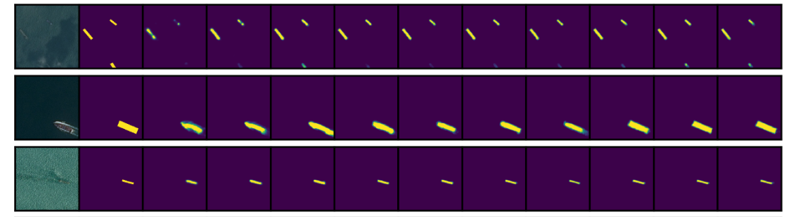
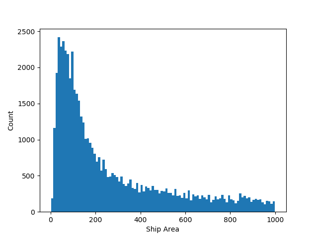
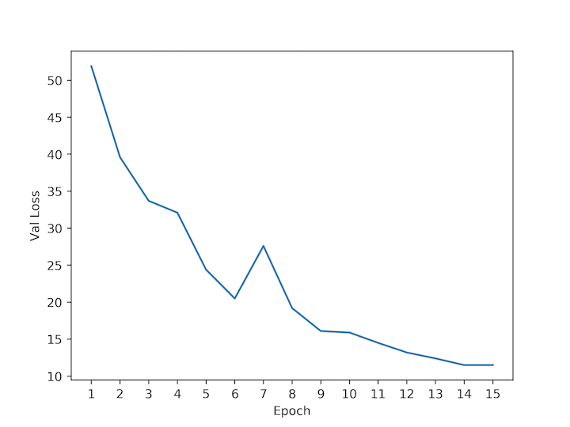
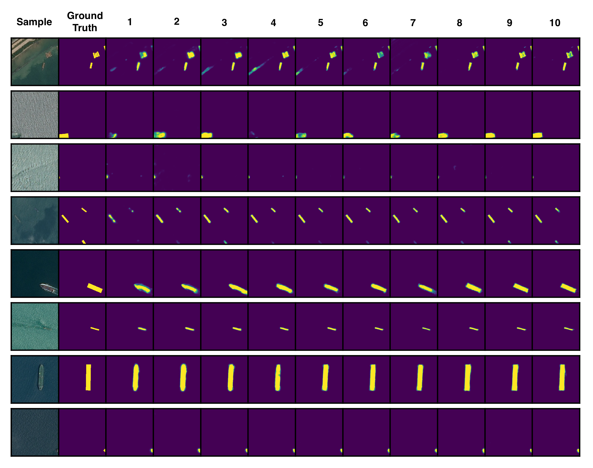
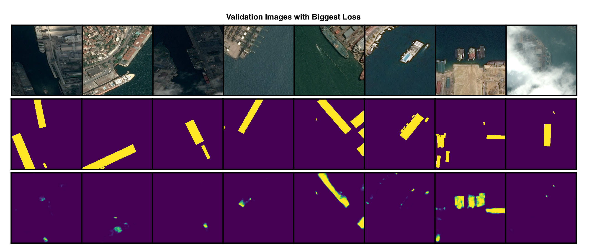
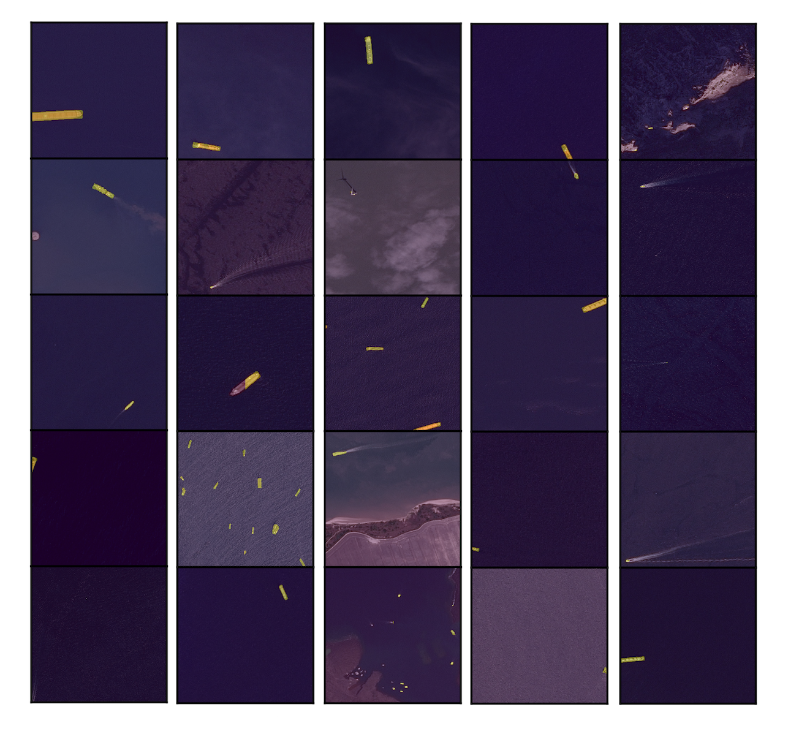

# Kaggle Ship Detection Challenge

<center></center>
<br />
Kaggle's [Ship Detection Challenge](https://kaggle.com/c/airbus-ship-detection) provides satellite images of the ocean with ground-truth labels indicating the locations of ships.  The objective is to make a model that accurately segments ships in a set of testing images.  This post follows my development of such a model.

## Data Exploration
Getting the data:
```bash
$ mkdir Airbus
$ cd Airbus
$ kaggle competitions download -c airbus-ship-detection
$ unzip ./train_v2.zip -d ./data/train_v2/
$ unzip ./test_v2.zip -d ./data/test_v2/
$ unzip ./train_ship_segmentations_v2.csv.zip -d ./data/
```

Check if any images are corrupt:
```bash
$ find ./data/test_v2/ -name "*.jpg" | xargs jpeginfo -c | grep "WARNING"
$ find ./data/train_v2/ -name "*.jpg" | xargs jpeginfo -c | grep "WARNING"
>>> ./data/train_v2/6384c3e78.jpg  768 x 768  24bit JFIF  N   98304  Premature end of JPEG file  [WARNING]
```
One of the images is corrupt, but it's a training image, so it won't be predict on, so I'm going to delete it.

How many images are there? 192555 train and 15606 test.

How many train images do/don't have ships?
```python
import numpy as np
import pandas as pd
# Get images that have ships
df = pd.read_csv('./data/train_ship_segmentations_v2.csv')
has_ship = [isinstance(_, str) for _ in df['EncodedPixels']]  # true if has ship
df_with_ships = df.loc[has_ship]
print('n with ships:', np.sum(has_ship))
print('n without ships:', len(has_ship)-np.sum(has_ship))
```
The result is mostly no ships: 150,000 without and 81,723 with.

What do images with ships look like?
```python
from skimage.io import imread
import utils
import matplotlib.pyplot as plt
plt.switch_backend('agg')

# Get images that have ships
df = pd.read_csv('./data/train_ship_segmentations_v2.csv')
has_ship = [isinstance(_, str) for _ in df['EncodedPixels']]  # true if has ship
df_with_ships = df.loc[has_ship]

# Accumulate rles that belong to the same image
rle_dict = {}
for _, im_id, rle in df_with_ships.itertuples():
    if im_id in rle_dict:
        rle_dict[im_id].append(rle)
    else:
        rle_dict[im_id] = [rle]

# Plot
n_plots = 6
plt_count = 0
for im_id, rles in rle_dict.items():
    plt_count += 1
    plt.subplot(2, n_plots, plt_count)
    plt.imshow(imread('./data/train_v2/' + im_id))
    plt.gca().set_xticks([])
    plt.gca().set_yticks([])
    plt.subplot(2, n_plots, plt_count+n_plots)
    plt.imshow(utils.rles2mask(rles))
    plt.gca().set_xticks([])
    plt.gca().set_yticks([])
    if plt_count == n_plots:
        plt.subplots_adjust(wspace=0, hspace=0)
        plt.savefig('./figures/train_images_masks.png', dpi=500)
        break
```
<center><a href="../airbus/train_image_masks.png"></a></center>
Some ships are large and easy to distinguish, like the first column, but others are small and hard to detect, like the last column.  Some ships are _very_ close together, making them hard to separate, even when zoomed in:
<center></center>
Some images have one ship while others have multiple.  What's the distribution over ships per image, given there are ships?
```python
ship_counts = [len(item[1]) for item in rle_dict.items()]
max_ships = max(ship_counts)
plt.hist(ship_counts, bins=range(max_ships))
plt.xticks(range(max_ships))
plt.xlim((1,max_ships))
plt.xlabel('Number of Ships')
plt.ylabel('Number of Images')
plt.savefig('./figures/ship_count_distribution.png')
```
<center></center>
Most images have only one ship, and nearly all have less than three.

What surface area do ships cover?
<center></center>
The smallest is tiny, only 2 pixels.  The largest is 25,904 pixels, about 4% of the image.  Most are in the hundreds range.  Here's a zoom-in:

<center></center>
## Modeling
To model, I'll make a binary classifier to find out if an image contains at least one ship, then I'll make a segmentation model and train it on images that only have ships.

First, I'll slice each image into (square) quarters.  This will allow the segmentaion model to train on images with a more balanced pixel-wise class distributions, i.e., the ratio of no-ship pixels to ship pixels will be closer to 0.5.  Cutting images into quarters will also allow reasonable batch sizes, such as 32 to fit in GPU memory.

A concern about quartering, however, is that ships will get split across quarters, leaving behind a sliver that might be hard to detect.  Let's see how many ships get split like this:

```python
rles = df['EncodedPixels'].tolist()
rles = [_ for _ in rles if isinstance(_,str)]   # remove empty masks

# Convert to mask, check if in multiple sectors
n_crossing = 0
for rle in tqdm(rles):
    mask = utils.rle2mask(rle)
    # Cut into quarters
    sectors = [
        mask[0:384, 0:384],
        mask[0:384, 384:],
        mask[384:, 0:384],
        mask[384:, 384:],
    ]
    in_sector = [np.sum(sector)>0 for sector in sectors]
    if np.sum(in_sector) > 1:
        n_crossing += 1
print(n_crossing)
```

The result is 10,045, so about 12% of ships get split.  That's more than I'd like, but the trade-off might be worth it, so I'll do the cutting anyway and check later to see if split ships are indeed harder to detect.

The train set now has 706,997 negative instances and 63,223 positive instances.

### The Binary Model

The set is split 0.75 train 0.25 val, and train images are rotated arbitrarily by 0, 90, 180, or 270 degrees on each epoch with the hope that this will build rotation robustness into the model.

After playing with several architectures, I settled on Xception.  It has ImageNet weights, global max-pooling on the last convolutional layer, and a sigmoid node on the end to represent probability of ship.  The first 50 layers of the network were frozen to decrease training time.

After the third epoch the validation accuracy reaches a maximum of 0.89 and the f-score reaches a maximum of 0.88.  The confusion matrix is
```bash
[[15529   277]
 [ 3177 12629]]
```
where rows are ground-truth and columns are predicted. There are many more false positives than false negatives.  This is ok because the real data, i.e., the test set, is expected to have many more negative samples than what's used in this validation set, so the test accuracy should be higher than what's shown here.  In fact, we can approximate the testing accuracy.  If the testing data has the same bias as the training data (0 = 92%, 1 = 8%), and the tp/tn/fp/fn rates are the same between validation and testing, then the testing accuracy will be about 97%. Not bad.

Let's look at some validation misclassifications:
<center><a href="../airbus/false_negatives.png"></a></center>

<center><a href="../airbus/false_positives.png"></a></center>
False negatives mostly occur when ships are either split, occluded by clouds, or really small; false positives mostly occur when there's a rectangular object in the image or there's a _mislabeled_ image.  _Several training images are mislabelled_.  For example, the bottom right image clearly has a ship, but the ground-truth says it's not there.

### The Segmetation Model

The segmentation model I'll use is a Unet with the same architecture as described in the original Unet [paper](https://lmb.informatik.uni-freiburg.de/people/ronneber/u-net/).

I train directly on 384x384 quarters using a 0.75/0.25 train/val split.  The optimizer is Adam with learning-rate 0.0001, batch size 6, and pixel-wise binary cross entropy loss.  Here's the validation loss over epochs:

<center></center>
<br />

And here are some validation predictions after each epoch (click to enlarge):

<center><a href="../airbus/unet_predictions.png"></a></center>
The results are pretty impressive.  After just the first epoch the model segments ships, and after the second/third epoch it distinguishes ships from their wakes and land.  What's really impressive is that predictions look like genuine _bounding boxes_, even though ships themselves aren't always rectangular.  The model even segments ship fragments on the edges of images, which is what I was worried about when I did the quartering.

Let's see where Unet performs poorly.  Here are validation samples that have the biggest loss:

<center><a href="../airbus/unet_errors.png"></a></center>
Evidently, docked ships are hardest to detect, they just look like a continuation of the land, especially the yachts, which, in some sense, are (good joke?).  The second to last column has what appear to be oil rigs that were misclassified.

### The Objective Function

The objective function used by Kaggle is somewhat convoluted.  For each image, an intersection-over-union is computed between any predictions and ground-truths that might exist.  The IoU is then thresholded over a set of values to determine if the prediction will be a TP.  Then, f2 score is calculated and averaged for each threshold.  Then, that average f2 score is averaged over all images, and that's your prediction score.  Note that bounding-boxes aren't used as predictions, but instead run-length encoded masks, so really they can look like anything.  It's not entirely clear if a single mask can be a TP for multiple ships, or if predictions are assigned to ground-truths when there are multiple predictions and ground-truths per image, but more info on scoring is [here](https://www.kaggle.com/c/airbus-ship-detection#evaluation).

To figure out where to threshold the Unet predictions, I loop over thresholds and look at average IoUs on the validation set (with error bars of 1 std dev on each side):

<center><a href="../airbus/iou_v_thresh.png"></a></center>
I'll use a threshold of 0.4.


### Testing
After a little post processing to remove masks that are too small (<40 pixels), the test results are:

|       Model       | Score |
|:-----------------:|:-----:|
| 2 unets, 2 binary | 0.697 |
| 2 unets, 1 binary | 0.687 |
|  1 unet, 1 binary | 0.680 |
|  blank submission | 0.520 |

As expected, accuracy increase with ensemble size.  The top scores for this problem are around 0.84, so I'll call my numbers a 'good' baseline.

To finish up, lets see some test predictions from the best ensemble:

<center><a href="../airbus/test_prediction_overlay.png"></a></center>
So even though my model's score isn't that good relative to the top score, it still appears to find all ships at a level of accuracy that would probably be sufficient for most applications.

### Ways to Improve

If I were to spend more time on this problem I would do a few extra things:
- __Hard sample learning__ After initially training the binary model, I'd re-train only on samples that have predict probability in the range 0.3-0.7.  In other words, do extra learning on 'hard' samples.
- __More data augmentation__ Do more types of image transformation to augment the training set.  For example, use [imaug](https://github.com/aleju/imgaug) or [Augmentor](https://github.com/mdbloice/Augmentor).
- __Smart cropping__ Don't let ships get split by a cropping boundary; check if splitting happens before cropping and adjust the crop boundary accordingly.
- __Ground-truth boundary erosion__ Erode the boundaries of ground-truth masks to help distinguish ships that are touching, then extend prediction boundaries to undo the learned erosion.


