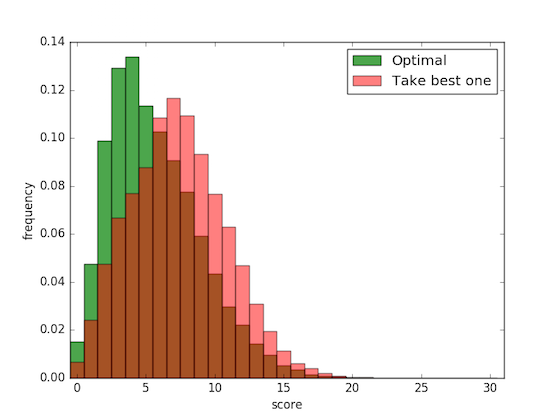
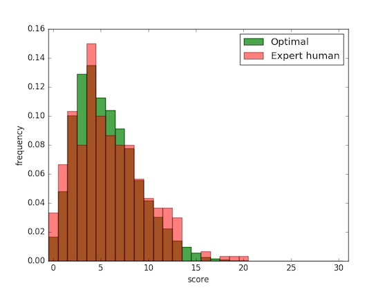
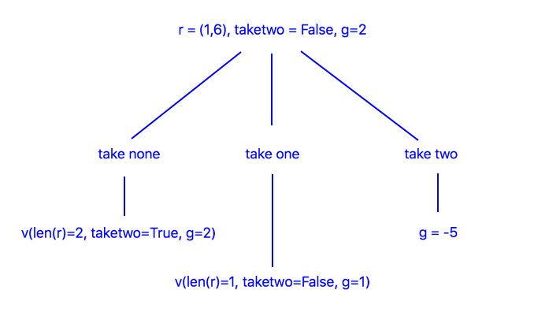
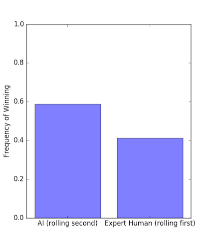

<br />
<h2><center>Solving Threes</center></h2>


<center><p>All threes&mdash;the infamous <em>hallelujah</em> roll.</p></center>

### Threes: How to Play

Threes is a dice game played by two or more people. The first player rolls five dice and takes the ones they want to keep, then they roll again and continue taking dice until they've collected them all.  The player's score is the sum of their dice with threes counting as _zero_.  The second player rolls in the same way and the player with the lowest score wins.

Dice are collected in an interesting way.  Players are supposed to take at least one dice after each roll, but if they roll all high dice (like all fives and sixes) and they don't want to take any, then they can choose to take no dice and re-roll, but with the consequence that they have to take _at least two_ dice on the re-roll.

Note that players aren't allowed to accumulate re-rolls and they aren't allowed to re-roll the last die---they have to take it.  An example game is shown at the bottom of this post.

### Backward Induction

We're going to solve Threes using backward induction.  Backward induction works by identifying the optimal action at the last step of the game, and uses that action to identify the optimal action at the second to last step, etc. until the current step is reached.

It may seem like this requires us to simulate the game backward every time we want to take an action, but in-fact we can compute so-called _values_ which cache the results of the simulation and eliminate the need to repeat simulations.  All of this will be clearer in the example to come.

### Game Representation
Let's set up some notation for the game representation:

* __States:__ Game states consist of a list of rolled dice values and a binary take-two indicator.  For example, the state $$ s = ((0,2,4,6),T) $$ indicates a roll of $$(0,2,4,6)$$ with take-two set to True.  The value $$3$$ is written as $$0$$ and the other outcomes are written in sorted order.  Sorting is done because we're going to refer to dice using an index and we want low indices to correspond to low dice values.

* __Actions:__ An action is an integer $$a$$ indicating the number of dice to take.  Since we're trying to minimize score, we'll assume that these are the _lowest_ $$a$$ dice.  Note that $$0 \le a \le len(r)$$, where $$r$$ is the roll-list.

* __Game Dynamics__: Game dynamics are determined by a pseudo-random number generator that gives each dice a uniformly random outcome.  Agent actions are determined by a policy $$a(s)$$ that maps states to actions.  Note that an agent is fully specified by its policy and in this sense the agent _is_ its policy.

### Rolling First
If you roll first, you don't know what your opponent's score is going to be, so your best bet is to minimize your final score.

To find the policy that does this, we'll make a probabilistic model of the dice outcomes and use it to predict which actions will result in which scores, then we'll choose an action that minimizes expected score and take that as our policy.

In technical slang we're treating the game as a _Markov decision process_ and we're solving it using _backward induction_ on the _Bellman equation_, but an easier way to understand this is with a few examples.

Suppose there are two dice left and we don't have to take two and we roll $$(1,6)$$.  The diagram below shows the decisions we can make.


The quantity $$v$$ indicates how many points we expect to collect on the _next_ roll, assuming we select the corresponding action.  For example, $$v(len(r)=2,\texttt{taketwo}=T) = 6$$ because rolling two dice and collecting them both gives a total of $$6$$ on average.  The bottom of the tree contains numbers that are used to make our final decision.  In this case $$a=1$$ is the optimal decision because cost plus value is minimum.

One more example, then we can generalize the solution:


In this case we can't choose an action because we don't know $$v(len(r)=3, \texttt{taketwo}=T)$$ or $$v(len(r)=2, \texttt{taketwo}=F)$$, but we can approximate them using simulations.  For example, $$len(r)=2, \texttt{taketwo}=F$$ is the situation shown in the first tree, and we were able to make a decision there, so we'll simulate this situation several times and average the score of the optimal action there.  The result is $$v(len(r)=3, \texttt{taketwo}=T)=7$$.  Using a similar technique we find that $$v(len(r)=2, \texttt{taketwo}=F)=4$$.

Thus the optimal action is $$a=1$$. Notice that we had to simulate backward starting from the end of the game.  This is the defining property of backward induction.  To prevent redundant simulations, we cache values so we only have to simulate once per state, afterwards we can just look-up the information we no to act.

__The Value Function__. Once we have all the values $$v$$ it's simple to choose the optimal action from an arbitrary state: choose the action that minimizes immediate points _plus_ next-state value.  Notice that $$v$$ depends on the _number_ of dice being rolled and not on the dice values themselves.  This means that the game can be represented more simply in terms of the number of dice rolled $$len(r)$$ and the take-two indicator.  The values are organized in a table called _the value function_.  Here it is:

| _len(r)_ | _taketwo_ | _v_ |
|:-------:|:---------:|:---:|
|    1    |   F   |  3  |
|    2    |    T   |  6  |
|    2    |   F   |  4  |
|    3    |    T   |  7  |
|    3    |   F   | 4.8 |
|    4    |    T   |  7  |
|    4    |   F   | 5.3 |
|    5    |    T   |  7  |
|    5    |   F   | 5.6 |

__The Optimal Policy__. The value function together with the heuristic "choose the action which minimizes immediate points plus next-state value" defines the optimal policy.  Here's the corresponding formula:

<center> $$a(s) = \arg \min_{a'} \bigl (r[0:a'] + v(len(r)-a',a'==0) \bigr)$$ </center>
Where $$r[0:a']$$ is the number of points gained from the immediate action, and $$v(len(r)-a',a'==0)$$ is the value of the next state assuming action $$a'$$ is taken.

__Experiments__. Let's do some experiments to see how well the optimal policy does.  Here's a comparison between the optimal policy and a policy that takes one lowest dice on every roll, the "playing it safe" policy. 30,000 games were simulated:

<center></center>

Here's a comparison between the optimal policy and _my_ policy.  To approximate my policy I played Threes three hundred times and recorded my score after each game (yes I actually did that).  On average the optimal policy gets a score of 5.6, while I get a score of 5.8.  Evidently I play approximately optimally, but I already had the feeling I did :).

<center></center>

### Rolling Second
If we roll second we know what score to beat, so instead of acting to minimizing final score we'll act to maximize probability of winning.  Again it's helpful to start with an example.

Suppose we roll two dice, resulting in $$(1,6)$$, and the opponent's score is $$5$$ and our score-so-far is $$3$$, and we don't have to take two.  We'll parameterize the problem in terms of the _gap_ $$g$$ between our score and the opponent's score. __In order to win or tie we have to preserve $$g \ge 0$$__.  In this example $$g=2$$.  The decision tree below shows the actions we can take:

<center></center>

The values, i.e., the probabilities of winning, are computed by simulation.  For $$a=0$$ we simulate collecting two dice, and for $$a=1$$ we simulate taking one dice with an update to $$g$$ to account for the dice we took.  The results are $$v(len(r)=2,\texttt{taketwo}=T,g=2)=0.166$$ and $$v(len(r)=1,\texttt{taketwo}=F,g=1)=0.333$$.  Thus we choose $$a=1$$.  Note that we didn't consider $$a=2$$ because it makes $$g < 0$$.

__The Value Function__.  The value function is a little more complicated compared to when we were rolling first; it now depends on $$g$$, which can have up to 30 values.   Instead of listing all the values in a table, we'll put them in a code snippet that also shows how to compute them.

```python
# adjust these as needed
taketwo = False
nleft = 5    # referred to as "len(r)" in the post

d = [0,1,2,4,5,6] # possible dice values

def get_pwin(nleft,taketwo,g):
    # return the probability of winning for the given input state.  these are the values of the value function.
    if (nleft, taketwo) == (1, False):
        return [0.1667, 0.3334, 0.5001, 0.5001, 0.6668, 0.8335, 1.000][g]
    elif (nleft, taketwo) == (2, True):
        return [0.028, 0.083, 0.166, 0.221, 0.304, 0.414, 0.581, 0.691, 0.774, 0.829, 0.912, 0.967, 0.995][g]
    elif (nleft, taketwo) == (2, False):
        return [0.093, 0.238, 0.398, 0.508, 0.623, 0.724, 0.849, 0.914, 0.950, 0.972, 0.993, 0.999, 0.999][g]
    elif (nleft, taketwo) == (3, True):
        return [0.0162, 0.0582, 0.1297, 0.2077, 0.2954, 0.3857, 0.4987, 0.5955, 0.6814, 0.7531, 0.8300, 0.8882, 0.9293, 0.9550, 0.9753, 0.9884, 0.9962, 0.9993][g]
    elif (nleft, taketwo) == (3, False):
        return [0.0580, 0.1634, 0.3050, 0.4322, 0.5596, 0.6698, 0.7774, 0.8611, 0.9183, 0.9492, 0.9722, 0.9857, 0.9929, 0.9964, 0.9988, 0.9997, 1.0000, 1.0000][g]
    elif (nleft, taketwo) == (4, True):
        return [0.0142, 0.0528, 0.1237, 0.2125, 0.3125, 0.4161, 0.5249, 0.6290, 0.7208, 0.7944, 0.8556, 0.9016, 0.9357, 0.9587, 0.9752, 0.9859, 0.9928, 0.9964, 0.9983, 0.9993, 0.9998, 1.0000, 1.0000, 1.0000][g]
    elif (nleft, taketwo) == (4, False):
        return [0.0433, 0.1258, 0.2489, 0.3750, 0.4999, 0.6184, 0.7311, 0.8227, 0.8915, 0.9358, 0.9634, 0.9801, 0.9898, 0.9948, 0.9975, 0.9988, 0.9995, 0.9998, 0.9999, 1.0000, 1.0000, 1.0000, 1.0000, 1.0000][g]
    elif (nleft, taketwo) == (5, True):
        return [0.0130, 0.0493, 0.1162, 0.2048, 0.3101, 0.4198, 0.5318, 0.6364, 0.7305, 0.8070, 0.8659, 0.9097, 0.9418, 0.9631, 0.9775, 0.9867, 0.9926, 0.9959, 0.9978, 0.9989, 0.9995, 0.9998, 0.9999, 1.0000, 1.0000, 1.0000, 1.0000, 1.0000, 1.0000, 1.0000][g]
    elif (nleft, taketwo) == (5, False):
        return [0.0356, 0.1059, 0.2144, 0.3359, 0.4604, 0.5793, 0.6940, 0.7910, 0.8659, 0.9190, 0.9535, 0.9746, 0.9868, 0.9934, 0.9968, 0.9985, 0.9993, 0.9997, 0.9999, 0.9999, 1.0000, 1.0000, 1.0000, 1.0000, 1.0000, 1.0000, 1.0000, 1.0000, 1.0000, 1.0000][g]

# approximate the win-probabilities by simulating all actions for all gaps.  this block is fairly dense...
n_sims = 300000
avgs = []
for g in range(nleft*6):
    pmaxs = []
    print('gap = '+str(g))
    for i in range(n_sims):
        r = np.sort(np.random.choice(d,nleft))
        probs = [0 for _ in range(nleft+1)]
        for a in range(nleft,-1,-1):
            if a < 2 and taketwo: continue
            gnew = g-np.sum(r[0:a])
            if gnew < 0: continue
            if a == nleft:
                probs[a] = 1.0
                break
            else:
                probs[a] = get_pwin(nleft-a,a==0,gnew)
        pmaxs.append(np.max(probs))
    avgs.append(np.mean(pmaxs))

print(avgs)   # the average probabilities of winning
```

__The Optimal Policy__.  The optimal policy for rolling second is:

<center> $$a(s,g) = \arg \max_{a'} v(len(r)-a',a==0,g-r[0:a])$$ </center>

Here $$v$$ is the value/win-probability of the corresponding state-triple; values are listed in the code-snippet above.  To evaluate this equation it's necessary to know the values for all actions being considered.

Initially values are only available for states at the end of the game, so it's necessary to simulate backward from $$len(r)=1$$ to $$len(r)=5$$ and place win-probabilities in the value function as they're discovered.  This is backward induction + value-cacheing.

__Experiments__.  To conclude the study, I'll roll first against the AI and see how often I win.  Here's the result:

<center></center>

Evidently the AI has an advantage, but it's probably minimal enough to keep the game fun!

### Appendix

__Example Game.__ Here's an example game, the winner is Player 2 who used a re-roll on the second roll.

#### Player 1

| Rolled | Collected | Cumulative Collected | Cumulative Score |
|:-------:|:--------:|:---------:|:---------:|
| 4,3,5,3,1 | 3,3 | 3,3 | 0  |
| 4,3,1 | 3,1 | 3,3,3,1 | 1  |
| 6 | 6 | 3,3,3,1,6 | 7  |

<br />

#### Player 2

| Rolled | Collected | Cumulative Collected | Cumulative Score |
|:-------:|:--------:|:---------:|:---------:|
| 3,3,1,2,5 | 3,3 | 3,3 |  0  |
| 6,4,5 | --- | 3,3 | 0  |
| 4,4,3 | 4,3 | 3,3,4,3 |  4  |
| 2 | 2 | 3,3,4,3,2 |  6  |

<br />

__Questions for the Reader__
* What challenges would be faced if the total number of dice was much larger than 5, say 5000?
* What would be an interesting format for betting on Threes?  How could the information derived in this post be used to maximize earnings?
* How would Threes be solved if it had more than two players?

<br />


