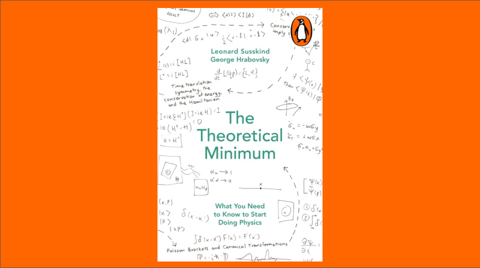

# Classical Mechanics

This post is a summary of classical mechanics based closely on Leonard Susskind's first book in his _Theoretical Minimum_ series. The post starts with a discussion of states and dynamics and then derives the various formulations of classical mechanics, touching on symmetries, conservation laws and determinism.

- [Classical Mechanics](#classical-mechanics)
    - [The Nature of It](#the-nature-of-it)
    - [Newton's Formulation](#newtons-formulation)
    - [More Than One Particle](#more-than-one-particle)
    - [Energy](#energy)
    - [The Action Principle](#the-action-principle)
    - [Symmetry and Conservation](#symmetry-and-conservation)
    - [The Hamiltonian Formulation](#the-hamiltonian-formulation)
    - [The Phase Space Fluid](#the-phase-space-fluid)
    - [Poisson Brackets](#poisson-brackets)
    - [Last](#last)
      - [Properties \& Principles](#properties--principles)
      - [Dynamics Equations](#dynamics-equations)
      - [Definitions](#definitions)

### The Nature of It

Classical mechanics is about the dynamics of systems that operate on relatively intuitive scales. Nothing is so small that quantum effects matter and nothing is so fast or massive that relativity has to be accounted for. Typically when you think of classical mechanics you think of masses on springs, planets orbiting stars, or waves propagating through water.

A fundamental concept in CM, and perhaps all of physics, is that of a _state_. States define how a system is configured at a given point in time and encode everything there is to know about the system in order to predict its subsequent state.

In terms of dynamics, all states within a system have a unique predecessor state and a unique successor state. As time ticks forward states transition from one to the next according to a state-transition rule, which can be encoded in various ways as we'll see. The consequence of such unique transitions is that once a state is specified along with the transition rule, all past and future states are uniquely determined. In other words, classical mechanics is a deterministic model of the universe.

### Newton's Formulation

Newton's formulation defines dynamics as the solution to a second order ODE given by $$F(x) = m\ddot{x}$$, where $$F$$ is a transition rule that's encoded in terms of a force acting on a particle of mass $$m$$. Usually this equation is solved by inputing $$x(t_0)$$, $$\dot{x}(t_0)$$ and $$F$$, and integrating over time to get the particle's trajectory. For a system of one particle, the state at time $$t$$ is defined by the vector $$(x(t),\dot{x}(t))$$. This vector and the dynamics encoded by $$F = m\ddot{x}$$ tell us everything we need to know about the system's evolution.

### More Than One Particle

For systems with more than one particle there's an $$x$$ and an $$\dot{x}$$ for each particle. For a system of $$N$$ particles in 3-space the state vector has $$6N$$ entries, and the system as a whole follows a trajectory through $$6N$$ dimensional state-space, even though each individual particle follows a trajectory through its own individual $$6$$ dimensional state-space. 

As an alternative to expressing a system's state in terms of $$x$$ and $$\dot{x}$$, we can express it in terms of $$x$$ and $$p$$. The reason is because the dynamics equation $$F=m\ddot{x}$$ is equivalent to $$F=\dot{p}$$, which formulates a particle's trajectory in terms of the vector $$(x(t),p(t))$$, with initial conditions $$x(0)$$ and $$p(0)=\dot{x}(0)/m$$. 

This space—where one axis is $$x$$ and the other is $$p$$—is called _phase space_. The reason we might want to use phase space instead of state space is because sometimes objects don't have masses (such as photons) and phase space allows us to avoid defining dynamics explicitly in terms of mass. Also, the Lagrangian and Hamiltonian formulations that we'll look at later deal directly with momentum, so it's more natural to work with momentum instead of velocity as a state-defining variable.

### Energy

A fundamental principle of physics is that all fundamental forces derive from a scalar function called _potential energy_: $$F(x) = -\nabla V(x)$$, and that the sum of potential and kinetic energy $$T = mv^2/2$$ is conserved. Note that in general $$F$$ is a vector and so is $$x$$, but I'm leaving them unbolded for now since we can easily generalize from one dimension if needed.

To verify that energy is conserved we have to show that $$\dot{E} = 0$$:

$$
\begin{align}
\dot{E} &= \dot{T} + \dot{V} \\
&= m\dot{x}\ddot{x} + \frac{\partial V}{\partial x}\dot{x} \\
&= m\dot{x}\ddot{x} - F\dot{x} \\
&= m\dot{x}\ddot{x} - m\ddot{x}\dot{x} \\
&= 0
\end{align}
$$

Note that there exist so-called _non-conservative_ forces for which force _isn't_ the gradient of a potential. For example, friction and air resistance are non-conservative. These forces, however, are not fundamental like gravity or electromagnetism and therefore fall outside of this rule's jurisdiction. Furthermore, when analyzing friction and drag we usually only model the object which is slowed down and not all of the individual air molecules which produce the drag. So in addition to this force not being fundamental, the system isn't closed. I like to call non-conservative forces "convenience" or "phenomenological" forces.

### The Action Principle

The action principal states that of all the trajectories that exist in state space, the one that's actually taken by a system is the one that minimizes the integral

$$
A = \int_{t_0}^{t_1} L(x(t),\dot{x}(t)) \, dt
$$

Where $$L = T - V$$  is called the _Lagrangian_, and $$A$$ is the trajectory's _action_ (a scalar). Although this is usually called the principle of _least_ action, it's really a statement about trajectories on an action-extrema, so sometimes it's called the principle of _stationary_ action instead. 

The stationary trajectory satisfies the Euler-Lagrange equation:

$$
\frac{d}{dt}\frac{\partial L}{\partial \dot{x}} = \frac{\partial L}{\partial x}
$$

To verify this result, we can plug in $$L = m\dot{x}^2/2 - V(x)$$ and find that it produces Newton's equation $$m\ddot{x} = -\partial V/\partial x$$. For systems of more than one degree of freedom there's a separate EL equation for each degree of freedom.

If the least-action formulation is equivalent to Newton's equation, then why should we care about it? Here are a few reasons:

- Entire theories, such as electrodynamics, Einstein's gravity, and the standard model of elementary particles are described by Lagrangians.
- It makes coordinate transformations more convenient, such as if we move between a stationary and rotating coordinate system.
- It allows us to conveniently incorporate constraints on trajectories through the use of _generalized coordinates_.

Generalized coordinates let us step away from Cartesian coordinates and use whatever coordinates we want as long as they uniquely specify a system's state. For example, if we were modeling a double pendulum we could use one pendulum's angle relative to the vertical as the first generalized coordinate and the second pendulum's angle relative to the first's as the second, as opposed to awkwardly using the x-y positions of each. 

The convenience of generalized coordinates is furthered by the fact that they seamlessly integrate constraints into motion. For example, if a particle is constrained to move on a manifold, then by choosing generalized coordinates on that manifold we automatically get dynamics equations in terms of those coordinates.

Notationally, $$q$$ and $$\dot{q}$$ are used for generalized position and velocity. The EL equation is then

$$
\frac{d}{dt}\frac{\partial L}{\partial \dot{q}} = \frac{\partial L}{\partial q}
$$

Each generalized coordinate has an associated generalized momentum called its _conjugate momentum_. To figure out what it is, note that

$$
\frac{\partial L}{\partial \dot{q}} = m\dot{q} = p
$$

So we define $$\partial L/\partial \dot{q}$$ as the generalized momentum conjugate. 

Why did we go through all of the trouble to compute a momentum which we already knew? Because sometimes momentum isn't obvious, and in such cases this formula is more convenient. For example, consider motion in polar coordinates where

$$
L = T = m(\dot{r}^2 + r^2\dot{\theta}^2) \,/\, 2
$$

The radial and angular momenta are easy to calculate in the Lagrangian formulation:

$$
p_r = \frac{\partial L}{\partial \dot{r}} = m\dot{r} \\
p_\theta = \frac{\partial L}{\partial \dot{\theta}} = mr^2\dot{\theta}
$$

Note that for $$\theta$$ the right-hand side of the EL equation is $$0$$, so $$\dot{p}_\theta=0$$ and we see right away that angular momentum is conserved.

### Symmetry and Conservation

We already know that coordinate reference frames are arbitrary and therefore don't influence dynamics, but how do symmetries such as this appear in the Lagrangian formulation? Here's an example:

Consider a two-particle system where the first particle has position $$\textbf{r}$$ and the second has position $$\textbf{s}$$. A typical Lagrangian for the first particle might be

$$
L = \frac{1}{2}m\dot{r}^2 - V(|\textbf{r} - \textbf{s}|)
$$

If we translate the entire system to $$\textbf{r}' = \textbf{r} + \textbf{a}$$ and $$\textbf{s}' = \textbf{s} + \textbf{a}$$, then the new Lagrangian is

$$
\begin{align}
L' &= \frac{1}{2}m\dot{r}'^2 - V(|\textbf{r}' - \textbf{s}'|) \\
&= \frac{1}{2}m\dot{r}^2 - V(|\textbf{r} + \textbf{a} - \textbf{s} - \textbf{a}|) \\
&= L
\end{align}
$$

So $$L$$ doesn't change and the system's dynamics are unaffected. Similarly, if we rotate the entire system to $$\textbf{r}' = \textbf{Rr}$$ and $$\textbf{s}' = \textbf{Rs}$$, then the new Lagrangian is

$$
\begin{align}
L' &= \frac{1}{2}m \left(\textbf{R}\dot{\textbf{r}}\right)^T\textbf{R}\dot{\textbf{r}} - V\left(|\textbf{Rr} - \textbf{Rs}|\right) \\
&= \frac{1}{2}m\dot{r}^2 - V\left(\left(\textbf{R}(\textbf{r}-\textbf{s})\right)^T \textbf{R}(\textbf{r}-\textbf{s}) \right) \\
&= L
\end{align}
$$

The Lagrangian is unchanged again, as expected (note that $$\textbf{R}^T\textbf{R} = \textbf{I}$$).

What about more general transformations, how do they change $$L$$? In general, the change in $$L(q,\dot{q})$$ is

$$
dL = \sum_i \left( \frac{\partial L}{\partial \dot{q}_i}d\dot{q}_i + \frac{\partial L}{\partial q_i}dq_i \right)
$$

Plugging in the EL equation and re-arranging terms turns this into

$$
dL = \frac{d}{dt} \sum_i p_i \ dq_i
$$

Where $$dq_i$$ encodes the general (infinitesimal) coordinate transformation in question. Now, if we already know that $$L$$ is invariant to a particular transformation, then $$dL = 0$$ and we discover a corresponding conserved quantity 

$$
\sum_i p_i \ dq_i = \text{const}
$$

How does this work out for the translation and rotation examples above? For translation, the infinitesimal equivalent is 

$$
q'_i = q_i + \epsilon
$$

So $$dq_i \equiv q_i' - q_i = \epsilon$$ and $$\sum_i p_i = \text{const}$$. This says that translational invariance implies linear momentum conservation. 

For rotation, if we consider a particle in 2-dimensions, we get

$$
\begin{align}
x' &= x\cos(\epsilon) + y\sin(\epsilon) \\
&= x + y\epsilon \\
y' &= -x\sin(\epsilon) + y\cos(\epsilon) \\
&= -x\epsilon + y
\end{align}
$$

So $$dx = y\epsilon$$ and $$dy = -x\epsilon$$, and $$p_xy - p_yx = \text{const}$$. This says that rotational invariance implies angular momentum conservation. 

In summary, if the Lagrangian is symmetric under the general transformation

$$
dq_i = f_i(q)\epsilon
$$

then a corresponding conserved quantity exists, and that quantity is proportional to $$\sum_i p_i \ dq_i = \sum_i p_i f_i(q)$$. (Note that $$\epsilon$$ can be ignored in this last equation because it's a constant.)

### The Hamiltonian Formulation

So far we've seen that coordinate invariance leads to momentum conservations. What about energy conservation? Energy conservation comes from time-translation invariance, which physically means that systems behave the same way if they evolve now, in the past, or in the future, as long as the time shift is applied to the entire system.

In general, a Lagrangian $$L(q,\dot{q},t)$$ changes with time according to

$$
\frac{dL}{dt} = \sum_i \left( \frac{\partial L}{\partial q_i} \dot{q}_i + \frac{\partial L}{\partial \dot{q}_i} \ddot{q}_i  \right) + \frac{\partial L}{\partial t}
$$

Inserting the EL equation and rearranging yields

$$
\frac{dL}{dt} = \frac{d}{dt} \sum_i p_i\dot{q}_i + \frac{\partial L}{\partial t}
$$

or

$$
\frac{d}{dt}\left( L - \sum_ip_i\dot{q}_i \right) = \frac{\partial L}{\partial t}
$$

Now, if $$L$$ doesn't explicitly depend on time, that is to say that the Lagrangian is time-translation invariant, then $$\partial L / \partial t = 0$$ and the conserved quantity is

$$
H \equiv \sum_ip_i\dot{q}_i - L
$$

What is this quantity? Lets plug in a simple $$L$$ and find out:

$$
\begin{align}
H &= p\dot{q} - \frac{1}{2}m\dot{q}^2 + V(q) \\
&= m\dot{q}\dot{q} - \frac{1}{2}m\dot{q}^2 + V(q) \\
&= T + V \\
&= E
\end{align}
$$

It's the total energy, and it's conserved. Note that if $$L$$ depended explicitly on time, then the system would not be time-translation invariant and its energy would change according to $$\partial L / \partial t$$.

$$H$$ is called the _Hamiltonian_ and it's yet another way to encode, or represent, a system. But like the Lagrangian it isn't a dynamics equation defining a trajectory, for that we have the EL equation. Does the Hamiltonian have its own version of the EL equation? To find out let's do what we tend to do when we have a new mathematical object: compute its differential. 

$$
dH = \sum_i \left( p_i d\dot{q}_i + \dot{q}_i dp_i \right) - dL
$$

Using the result for $$dL$$ from above, canceling terms, and using EL identities simplifies this to

$$
dH = \sum_i \left( \dot{q}_i dp_i - \dot{p}_i dq_i \right)
$$

Comparing this to the general form of the differential

$$
dH(q,p) = \sum_i \left( \frac{\partial H}{\partial q_i}dq_i + \frac{\partial H}{\partial p_i}dp_i \right)
$$

we see that 

$$
\frac{\partial H}{\partial q_i} = -\dot{p}_i \\
\frac{\partial H}{\partial p_i} = \dot{q}_i
$$

Together these are the dynamics equations for the Hamiltonian. Whereas the EL equation is a single second-order equation for $$q$$, the Hamilton equations are two first-order equations for $$q$$ and $$p$$, and dynamics are defined in terms of trajectories through phase space, as opposed to configuration space.

### The Phase Space Fluid

What are trajectories like in phase space? Firstly, they each define a contour of constant energy, if they didn't then energy wouldn't be conserved. Second, trajectories with different initial conditions never converge with each other, and a single trajectory never diverges into multiple trajectories. In other words distinct trajectories stay distinct. This is a re-statement of the $$-1^{\text{st}}$$ Law from earlier: all states have unique successor states and unique predecessor states. Dynamics are deterministic.

To see why the $$-1^{\text{st}}$$ Law is true in the context of the Hamiltonian formulation, we'll imagine that trajectories are like particles moving in a phase space 'fluid' and show that the divergence of these 'particles' is everywhere zero. Divergences act on vector fields, and in the case of phase space the vector field in question is a 'velocity' field defining how trajectories change in time:

$$
\textbf{v}(q,p) \equiv (\dot{q},\dot{p}) = \left( \frac{\partial H}{\partial p}, -\frac{\partial H}{\partial q} \right)
$$

The gradient operator in phase space is

$$
\nabla = \left( \frac{\partial}{\partial q}, \frac{\partial}{\partial p} \right)
$$

The divergence is 

$$
\nabla \cdot \textbf{v} = \sum_i \frac{\partial}{\partial q_i}\frac{\partial H}{\partial p_i} - \frac{\partial}{\partial p_i}\frac{\partial H}{\partial q_i}
$$

Because the order of partial differentiation doesn't matter the divergence is zero and phase space is incompressible. Trajectories don't converge or diverge. This result is called the Gibbs-Liouville theorem, a corollary to it is that trajectory-volumes in phase space are conserved.

### Poisson Brackets

Poisson brackets are the last part of classical mechanics I'll summarize. They deal with computing time-derivatives of functions over phase space $$\dot{F}(q,p)$$ in terms of the Hamiltonian.

The time derivative of a function over phase space is

$$
\begin{align}
\dot{F}(q,p) &= \sum_i \left( \frac{\partial F}{\partial q_i} \dot{q}_i + \frac{\partial F}{\partial p_i} \dot{p}_i \right) \\
&= \sum_i \left( \frac{\partial F}{\partial q_i} \frac{\partial H}{\partial p_i}  - \frac{\partial F}{\partial p_i} \frac{\partial H}{\partial q_i} \right) \\
&\equiv \{F,H\}
\end{align}
$$

where $$\{F,H\}$$ is defined as the _Poisson bracket_ of $$F$$ with $$H$$. PBs have several identities associated with them, which I won't enumerate, but to get a taste:

- Antisymmetry: $$\{A,B\} = -\{A,B\}$$
- Linearity: $$\{kA,B\} = k\{A,B\}$$ and $$\{(A+B),C\} = \{A,C\} + \{B,C\}$$
- Hamilton's equations are reproduced by plugging in $$F = q$$ and $$F = p$$
- And many more!

Thus, to find the time rate of change for any quantity, just compute its PB with the Hamiltonian.

### Last

It's interesting to note that the Hamiltonian formulation was derived using the Lagrangian formulation, for example to derive the Hamilton equations it was necessary to substitute the EL equation. In this sense the Lagrangian seems to be more fundamental than the Hamiltonian. Likewise the EL equation was derived in terms of the action principle, so the action principle appears to be the most fundamental of all. This shouldn't come as a surprise though, after all it's a _principle_, so someone made it up! (the original author is disputed, but it's probably either Fermat, Maupertuis or Gauss, back in the 1740s).

Here are a few things to wrap up with: 

#### Properties & Principles

- Classical systems follow state-space trajectories that minimize their action. 
- Phase space is incompressible and trajectories are deterministic (the $$-1^{\text{st}}$$ Law).
- If the Lagrangian is symmetric under a transformation, then that transformation has a corresponding conserved quantity.

#### Dynamics Equations

There are different dynamics equations to use depending on how a system is encoded:

| Encoding    | Dynamics Equation          |
| ----------- | -------------------------- |
| Forces      | Newton's second law        |
| Lagrangian  | EL equation                |
| Hamiltonian | The two Hamilton equations |

#### Definitions

- Hamiltonian: $$H =\sum_ip_i\dot{q}_i - L$$
- Generalized momentum: $$p_i = \partial L/\partial \dot{q}_i$$
- Poisson bracket: $$\{A,B\}$$, see above for explicit definition



