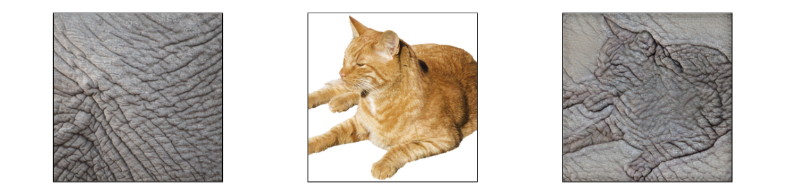
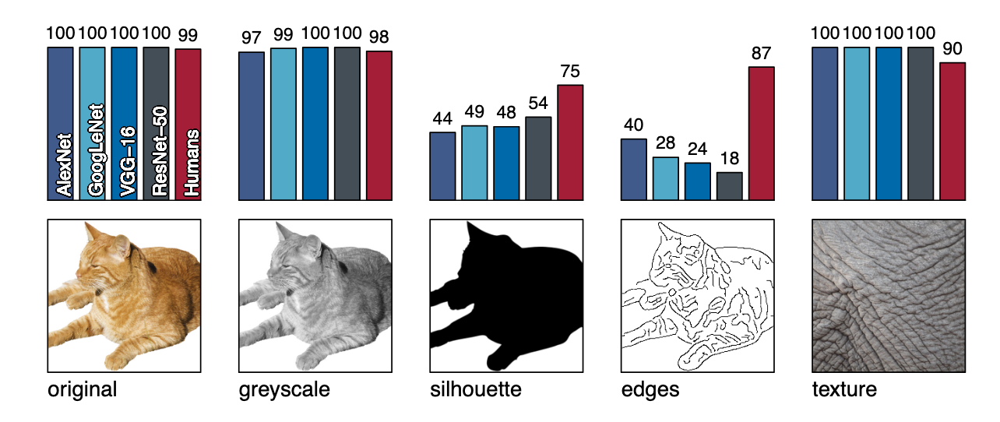
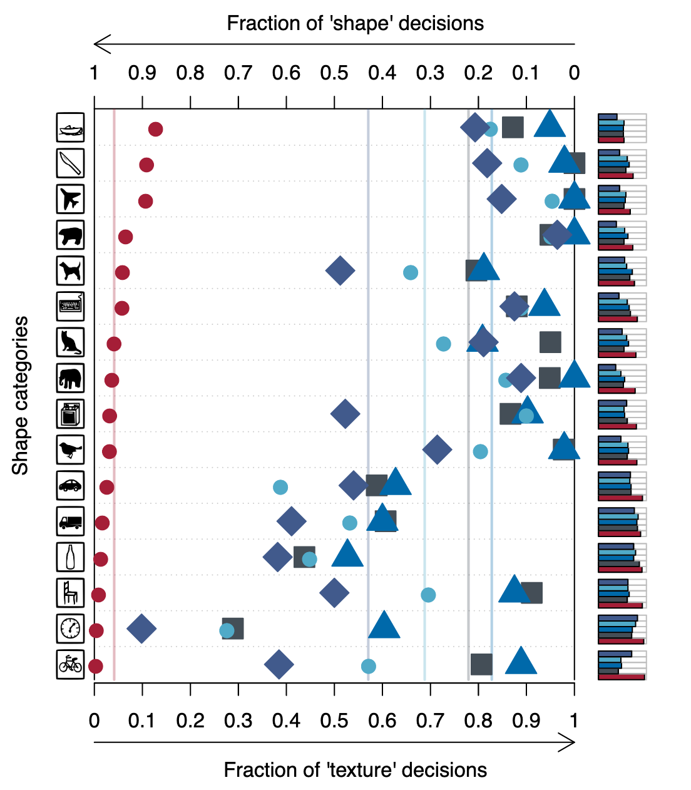
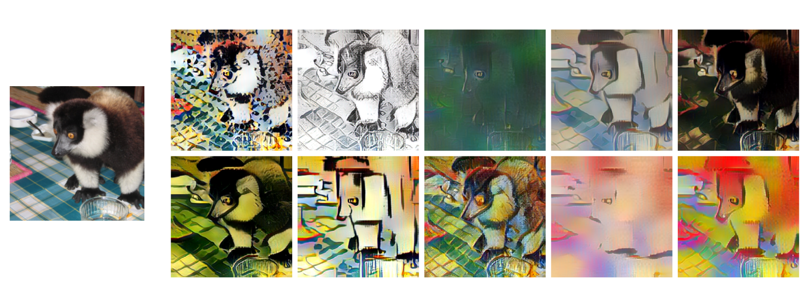
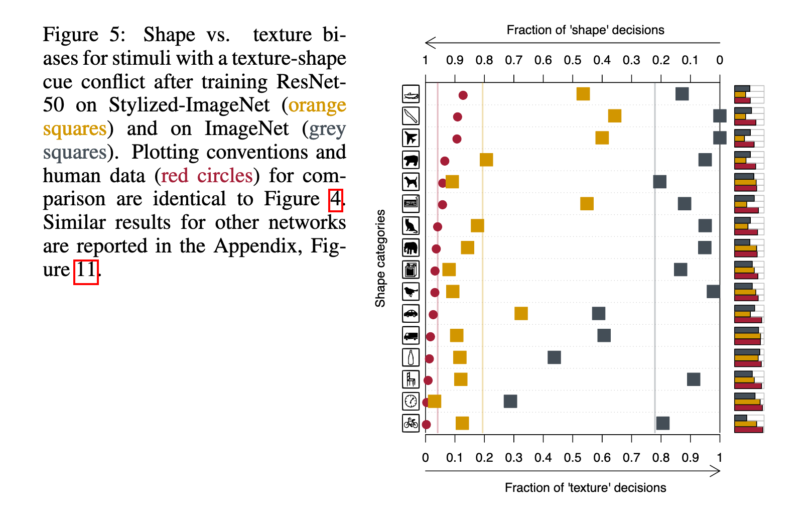
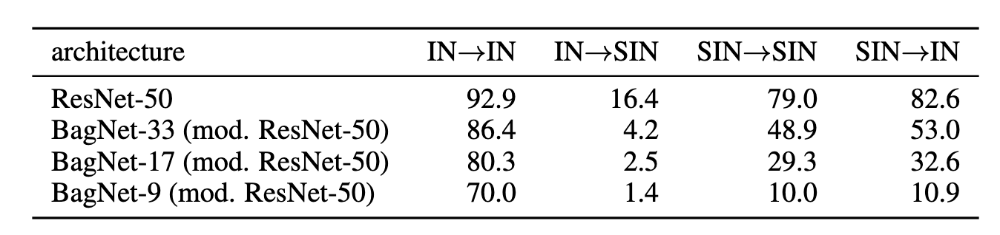
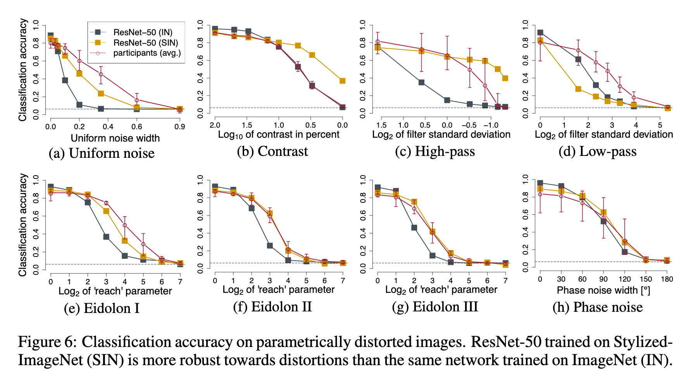

# TLDR: "ImageNet-trained CNNs are biased toward texture; increasing shape bias increases accuracy and robustness", Geirhos et al, 2019

This paper investigates texture and shape bias in CNNs by looking at how models perform when texture and shape are removed or conflated in images. "Texture" is hand-wavily defined as "an image region with spatially stationary statistics". What these statistics are exactly is left to the reader as an exercise. Nevertheless, distinguishing texture from shape is generally intuitive and easy for people (e.g., elephant skin vs cat outline), so texture and shape labels can be assigned to images without much ambiguity.

To remove or conflate texture with shape, the authors apply the following transformations to ImageNet images:

- Greyscale: keep shape and texture
- Silhouette: keep foreground object's outline, remove texture, preserve coarse shape
- Canny edges: remove texture, preserve fine shape
- Cue-conflict: transfer texture from one object to another (see the cat-elephant above)

Predicting on these images gives the top-5 accuracies shown below. This suggests that _humans are shape-biased while CNNs are texture biased_.

Predicting on the cue-conflict images, the authors find similar results, shown below. Red marks predictions made by human participants and blue by CNNs, with shape corresponding to architecture. A "texture decision" is when the class of the texture is correctly predicted (e.g. elephant) and a "shape decision" is when the class of the shape object (e.g. cat) is correctly predicted. Incorrectly classified images are ignored.

To overcome texture bias (is texture bias a bad thing that needs to be overcome?), the authors do what we normally do to induce robustness: train on a lot of variations of the thing you want to be robust to, like rotating images randomly during training to be robust to rotations. For texture bias this means training on images that have had random texture variations applied. What's a texture variation? To the authors, it's what you get when you transfer style from a painting to a normal image. The authors create what they call Stylized ImageNet (SIN), consisting of ImageNet image that are stylized using a set of ~80,000 texture sources:

These images tend to retain the overall shape of the foreground subject (class label), but certainly not the texture, at least not on average.

As desired, training on SIN reduces texture bias on the cue-conflict images:

At this point the authors have presented an interesting property of ImageNet-trained CNNs, namely that their cues differ from peoples', and that their cue-bias can be switched via SIN training.  This is a valueable insight, but unanswered is still the question of whether one cue is more desireable than the other.

To answer this, the authors go through the permutations of training/testing on IN/SIN:

Evidently, models biased toward shape (trained on SIN) are much better at classifying normal images (IN) than the other way around (training on IN then testing on SIN), so it seems that shape cues may be more reliable. The last obvious thing to do is train on IN _and_ SIN then test on IN, because, after all, models in deployment will be looking at normal IN-like images, not psychedelic SIN images.

The result is that SIN+IN trained models are almost exactly as accurate on IN as IN trained models are, so would we ever want to do SIN training in practice, purposefully biasing a model toward shape? I believe yes. Shape-biased models in some sense 'see' images more like people do, and so one might expect them to be easier to interperet and explain. Furthermore, in the last part of their analysis, the authors show that an SIN-trained model is more robust to certain perturbations than an IN-trained model:

An analysis which wasn't presented, but which would be interesting to see, is if shape biased models can be adversarially attacked in the same ways as texture biased models. Many of the current algorithms for generating attacks yield perturbations that have a texture remniscant of the adversarial target class (see: [toaster sticker](https://arxiv.org/pdf/1712.09665.pdf)). If a model is shape-biased, then these attacks may be less successful, or they may be forced to modifying shape features which are, as this paper has shown, more salient to people, making the typical adversarial constraint of imperceptibility harder to satisfy.

## References

- [Noise or Signal: The Role of Image Backgrounds in Object Recognition](https://arxiv.org/abs/2006.09994), Xiao et al, 2020
- [ImageNet-trained CNNs are biased towards texture; increasing shape bias improves accuracy and robustness](https://openreview.net/pdf?id=Bygh9j09KX), Geirhos et al, 2019
- [The Origins and Prevalence of Texture Bias in Convolutional Neural Networks](https://arxiv.org/abs/1911.09071), Hermann et al, 2019


