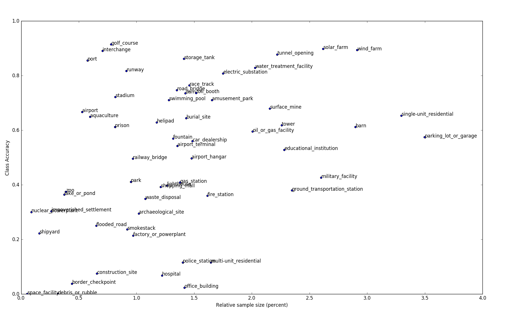

<link rel="stylesheet" type="text/css" media="all" href="quote.css" />

# Sattelite Image Classification on the FMoW Dataset

The Functional Map of the World dataset (FMoW) is a satellite image dataset recently released by IARPA.  Each image in the dataset contains a bounding box over an object of interest and the goal is to train a classifier to correctly label bounding boxes.  This post lists some observations I've made while working with FMoW.

### Fine-Tuning Works
Despite the dissimilarity between satellite images and ImageNet, both VGG and ResNet architectures with Imagenet weights can be fine-tuned to predict FMoW labels reasonably well.  VGG16 turned out to be slightly more accurate than ResNet, so it's what I use from this point forward.

VGG16 was trained on cropped bounding boxes that were re-shaped to 224x224.  All convolutional blocks except the first were fine-tuned, and a single fully connected layer with 256 nodes was used with a softmax classifier.  I found that the more convolutional blocks that were trained the more accurate the model was, but shallower blocks were less influential than deeper ones.  I also found that increasing the number of fully-connected nodes didn't influence accuracy much and neither did adding a second fully-connected layer.

Below are examples of accurate predictions despite image noise and discoloration.  Also shown is a training curve with an end accuracy of 61%, this is the top-1 accuracy.  The top-2 accuracy is 74% and the top-5 accuracy is 86%, which suggests that better top-1 accuracy within reach.

Above: Accurate predictions despite image noise and discoloration.

Above: VGG16 confusion matrix.

Above: Training curve for fine-tuned VGG16.

 

### Small Sample Size Doesn't Imply Small Accuracy
Some classes in FMoW are hugely underrepresented.  The class `port`, for example, only accounts for about 0.5% of the entire dataset (roughly 500 images), but the accuracy for `port` was one of the highest (about 85%).  Ports have features that easily distinguish them from other classes, so the effects of features can sometimes out-weigh the effects of sample size.

The scatterplot below shows how accuracy relates to sample-size for each class.  Accuracy is positively correlated with sample size, but the correlation is wide.  Furthermore, reducing the sample size of each class to contain about half of the samples only reduces accuracy by a few percent, as shown in the second plot below.

Above: Scatter of accuracy vs. sample size for each class.  Accuracy is positively correlated with sample size, but the correlation is wide.

Above: Validation accuracy for various training set sizes.  Using half of the training set decreases accuracy by only about 5%.

 
## Spatial Context is Important
One of the issues with FMoW bounding boxes is that they don't contain much spatial context.  For example, `airport_terminal` often excludes airplanes and `lighthouse` often excludes water, as shown below, but these are important distinguishing features.

Above: Misclassifications when distinguishing context is excluded from bounding boxes.

 
To incorporate spatial context I trained a second VGG16 on entire images and combined its predictions with the model that was trained on bounding boxes.  There were several ways to combine predictions: class-wise weighting, winner-take-all, model-wise weighting, etc.  I found that accuracy increased the most when I weighted each model's predictions by its overall accuracy. This resulted in a combined accuracy that was about +7% greater than the bounding box model alone.  Interestingly, at least one of the models was correct 75% of the time, so the upper limit on accuracy gain was 11%, which is significant.

## Confusion Matrices Can Be Clustered for Hierarchical Modeling
Visually similar classes often get confused with one another, for example `single-unit_residential` and `multi-unit_residential`, and `airport` and `runway`.  In an attempt to de-confuse these classes, I applied a clustering algorithm (spectral clustering) to VGG16's confusion matrix to identify groups of classes that get confused with each other, then I trained separate VGG16s on each group hoping they would specialize in their respective classes and produce better results.

Unfortunately the results weren't so great.  The clustering technique worked OK, as is indicated by the apparent blocks on the diagonal of the the confusion matrix (shown below), but the hierarchical scheme had about the same accuracy as the non-hierarchical scheme.  This might be because accuracy had saturated given the features and sample-sizes used, or perhaps the fc-layer was already implementing a form of hierarchical modeling owing to the use of dropout, so creating a DIY hierarchy was redundant.

Above: fMoW classes after being sorted so classes of the same cluster are adjacent. (The diagonal is zeroed so the off-diagonal is more apparent.)

 

## Experimenting with Sample Size Distributions
The sensitivity of scoring metrics to sample distributions is something that's well known and relevant across all of machine learning.  In this study I used accuracy as a metric because I knew the validation set contained a class-wise fraction of the training set, i.e., the validation set had the same class-distribution as the training set, so bias would favor overrepresented classes, which is good for accuracy.

To show how different scoring metrics respond to different train/test distributions I constructed three different distributions and trained and tested models on all nine pairs of them.  Shown below are the train/test distributions.  Also shown are the 3-fold averaged validations for accuracy and f-score.

When accuracy is used as a metric it's best to select a training distribution that matches the testing distribution, even if it's biased, but when f-score is used as a metric a uniform training distribution is generally preferred.  These results are as expected but please keep in mind that only three folds were used and the score variations are relatively small.

Above: Accuracies and fscores for different combinations of train/test sample distributions.  Biased training sets are appropriate if accuracy is used as a metric and the testing distribution matches that of the training.  

 


