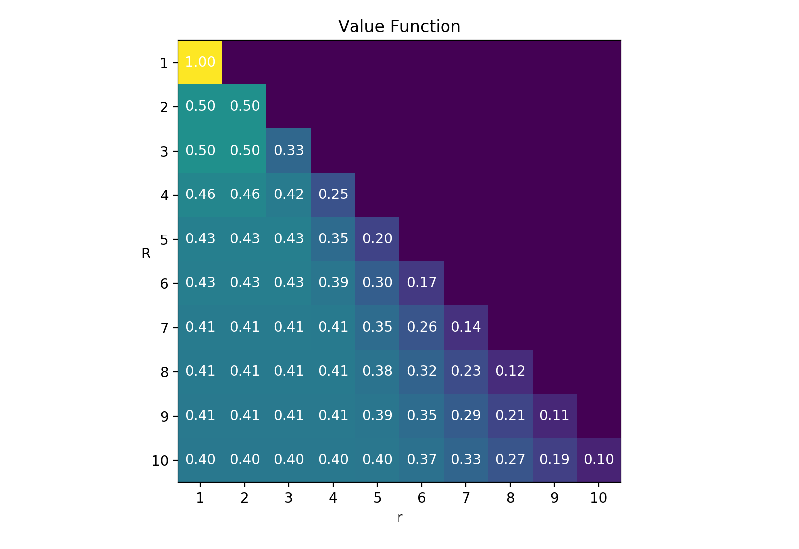

# The Hiring Problem

Suppose you're interviewing candidates for a job.  A job that _must_ be filled by the best candidate, otherwise your company is bound to fail.  The candidates you have lined up are top-notch, but this means they have offers on the table from your competitor, and they'll take those offers unless you hire them on the spot.

Candidates are rank-able, so they can be sorted ordinally according to how fit they are.  A candidate's fitness is determined after you interview them, at which time you either hire or pass to the next candidate.  If you pass on a candidate, you can't go back later and make them an offer; they've already accepted your competitor's offer!

Your objective is to hire the top-ranking candidate.  What's your strategy?

### The optimal strategy

First I'll tell you the optimal strategy, then we'll solve for the details.

The optimal strategy is to automatically pass on a fixed number of candidates and then select the first one who's better than the rest seen so far.  If no better candidate is found, select the last one (you have to, they're the only one left).

The intuition is as follows: All ranks are independent, and candidate order is uniformly random, so knowing the relative rank of the cadidate's you've interviewed doesn't help predict the relative rank of candidates to come, so the best strategy is to pass on the first several candidates (possibly only one) and hope to find the best after this.  As for _when_ to choose, if you did something like "choose the 6th candidate always", you'd ignore the fact that the 6th candidate might not be better than the first 5, and since you're looking for rank-$$1$$ you should pass, even if this means passing until you get to the last candidate (in this version of the problem selecting rank-2 is equally as bad as selecting the bottom-ranked candidate).

So the question becomes: what's the cutoff after which you should start looking for the best-so-far, i.e., transition from exploring possibilities to exploiting what you know?

### Finding the cutoff

I'm going to find the cutoff using backward induction.  Like most backward induction problems it helps to look at a state-action diagram:

In the diagram time flows downward with candidates being interviewed sequentially. Arrows point to outcomes, which can either be another interview or the option to hire.

When candidate number $$r$$ is interviewed they can either be the best-so-far or not.  If they're not, we pass automatically (as per the heuristic); if they are, we can hire or pass.  If we hire, we're done.

Given that a candidate is best-so-far, we need to decide if it's better to hire them or pass.  This is done by computing two things: the probability that they're rank-1, and the probability that we'll find and hire rank-1 if we pass.  Lets call the first quantity $$P(1 \vert \text{bsf})$$ and the second quantity $$V(r+1)$$.  In the parlance of backward induction $$V$$ is the _value function_ and $$V(r+1)$$ is the value of being in _state_ $$r+1$$.  $$\text{bsf}$$ is a binary variable indicating if the current candidate is the best-so-far.

The solution is to hire when $$P(1 \vert \text{bsf}) \ge V(r+1)$$, otherwise pass.

### Computing P and V

The value function has a term for the best-so-far outcome and a term for the not-best-so-far ourcome:

$$V(r) = V(r \vert \text{bsf})P(\text{bsf} \vert r) + V(r \vert \neg\text{bsf})(1-P(\text{bsf} \vert r))$$

Here, $$P(\text{bsf} \vert r)$$ is the probability that candidate $$r$$ will be the best-so-far before we've interviewed them.  To compute it, we need to count the number of ways $$\text{bsf}$$ can happen.

Here's an example of how to do this.  Suppose there are 5 candidates and we're about to interview candidate 3.  The following are possible rank outcomes, ordered left to right by order of interview:

$$\rightarrow \text{34152}$$

$$\rightarrow \text{43251}$$

$$\text{32514}$$

$$\rightarrow \text{45312}$$

$$\rightarrow \text{45321}$$

$$\text{23451}$$

$$\vdots$$

These are the ranks we would know if we interviewed to the end. If we're at $$r=3$$, the arrowed outcomes are the ones for which $$\text{bsf}=True$$. Our job is to count the number of arrowed outcomes and divide by the total number of possible outcomes.

To start, observe that $$\text{bsf}$$ can only be $$True$$ when $$rank(3) \in \{1,2,3\}$$.  (For example, if $$rank(3)=4$$, there's no way to make $$rank(1) \lt 4$$ and $$rank(2) \lt 4$$.) For each rank in this set, there are a different number of ways to fill in the other 4 ranks. For example, if $$rank(3)=3$$, then the only ranks that can be to the left are 4 and 5, but if $$rank(3)=2$$, then the ranks that can be to the left are 3, 4, and 5.  Note that the number of possible ranks to the left can exceed the number of spaces to the left, and the ranks to the left and right of $$r$$ are independently permutable.  For example, both $$\text{45312}$$ and $$\text{54321}$$ have $$\text{bsf}=True$$.

Putting this all together we get

$$P(\text{bsf} \vert r )=\frac{1}{R!} \sum_{i=1}^{R-r+1}N(i)$$

where

$$N(i) = \binom{R-i}{r-1}(r-1)!(R-r)!$$

The binomial coefficient comes from choosing which ranks to put on the left of $$r$$, and the factorials come from the permutations.  The normalization constant $$1/R!$$ is the total number of possible rank orderings.

The probability simplifies conveniently to $$1/r$$.

Next, let's look at $$V(r \vert \neg \text{bsf})$$.  This one's much easier.  This is the case where we automatically pass to the next candidate, in otherwords $$V(r \vert \neg \text{bsf}) = V(r+1)$$. Easy.

Now $$V(r \vert \text{bsf})$$.  This is where we know candidate $$r$$ is best-so-far.  So what's the value then?  It's the value of choosing the optimal decision.  If the decision is pass, then we move to $$r+1$$ and the value is $$V(r+1)$$. If the decision is keep, then the value is the probability they're rank-1; this probability we've already encountered, it's $$P(1 \vert \text{bsf})$$.  So we have

$$V(r \vert \text{bsf}) = \max \left\{ P(1 \vert \text{bsf}), V(r+1) \right\}$$

To calculate $$P(1 \vert \text{bsf})$$ our job is to count the number of ways a candidate can be rank-1 given they're best-so-far, and divide by the total number of ways to be best-so-far.  $$N(i)$$ counts exactly these things:

$$P(1 \vert \text{bsf}) = \frac{N(1)}{\sum_{i=1}^{R-r+1}N(i)}$$

Which simplifies conveniently to $$r/R$$.

Finally, putting all the pieces together we end up with

$$V(r) = \max \left\{ r/R, V(r+1) \right\} \frac{1}{r} + V(r+1)(1-1/r)$$

And the optimal policy is to hire if $$r$$ is better than the best so-far and  $$r/R  \ge V(r+1)$$.

### Numeric solution

I wasn't able to find a nice compact way of writing $$V(r)$$ in terms of $$r$$ alone, i.e., without recursion, so the next best thing is to compute it numerically, starting from $$V(R)$$ and working backward.  This is where the _backward_ in backward induction comes from.  Here's the result:

Value is constant for early states, corresponding to the probability of finding the best candidate.  After this, the value decreases to $$1/R$$.

Here's the stop-automatically-passing threshold and win probability as a function of $$R$$:

We see that the threshold is linear in $$R$$ and the win probability converges to a constant. Interestingly, this constant is $$1/e$$, meanwhile the slope of the threshold is about 0.37, close to $$1/e$$.

So when all is said and done, the first 37% of candidates should be ignored, in which case the probability of choosing the best candidate maximizes at at least 37%.

Now you know, so go save your company!

