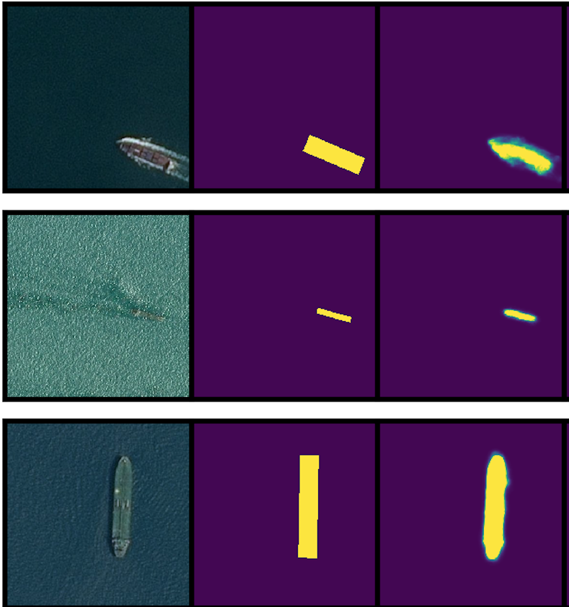
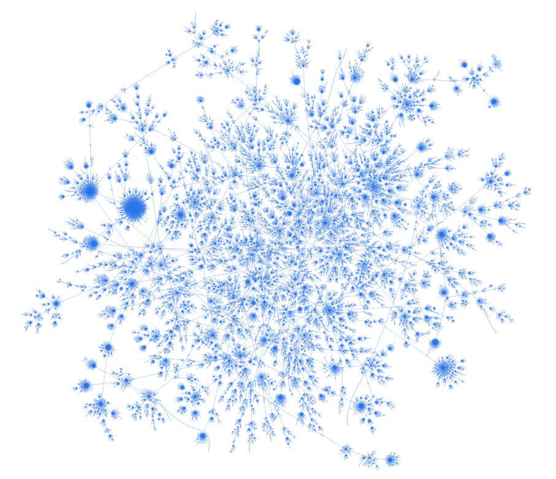
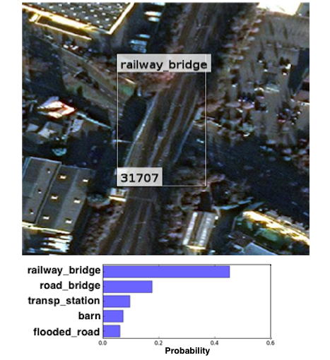
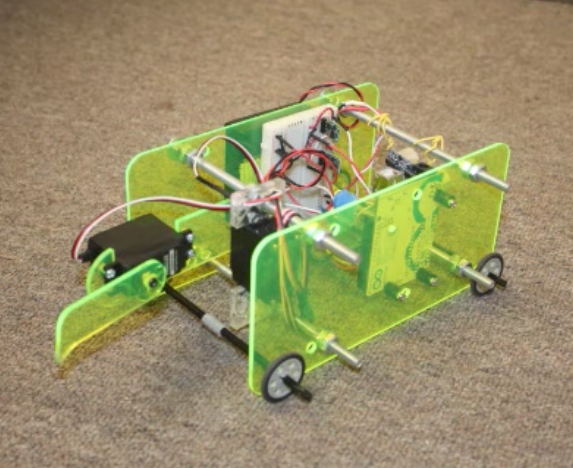
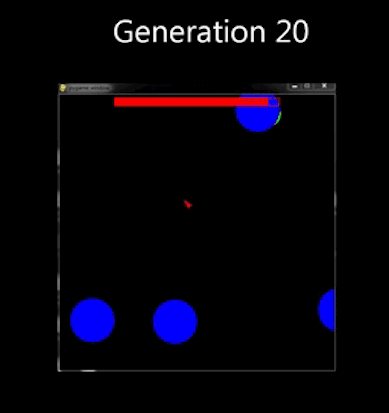
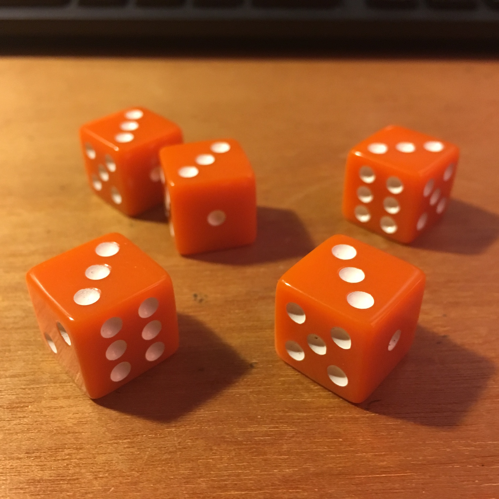

<!-- 
 -->

 
 
 
 

<h4><b>Welcome to</b></h4>

<h2><b>Andrew August's Notebook</b></h2>

<h5><b>Here I keep track of some things I've done, mostly related to Data Science.</b></h5>

 
 
 
 

<table>
<tr class="notebook-table">
  <td colspan="2" class="full">
    
 
    <h3><a href="/airbus/"><b>Kaggle Diary: Ship Segmentation</b></a></h3>
  </td>
 </tr>
 <tr class="notebook-table">
   <td width="50%" class="full">
       
<em>2018-11</em>

       
The Kaggle Ship Detection Challenge provides satellite images of the ocean with ground-truth masks indicating ships in each image.  The objective is to make a model that accurately segments ships in a set of testing images.  This post follows my development of such a segmentation model.

   </td>
   <td width="50%" class="full">
       
        
   </td>
 </tr>
<tr class="notebook-table">
  <td colspan="2" class="full">
    
 
    <h3><a href="/wikilinks/"><b>Exploring the First-Link Taxonomy of Wikipedia</b></a></h3>
  </td>
</tr>
<tr class="notebook-table">
  <td width="50%" class="full">
    
<em>2018-04</em>

    
An interesting property of Wikipedia is that pages often have first-links that go to their immediate superset.  For example, 'poker' first-links to 'card game' and 'card game' first-links to 'game', etc.  Where do all these first-links go?  And what does the first-link taxonomy of Wikipedia look like?

  </td>
  <td width="50%" class="full">
       
        
   </td>
</tr>
<tr class="notebook-table">
  <td colspan="2" class="full">
    
 
    <h3><a href="/fmow/"><b>Satellite Image Classification with Deep CNNs</b></a></h3>
  </td>
 </tr>
 <tr class="notebook-table">
   <td width="50%" class="full">
       
<em>2017-12</em>

       
This post documents the use of CNNs for object classification on The Functional Map of the World Dataset.  I look at fine-tuning, the effects of sample size distribution, and the effect of including spatial context.

   </td>
   <td width="50%" class="full">
       
        
   </td>
 </tr>
<tr class="notebook-table">
  <td colspan="2" class="full">
    
 
    <h3><a href="/rl/"><b>Reinforcement Learning IRL</b></a></h3>
  </td>
 </tr>
 <tr class="notebook-table">
   <td width="50%" class="full">
       
<em>2017-11</em>

       

         This is an Arduino robot that learns to crawl using Q-learning.  The robot initially moves randomly but eventually finds actions that cause continual forward motion. Included is a video of the robot in-action.
       

   </td>
   <td width="50%" class="full">
       
        
   </td>
 </tr>

<tr class="notebook-table">
  <td colspan="2" class="full">
    
 
    <h3><a href="/cm-clustering/"><b>Discovering Class-Hierarchies by Clustering Confusion Matrices</b></a></h3>
  </td>
 </tr>
 <tr class="notebook-table">
   <td width="50%" class="full">
   
<em>2017-10</em>

      

         This is an example where class hirerarchies are discovered by applying spectral clustering to a confusion matrix.
       

   </td>
   <td width="50%" class="full">
       
        
   </td>
 </tr>

<tr class="notebook-table">
  <td colspan="2" class="full">
    
 
    <h3><a href="/neuroev/"><b>Artificial Life, Neural Nets, and Genetic Algorithms</b></a></h3>
  </td>
 </tr>
 <tr class="notebook-table">
   <td width="50%" class="full">
   
<em>2017-10</em>

       

         Can neural nets control Artificial Life agents?  Can genetic algorithms optimize Artificial Life NNs?  In this post a GA called Enforced Subpopulations is implemented to show that <em>yes</em> GAs can optimize NNs, and <em>yes</em> NNs can effectively control AL agents.
       

   </td>
   <td width="50%" class="full">
       
        
   </td>
 </tr>
  <tr class="notebook-table">
    <td colspan="2" class="full">
      
 
      <h3><a href="/bellman/"><b>Solving Threes</b></a></h3>
    </td>
   </tr>
   <tr class="notebook-table">
     <td width="50%" class="full">
     
<em>2017-09</em>

         

           Threes is a dice game definitely worth knowing.  Do <em>you</em> know how to play Threes?  Do <em>you</em> know how to win at Threes?  Here I explain the rules of Threes and use backward induction to find its optimal policy.
         

     </td>
     <td width="50%" class="full">
         
          
     </td>
   </tr>
</table>

 
 
 

<h2>More posts coming soon...</h2>

 
 
 

