<link rel="stylesheet" type="text/css" media="all" href="quote.css" />

<figure class="quote" style="background-color: #212426;">
  <blockquote style="color: #a7a095;">
    Everything is interesting if you go into it deeply enough.
  </blockquote>
  <figcaption>
    &mdash; Richard Feynman, <cite>The Pleasure of Finding Things Out</cite>
  </figcaption>
</figure>

<figure class="quote" style="background-color: #212426;">
  <blockquote style="color: #a7a095;">
    Figuring out the best way to explain something is almost always the best way to understand it yourself.
  </blockquote>
  <figcaption>
    &mdash; Leonard Susskind, <cite>The Theoretical Minimum</cite>
  </figcaption>
</figure>

  
  

    <h2 style="margin-top: 0; margin-bottom: 0.2em;"><a href="thermo-1.html">Statistical Thermodynamics</a></h2>
    
12/2024

    
On the emergence of thermodynamics from the collective motion of microscopic particles.

  

  
  

    <h2 style="margin-top: 0; margin-bottom: 0.2em;"><a href="quantum-3.html">Quantum Mechanics Part III: Joint Systems & Entanglement</a></h2>
    
11/2023

    
On interacting quantum systems, based on Leonard Susskind's book <em>The Theoretical Minimum</em>.

  

  <a href="quantum-2.html" style="flex-shrink: 0; display: block;">
    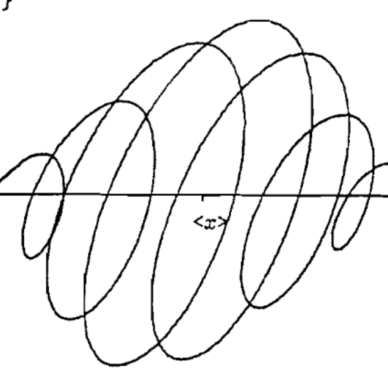
  </a>
  

    <h2 style="margin-top: 0; margin-bottom: 0.2em;"><a href="quantum-2.html">Quantum Mechanics Part II: Dynamics & Continuous States</a></h2>
    
07/2023

    
On quantum dynamics and continuous states, based on Leonard Susskind's book <em>The Theoretical Minimum</em>.

  

  
  

    <h2 style="margin-top: 0; margin-bottom: 0.2em;"><a href="quantum-1.html">Quantum Mechanics Part I: States & Principles</a></h2>
    
06/2023

    
On the foundations of quantum mechanics, based on Leonard Susskind's book <em>The Theoretical Minimum</em>.

  

  <a href="classical-mechanics.html" style="flex-shrink: 0; display: block;">
    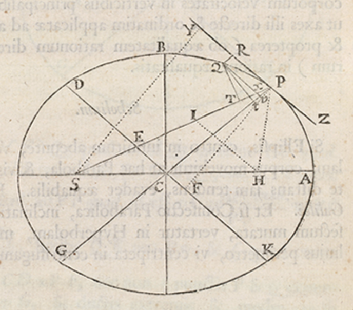
  </a>
  

    <h2 style="margin-top: 0; margin-bottom: 0.2em;"><a href="classical-mechanics.html">Classical Mechanics</a></h2>
    
05/2022

    
On forces, Hamiltonians and Lagrangians, based on Leonard Susskind's book <em>The Theoretical Minimum</em>.

  

  <a href="cnn-texture-bias.html" style="flex-shrink: 0; display: block;">
    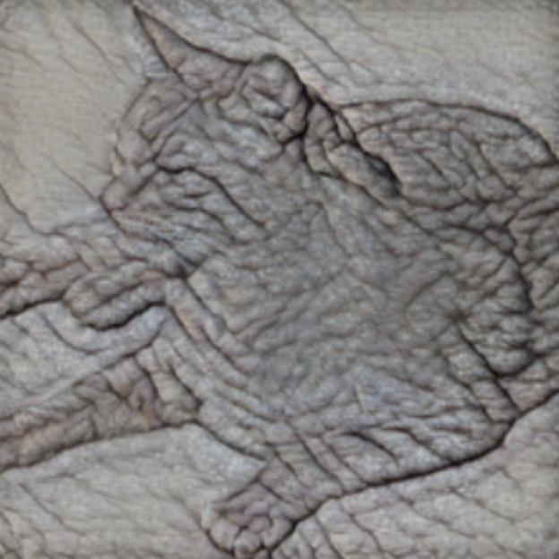
  </a>
  

    <h2 style="margin-top: 0; margin-bottom: 0.2em;"><a href="cnn-texture-bias.html">TLDR: CNN Texture Bias</a></h2>
    
01/2021

    
A summary of the paper <em>ImageNet-trained CNNs are biased toward texture; increasing shape bias increases accuracy and robustness</em> by Geirhos et al, 2019.

  

  
  

    <h2 style="margin-top: 0; margin-bottom: 0.2em;"><a href="platformio-notes.html">PlatformIO Notes</a></h2>
    
02/2020

    
PlatformIO is an IDE for Arduino that supports environments and command-line uploads, but more importantly it has code completion and inspections, which the default Arduino IDE doesn't have.

  

  <a href="hiring-problem.html" style="flex-shrink: 0; display: block;">
    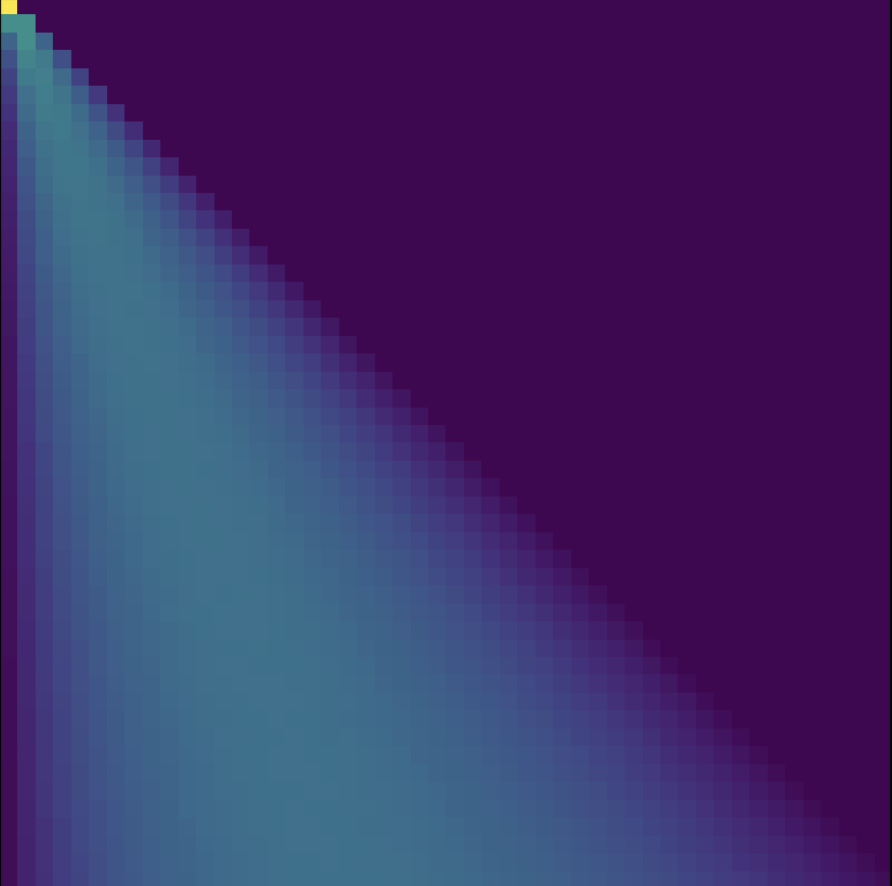
  </a>
  

    <h2 style="margin-top: 0; margin-bottom: 0.2em;"><a href="hiring-problem.html">The Hiring Problem</a></h2>
    
09/2019

    
A toy problem about optimizing the trade-off between information collection and lost opportunity, in the context of hiring job applicants.

  

  <a href="neural-style-transfer.html" style="flex-shrink: 0; display: block;">
    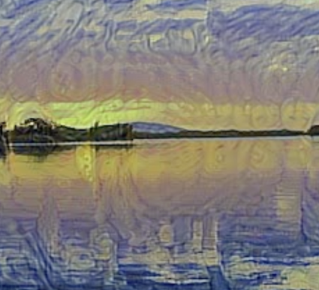
  </a>
  

    <h2 style="margin-top: 0; margin-bottom: 0.2em;"><a href="neural-style-transfer.html">Neural Style Transfer</a></h2>
    
02/2019

    
What defines the <em>style</em> of an image? Can it be captured computationally? If so, is it possible to transfer styles from one image another, like making a selfie appear to be painted by Van Gogh?

  

  <a href="airbus.html" style="flex-shrink: 0; display: block;">
    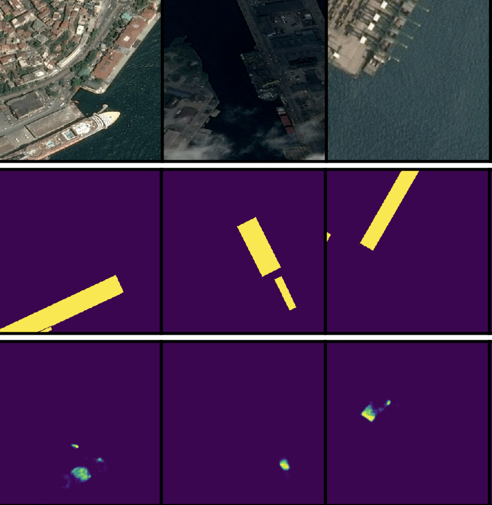
  </a>
  

    <h2 style="margin-top: 0; margin-bottom: 0.2em;"><a href="airbus.html">Kaggle Ship Detection Challenge</a></h2>
    
11/2018

    
Detecting ships in sattelite images, from a Kaggle challenge.

  

  
  

    <h2 style="margin-top: 0; margin-bottom: 0.2em;"><a href="wikilinks.html">The First Link Taxonomy of Wikipedia</a></h2>
    
04/2018

    
The first link on most Wikipedia pages goes to the next most general thing. "Poker" goes to "card game", "card game" goes to "game", etc. Where do all these first links finally lead? Does Wikipedia's have something like a first-link taxonomy?

  

  <a href="fmow.html" style="flex-shrink: 0; display: block;">
    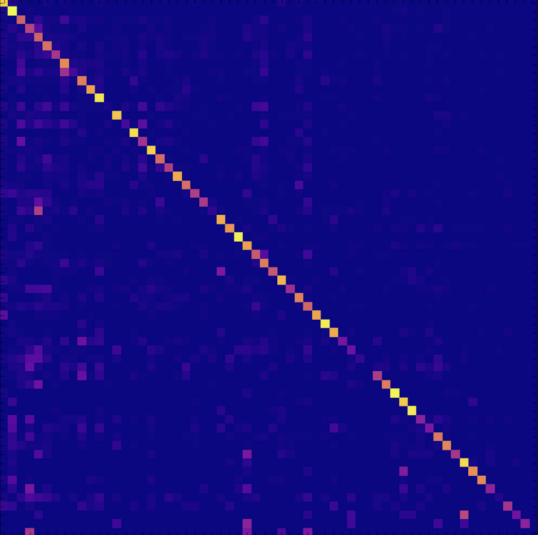
  </a>
  

    <h2 style="margin-top: 0; margin-bottom: 0.2em;"><a href="fmow.html">Satellite Image Classification on the FMoW Dataset</a></h2>
    
12/2017

    
Classifying objects in satellite images, from the Functional Map of the World dataset.

  

  <a href="cm-clustering.html" style="flex-shrink: 0; display: block;">
    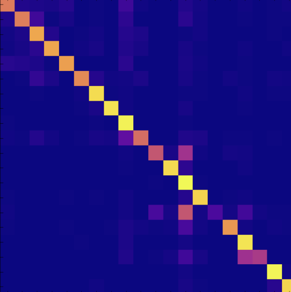
  </a>
  

    <h2 style="margin-top: 0; margin-bottom: 0.2em;"><a href="cm-clustering.html">Discovering Class-Hierarchies by Clustering Confusion Matrices</a></h2>
    
10/2017

    
An example of finding class hierarchies by applying spectral clustering to confusion matrices.

  

  <a href="bellman.html" style="flex-shrink: 0; display: block;">
    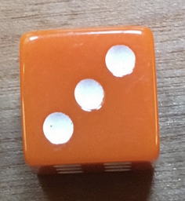
  </a>
  

    <h2 style="margin-top: 0; margin-bottom: 0.2em;"><a href="bellman.html">Solving Threes</a></h2>
    
03/2016

    
A derivation of the optimal policy for the dice game <em>Threes</em>.

  

  <a href="neuroev.html" style="flex-shrink: 0; display: block;">
    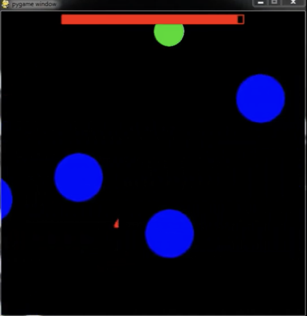
  </a>
  

    <h2 style="margin-top: 0; margin-bottom: 0.2em;"><a href="neuroev.html">Artificial Life, Neural Nets, and Genetic Algorithms</a></h2>
    
11/2015

    
Can neural nets control Artificial Life agents? Can genetic algorithms optimize these nets? In this post I implement a genetic algorithm called Enforced Subpopulations to show that yes, yes they can.

  

  <a href="rl.html" style="flex-shrink: 0; display: block;">
    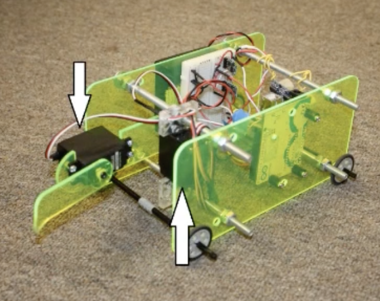
  </a>
  

    <h2 style="margin-top: 0; margin-bottom: 0.2em;"><a href="rl.html">Learning to Crawl: A Physical Implementation of Reinforcement Learning</a></h2>
    
12/2014

    
An Arduino robot learning to crawl using reinforcement learning, with a video about RL and how it's implemented in the robot.

  

  <a href="songbook.html" style="flex-shrink: 0; display: block;">
    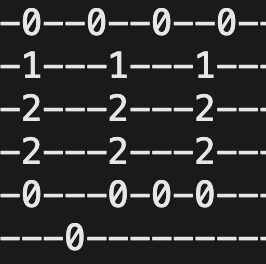
  </a>
  

    <h2 style="margin-top: 0; margin-bottom: 0.2em;"><a href="songbook.html">Songbook</a></h2>
    
ongoing

    
When guitar chord websites are all covered in ads and pop-ups, what do you do? Host your own chords, ad free!

  

 