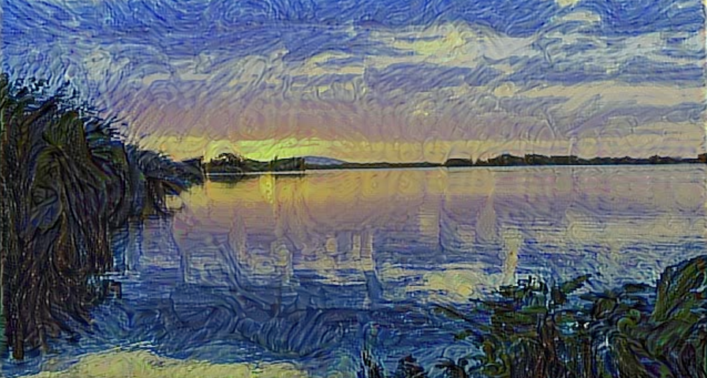

# Neural Style Transfer

<a href="neural-style-transfer/banner2.png"></a>

## Background
In the paper [Image Style Transfer Using Convolutional Neural Networks](https://www.cv-foundation.org/openaccess/content_cvpr_2016/papers/Gatys_Image_Style_Transfer_CVPR_2016_paper.pdf) (Gatys et al CVPR 2016), the authors define a neural method for transfering the style of one image to another.

Why might this be possible?  Neural networks, particularly convolutional ones, have been shown to extract/respond to texture at hi and low spatial scales.  The photos below, borrowed from the [keras blog](https://blog.keras.io/category/demo.html), show input images that maximally activate filters in an ImageNet trained VGG16.  Note that shallow layers respond to high frequency texture while deep layers respond to low frequency texture.


Given the ability to respond to texture like this, and the correspondence between texture and style, the authors ask if convolutional output can be used to achieve style transfer. They show that the answer is yes.  Here's how they do it.

## Approach

Let $$X$$ be a $$N \times M \times K$$ matrix containing the output of a convolutional layer in a VGG type network.  $$N$$ and $$M$$ are the spatial shapes determined by the width and height of the input image, and $$K$$ is the channel shape determined by the number of conv filters in the layer.  Now treat each channel like a $$NM \times K$$ vector and take the inner product between each pair of channel vectors to form the so-called _style matrix_

$$G = \frac{1}{NM} X^TX$$

We've normalized by spatial shape because we don't want input shape to influence the magnitude of entries in $$G$$.

We'll compute $$G$$ for the source image and compute $$\tilde{G}$$ for the destination image and do gradient descent on the destination image until $$G \approx \tilde{G}$$.  In particular, we'll minimize

$$\frac{1}{K^2}\sum_{ij}{(G_{ij} - \tilde{G}_{ij}(D))^2}$$

with respect to the destination image $$D$$. The factor $$K^2$$ is there because this is an average.

But why this definition of style matrix?  The authors don't provide an answer, and a look around the internet suggests no clear consensus.  I like to think it's because if instead of making the $$G$$s match we directly make the conv output match, then we'd find ourselves constructing a destination image that's pixel-for-pixel equal to the source image.  This suggests that maybe we should try instead to reconstruct the _relationship_ between conv outputs, instead of exact values.  Dot products are a good candidate for measuring relationship because they calculate angle between vectors, so if we reconstruct all angles between conv vectors then maybe we'll reconstruct the style of the source image and still maintain the content of the destination image.  Of course the real explanation for why $$G$$ is defined this way is because it works, so we'll stick with it and do some experiments of our own :)

## Implementation

I used `keras` to implement the style transfer.  Here's the code:

```python
import numpy as np
np.random.seed(10)
from keras.applications.vgg19 import VGG19, preprocess_input
from keras.models import Model
from keras import backend as K
from keras.preprocessing.image import load_img
from cv2 import VideoWriter, VideoWriter_fourcc
'''
Working example of applying gradient descent to an input image for style transfer.
'''

# Load source image
src_im_file = 'ims/starry_night.jpg'
src_im = np.array(load_img(src_im_file))
src_im = preprocess_input(src_im)
src_im = np.expand_dims(src_im, axis=0)
_, input_rows, input_cols, _ = src_im.shape

# Load destination image
# dest_im = np.random.random((input_rows, input_cols, 3))*255
dest_im_file = 'ims/skatedog.jpg'
dest_im = np.array(load_img(dest_im_file, target_size=(input_rows,input_cols)))
dest_im = preprocess_input(dest_im)
dest_im = np.expand_dims(dest_im, axis=0)

# Init video writer for saving output
video_dest = 'video.mp4'
fps = 10
codec = VideoWriter_fourcc(*'mp4v')
video = VideoWriter(video_dest, codec, fps, (input_cols,input_rows))


def normalize(x):
    # L2 norm for conv output
    return x / (K.sqrt(K.sum(K.square(x))) + K.epsilon())

def postprocess(im):
    # undo preprocessing so image is plot-able
    im = im[0,:,:,:]
    im += np.array([103.939, 116.779, 123.68])  # offsets used by vgg19.preprocess_input
    im = np.clip(im,0,255)
    return im.astype(np.uint8)


# load model
model = VGG19(include_top=False, input_shape=(input_rows, input_cols,3))

# intermediate model
conv_block = 1
conv_number = 1
probe_model = Model(inputs=model.input, outputs=model.get_layer('block%s_conv%s' % (conv_block, conv_number)).output)

# save intermediate output of source image
X_src = probe_model.predict(src_im)

# compute loss
_, n_rows, n_cols, n_channels = X_src.shape
X_src, X_dest = K.reshape(X_src, (n_rows*n_cols, n_channels)), K.reshape(probe_model.output, (n_rows*n_cols, n_channels))
G_src, G_dest = K.dot(K.transpose(X_src), X_src), K.dot(K.transpose(X_dest), X_dest)
G_src, G_dest = G_src / (n_rows*n_cols), G_dest / (n_rows*n_cols)
loss = K.mean(K.pow(G_src - G_dest, 2))

grads = K.gradients(loss, probe_model.input)[0]
grads = normalize(grads)

f = K.function([probe_model.input], [loss, grads])

# Main loop
eta = 100            # gradient descent coeff
for i in range(2000):
    l, g = f([dest_im])
    print(i, l)
    dest_im -= eta*g
    plt_im = postprocess(dest_im.copy())
    if i % 10 == 0:
        video.write(plt_im)

video.release()
```

A few notes:
- The CNN is a VGG19 with imagenet weights.
- A `probe_model` is defined to extract intermediate model output.
- To use the keras `gradient` function, it's necessary for arrays to be `Tensor` objects, so they should be modified by backend functions like `K.dot` and `K.transpose`.
- In defining the loss it's necessary to refer to convolutional output abstractly as `probe_model.output`.
- Loss and gradient computations are consolidated into one function: `K.function([probe_model.input], [loss, grads])`. Like the convolutional output reference, input here is abstractly referenced as `probe_model.input`.
- The actual optimization happens in the simple line `dest_im -= eta*g`.

## Results

Lets see some results for when $$X$$ comes from different layers.  I use van Gogh's Starry Night as a source image.

<center>
block1_conv1
<div class="video-responsive">
  <iframe width="640" height="360" src="https://www.youtube.com/embed/2yX5gFyTeh4?rel=0" frameborder="0" allow="accelerometer; autoplay; encrypted-media; gyroscope; picture-in-picture" allowfullscreen></iframe>
</div>
</center>

<center>
block1_conv2
<div class="video-responsive">
  <iframe width="640" height="360" src="https://www.youtube.com/embed/i5J-qCkcSIQ?rel=0" frameborder="0" allow="accelerometer; autoplay; encrypted-media; gyroscope; picture-in-picture" allowfullscreen></iframe>
</div>
</center>

<center>
block2_conv1
<div class="video-responsive">
  <iframe width="640" height="360" src="https://www.youtube-nocookie.com/embed/s7YawJTg3UU?rel=0" frameborder="0" allow="accelerometer; autoplay; encrypted-media; gyroscope; picture-in-picture" allowfullscreen></iframe>
</div>
</center>

<center>
block3_conv2
<div class="video-responsive">
  <iframe width="640" height="360" src="https://www.youtube-nocookie.com/embed/gD0GjJxSZfs?rel=0" frameborder="0" allow="accelerometer; autoplay; encrypted-media; gyroscope; picture-in-picture" allowfullscreen></iframe>
</div>
</center>

<center>
block3_conv4
<div class="video-responsive">
  <iframe width="640" height="360" src="https://www.youtube-nocookie.com/embed/kH5sDBnfJVc?rel=0" frameborder="0" allow="accelerometer; autoplay; encrypted-media; gyroscope; picture-in-picture" allowfullscreen></iframe>
</div>
</center>

<center>
block4_conv1
<div class="video-responsive">
  <iframe width="640" height="360" src="https://www.youtube-nocookie.com/embed/TbNzl2KexYs?rel=0" frameborder="0" allow="accelerometer; autoplay; encrypted-media; gyroscope; picture-in-picture" allowfullscreen></iframe>
</div>
</center>

<center>
block5_conv1
<div class="video-responsive">
  <iframe width="640" height="360" src="https://www.youtube-nocookie.com/embed/CmD0vwmCD88?rel=0" frameborder="0" allow="accelerometer; autoplay; encrypted-media; gyroscope; picture-in-picture" allowfullscreen></iframe>
</div>
</center>

<center>
block5_conv4
<div class="video-responsive">
  <iframe width="640" height="360" src="https://www.youtube-nocookie.com/embed/3IGXvvD0xy8?rel=0" frameborder="0" allow="accelerometer; autoplay; encrypted-media; gyroscope; picture-in-picture" allowfullscreen></iframe>
</div>
</center>

We see that the spatial extent of texture increases with layer depth.  This is expected given that deeper layers have a wider effective field of view on the input (deeper layers' output is a function of a wider spatial portion of the input compared to shallow layers).  This fits with the results of the keras blog images above.

Qualitatively, color transfer happens in block1, brush-stroke transfer happens in block3, and 'swirl' transfer happens in block5.

In general we'd like to transfer style at multiple spatial scales, so we'll measure $$X$$ at multiple layers and compute the corresponding $$G$$s and $$\tilde{G}$$s, then sum the loss for each layer and apply gradient descent.  In terms of implementation, we get multiple layer output using
```python
layers_names = ['block1_conv1', 'block4_conv1']
layer_outputs = [model.get_layer(l).output for l in layers_names]
probe = K.function([model.input], layer_outputs)
```

Here's the result:

<center>
block1_conv1 and block4_conv1
<div class="video-responsive">
  <iframe width="640" height="360" src="https://www.youtube-nocookie.com/embed/sfjCsvHFsME?rel=0" frameborder="0" allow="accelerometer; autoplay; encrypted-media; gyroscope; picture-in-picture" allowfullscreen></iframe>
</div>
</center>

Pretty sweet!

## Future Considerations
The main drawback of this method is that gradient descent has to be performed on each new image we want to stylize.  Wouldn't it be nice if we had a _model_ which could immediately stylize any image just by calling `model.predict` on it?  Turn out [people have looked into this](https://arxiv.org/abs/1603.08155).  The clever solution involves four things: a style (source) image, a set of _several_ content (destination) images, a style network, and a loss network.  The style network is the thing we'll eventually call `model.predict` on, it's an untrained CNN that has output shape equal to input shape (it outputs an image).  The loss network is a pre-trained CNN like the one we've been using.

1. Pass a batch of destination images through the style network.
2. Pass the output of the stylize network through the pre-trained CNN.
3. Compute the average loss, defined as before.
4. Do gradient descent on the _stylize network_ using this loss.
5. Loop until loss is sufficiently low.

What this gives you is a style network that transfers style to a variety of images, so once it's trained sufficiently it'll output a stylized version of its input, even if the input's not in the training set, and with no need for further optimization.

## Footnote: Alternative Implementation

In the example code we implemented gradient descent 'by hand'---we computed gradients and explicitly wrote `dest_im -= eta*g`.  Wouldn't it be nice if instead we could use the fancy optimization algorithms already built into keras?  But these algorithms operate on _weights_, and what we're optimizing is an input.  An input isn't weights is it?  It could be.  We could trick keras into thinking the input image is weights by pre-pending the network with a layer containing the image pixel values as weights and have an identity input consisting of ones.  This way we can call `model.predict` and the input image will be updated.  We just need to set all other weights to have `trainable = False`.


<br/>
<br/>

