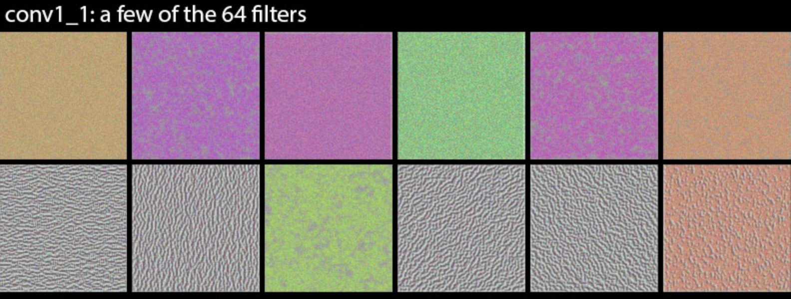
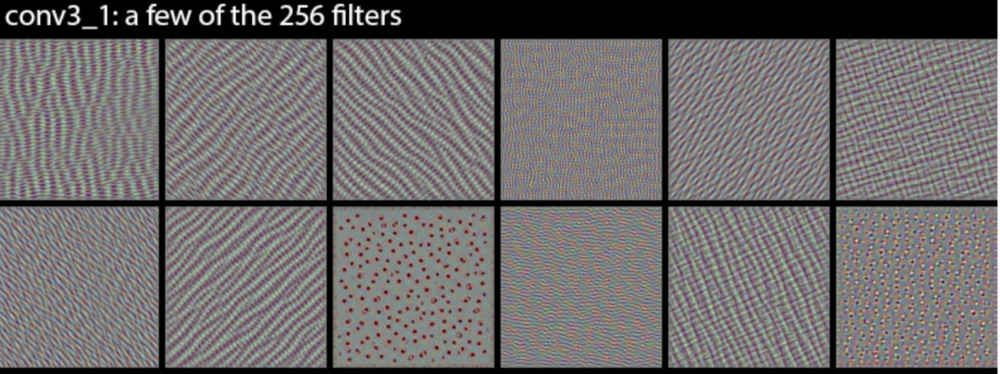
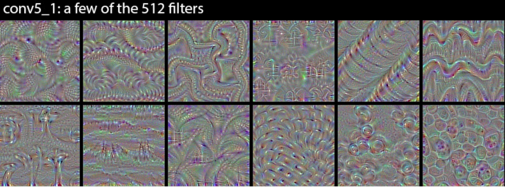

# Notes on Neural Style Transfer

## Background
In the paper [Image Style Transfer Using Convolutional Neural Networks](https://www.cv-foundation.org/openaccess/content_cvpr_2016/papers/Gatys_Image_Style_Transfer_CVPR_2016_paper.pdf), published by Gatys et al for CVPR 2016, the authors define a neural method for transforming the style of an image so it matches the style of another image.

(im dog) + (im van gogh) = (style transfer)

Neural networks, in particular convolutional ones, have been shown to extract texture information at both hi and low spatial scales.  The photos below, borrowed from the [keras blog](https://blog.keras.io/category/demo.html), show the images that maximally activate filters in an ImageNet trained VGG16.  Note that shallow layers respond to high frequency texture while deep layers respond to low frequency texture.

Given the ability to respond to texture like this, and the correspondence between texture and style, the authors of the paper ask if convolutional output can be used to achieve style transfer. They show that the answer is yes. Here's how they do it.

Let $$X$$ be a $$N \times M \times K$$ matrix containing the output of a convolutional layer of a VGG style network.  $$N$$ and $$M$$ are the _spatial_ shapes determined by the width and height of the input image, and $$K$$ is the _channel_ shape determined by the number of conv filters in the particular layer.  Now treat each channel like a $$NM \times K$$ vector and take the inner product between each pair of channel vectors to form what we'll call the _style matrix_

$$G = \frac{1}{NM} X^TX$$

Here we've normalized by spacial shape because we don't want the shape of the input image to influence the magnitude of the entries in $$G$$.

We'll compute $$G$$ for the source image and $$\tilde{G}$$ for the destination image, then we'll do gradient descent on the destination image until $$G \approx \tilde{G}$$.  In particular, we'll minimize

$$\sum_{ij}{(G_{ij} - \tilde{G}_{ij})^2}$$

with respect to the input image.

- __Architecture__ Features from VGG19 (16 conv, 5 pool). "Normalize" network weights.  No fully connected layers.  Use avg pool instead of max pool.

- __Content Transfer__ 1) Input an image to CNN, 2) Measure the output at layer $l$, 3) Input a random noise image to the CNN, 4) Apply gradient descent to the noise image such that the output at $l$ matches that of the original image.

Let $X^l_i$ be the outputs from the original image and $\tilde{X}^l_i$ be the outputs from the constructed image, then the content loss is given by

$$J_{content}^l = \sum_{i}{(X^l_i - \tilde{X}^l_i)^2}$$

- __Style representation__  Style is represented by the covariance between channels in a convolutional output.  If a convolutional output has shape $$N \times M \times K$$, then each channel is flattened and arrange into a matrix of shape $$N M \times K$$.  This matrix is used to compute covariance in the usual way: $$G = FF^T$$.

- [picture of style reconstruction from fig. 1]

- __Style Transfer__ Style is transferred just like content is, but instead of matching $X_l$ to $\tilde{X}_l$, we match $G_l$ to $\tilde{G}_l$.  The style objective is

$$J_{style}^l = \sum{(G^l_i - \tilde{G}^l_i)}^2$$

Note that G is really 2 dimensional, so technically this should be a double sum, but we're comparing element-wise so we can ignore the complex notation of two sums. If you like, imagine G gets flattened prior to summing, so now we only need one index.

- __Putting it all together__  The final objective is

$$J = \sum_{l}{\alpha J_{content}^l + J_{style}^l}$$

Where $\alpha$ controls how much the content is emphasized relative to the style.

- __Heuristics__ The authors point out that it isn't necessary to initialize the generated image to random noise.  Instead, the content image could be the initialization.  In this case there will be one unique generate image (assuming there's a fixed random seed on the objective solver), whereas using a random initialization allows for possibly different generated images to be found.
