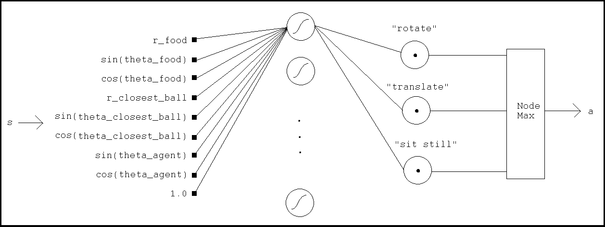
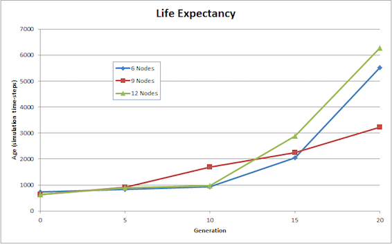

# Artificial Life, Neural Nets, and Genetic Algorithms

  <iframe width="840" height="472" src="https://www.youtube.com/embed/UW8y_R7PE_c?rel=0" frameborder="0" allowfullscreen></iframe>

 

## Background

Using neural nets to control AI agents can be challenging because they're hard to optimize. Neural classifiers and regressors by comparison are easier to optimize because their objective functions are explicitly defined in terms of the NN's inputs and outputs, and they're differentiable so gradient-based methods can be used.  Meanwhile in agent-based contexts objective functions usually aren't evaluated until after a long sequence of outputs (actions), so it's unclear how individual outputs contribute to the objective function (the so-called credit assignment problem). On top of all that, agent-based objective functions usually aren't differentiable.

But learning is an optimization task, so any optimization algorithm is candidate to be a learner.  In this post I explore a non-gradient based genetic algorithm called enforced subpopulations to learn useful neural net weights in the context of an artificial life agent. The algorithm finds useful weights despite the absence of instantaneous feedback or a differentiable objective function.

## Artificial Life: The Setting

The context of the problem is artificial life. An agent moves in a 2-d world where it must find food and avoid moving objects to survive.  The world contains randomly generated moving objects that kill the agent if they touch it, and each agent has a "metabolic clock" that kills it if it reaches 0%, so each agent has to find food before they starve.

Each agent is controlled by a feed-forward neural net that maps inputs to actions, where the inputs are measurements of the environment.  Actions are based solely on the weights of the network and the inputs at a given time.  To identify the network weights that generate long-living agents, a genetic algorithm is used.  The algorithm searches through weight space and finds useful weights that keep agents alive for as long as possible.

The video above shows agents at various stages of optimization, so-called _generations_.  In the beginning, agents  have randomly chosen weights, so they move arbitrarily and get killed pretty quickly (the red bar indicates health).  After about 10 generations they manage to navigate to food and by generation 25 they're very effective at avoiding danger and navigating to food quickly.

## Neural Nets: The Brain

Agents have access to their environment through eight senses:

* The distance to food.
* The distance to the nearest blue ball.
* The sine and cosine of the angle between the agent's heading direction and food.
* The sine and cosine of the angle between the agent's heading direction and the nearest blue ball.
* The sine and cosine of the agent's heading direction relative to the world's coordinate system.

These measurements are fed into a single-layer feed-forward network that functions as the agent's brain.  The network outputs one of the following actions at each time-step:

* Rotate by a small pre-defined amount.
* Translate forward by a small pre-defined amount.
* Sit still.

Here's a diagram of the neural net:

 
The network has six sigmoid nodes (tanh) and three linear nodes.  Actions are associated with each linear node and the action with the largest output is implementation by the agent.

The action performed at a given timestep is an index into the action-list:

$$a_t = \arg\max{[W_2\tanh{(W_1s_t)]}}$$

## Genetic Algorithms: The Optimizer
Brains are standard feed-forward neural nets, but they're optimized in an interesting way. Neural nets typically train using backpropagation which requires ground-truth feedback.  In the context of the agent there isn't really any ground-truth.  Agent's lifespans are measured and used this to define "error", but the length of time that an agent lives doesn't inform _what_ made the agent live that long.  For instance, if an agent rotates in place every few seconds and then moves towards food every few seconds then was it the rotating in place that made the agent successful or the moving towards food?  Obviously we know it's the moving towards food, but the lifespan measurement doesn't distinguish those.  To deal with ambiguous feedback like this we use an optimization algorithm that doesn't require continuous feedback, we use a genetic algorithm called Enforced SubPopulations, or ESP.

ESP, like most genetic algorithms, finds (or hopes to find) good weights by combining weights from networks that have been tested in the past and were successful.  In the context of our agent "tested" means running the network in the world and "successful" means the agent lived a long time.

ESP is distinguished from other genetic algorithms by its assignments of _subpopulations_ to each network-node.  Subpopulations are a list of weight-lists,  each defined by the parameters going into and outof the corresponding node.  To make a fully-formed network one weight-list is selected from each node's subpopulation and applied the node's edges.  The fully-formed network is then placed "in" an agent and the agent is evaluated in the world.

Identifying good weights is the primary challenge of this problem.  It's solved through the following algorithm:
1. _Initialization_: Initialize all weights uniformly in [−1, 1], with 50 weight-lists per node.
2. _Evaluation_: Randomly select weight-lists from each node and use them to construct a fully-defined network. Run this network in an agent until it dies and record its lifetime.  Give each weight-list that participated in the network a score equal
to the lifetime. Do this until each weight-list in each subpopulation is used at least 100 times.
3. _Selection_: For each node, delete the lowest scoring 50% of weight-lists.
4. _Crossover_: Within each node, arbitrarily select two of the retained weight-lists and cross them at an arbitrary location.  Replace one of the deleted lists with this "child" list. Repeat until all deleted lists are replaced.
5. _Mutation_: Mutate all weights by adding a uniformly random number between −0.02 and 0.02 to them.
6. _Repeat_: Goto Step 2 until an agent's life-time exceeds a threshold, print this agent's weights and terminate training.

Each loop through this algorithm is called a _generation_.  Here's a plot of lifetime vs generation when different numbers of sigmoid nodes are used:

 
Evidently there isn't a clear relationship between the lifetime and the number of sigmoid nodes used (at least in the range tested), but nonetheless the GA works and after about 20 generations the agents live for about 1000 (!) times longer than their arbitrarily generated ancestors.  Pretty awesome!

__Reference:__ Gomez, F. J. (2003). Robust Non-linear Control through Neuroevolution. PhD thesis, University of Texas, Austin, TX. [Link](http://www.cs.utexas.edu/users/nn/downloads/papers/gomez.phdtr03.pdf)

__Code:__ [https://github.com/andraugust/neuroevESP](https://github.com/andraugust/neuroevESP)

__Questions:__
* How necessary were genetic algorithms and sigmoid nets for this application?  Could successful agents have been found using simpler optimization procedures?  What if a linear neural net was used instead of a sigmoid net?  Can linear nets generate successful agents too?
* The agents in this application don't have any memory---their feedforward nets give the same output for the same input, regardless of past inputs.  If networks had feedback connections, could they learn faster?  The current environment doesn't require memory--agents are able to survive without it.  What types of environments do require memory?
 


