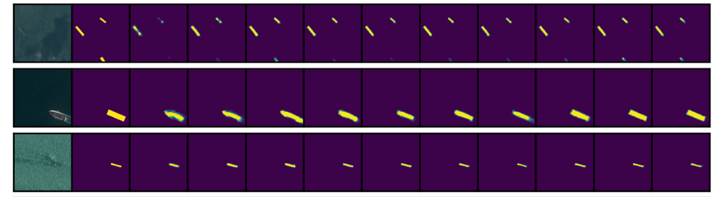
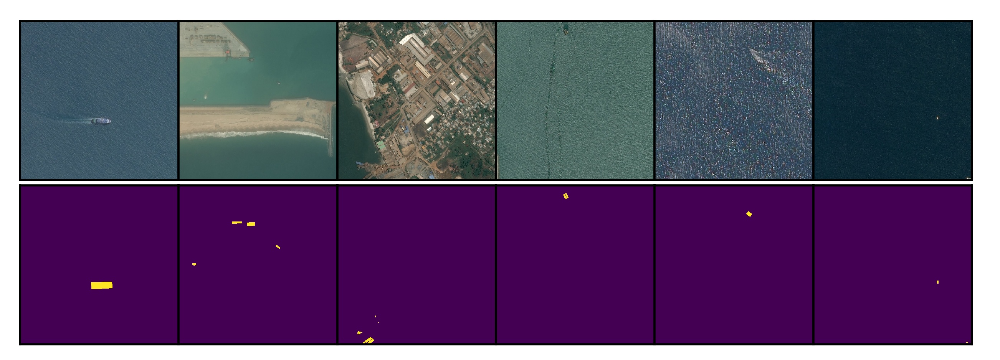
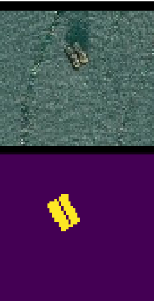
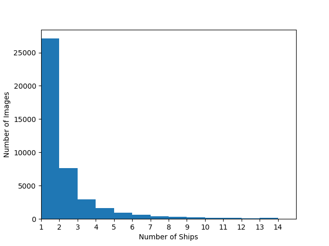
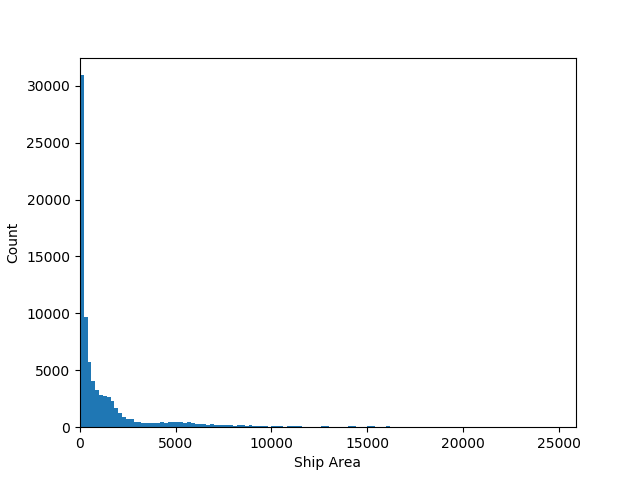
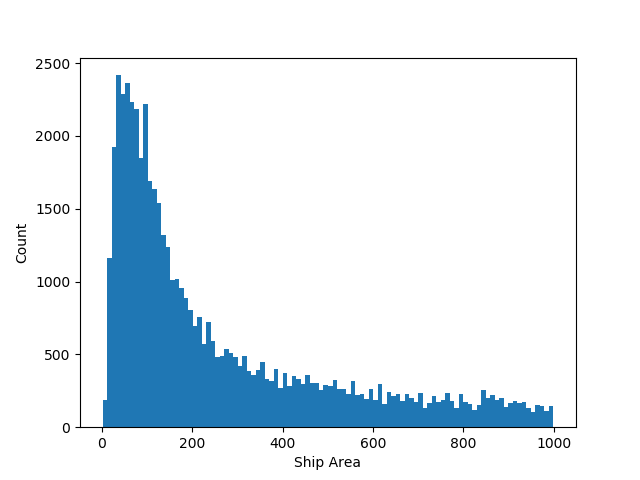
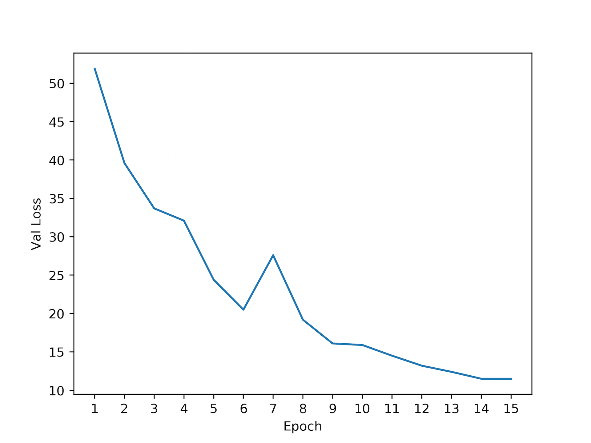
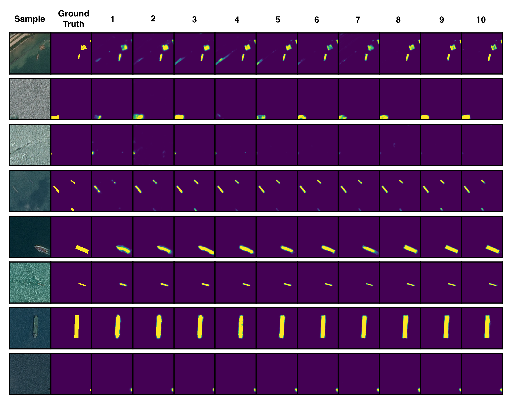
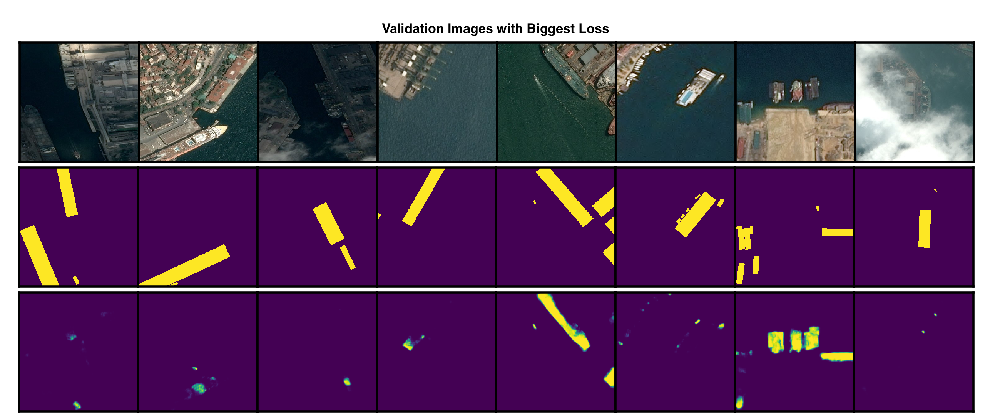
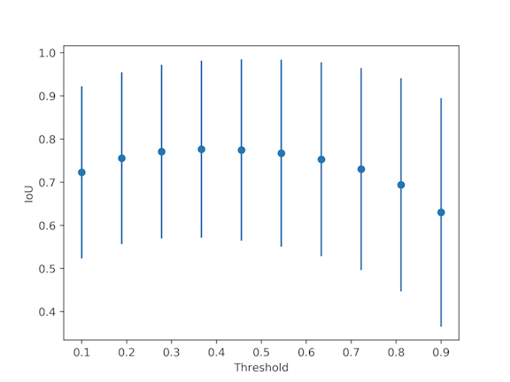

<br />
<h2><center>Kaggle Ship Detection Challenge</center></h2>
<center></center>
<br />
The Kaggle Ship Detection Challenge sponsored by Airbus provides satellite images of the ocean with ground-truth masks indicating the locations of ships in each image.  The objective is to accurately localizes ships in a set of testing images.  This post is my solution journal.

## Data Exploration
Getting the data:
```bash
$ mkdir Airbus
$ cd Airbus
$ kaggle competitions download -c airbus-ship-detection
$ unzip ./train_v2.zip -d ./data/train_v2/
$ unzip ./test_v2.zip -d ./data/test_v2/
$ unzip ./train_ship_segmentations_v2.csv.zip -d ./data/
```

Check if any images are corrupt:
```bash
$ find ./data/test_v2/ -name "*.jpg" | xargs jpeginfo -c | grep "WARNING"
$ find ./data/train_v2/ -name "*.jpg" | xargs jpeginfo -c | grep "WARNING"
>>> ./data/train_v2/6384c3e78.jpg  768 x 768  24bit JFIF  N   98304  Premature end of JPEG file  [WARNING]
```
One of the images is corrupt, but it's a training image, so we don't need to predict on it, so we can delete it.

How many images are there? 192555 train and 15606 test.

How many train images do/don't have ships?
```python
import numpy as np
import pandas as pd
# Get images that have ships
df = pd.read_csv('./data/train_ship_segmentations_v2.csv')
has_ship = [isinstance(_, str) for _ in df['EncodedPixels']]  # true if has ship
df_with_ships = df.loc[has_ship]
print('n with ships:', np.sum(has_ship))
print('n without ships:', len(has_ship)-np.sum(has_ship))
```
The result is mostly no ships: 150,000 without and 81,723 with.

What do images with ships look like?
```python
from skimage.io import imread
import utils
import matplotlib.pyplot as plt
plt.switch_backend('agg')

# Get images that have ships
df = pd.read_csv('./data/train_ship_segmentations_v2.csv')
has_ship = [isinstance(_, str) for _ in df['EncodedPixels']]  # true if has ship
df_with_ships = df.loc[has_ship]

# Accumulate rles that belong to the same image
rle_dict = {}
for _, im_id, rle in df_with_ships.itertuples():
    if im_id in rle_dict:
        rle_dict[im_id].append(rle)
    else:
        rle_dict[im_id] = [rle]

# Plot
n_plots = 6
plt_count = 0
for im_id, rles in rle_dict.items():
    plt_count += 1
    plt.subplot(2, n_plots, plt_count)
    plt.imshow(imread('./data/train_v2/' + im_id))
    plt.gca().set_xticks([])
    plt.gca().set_yticks([])
    plt.subplot(2, n_plots, plt_count+n_plots)
    plt.imshow(utils.rles2mask(rles))
    plt.gca().set_xticks([])
    plt.gca().set_yticks([])
    if plt_count == n_plots:
        plt.subplots_adjust(wspace=0, hspace=0)
        plt.savefig('./figures/train_images_masks.png', dpi=500)
        break
```
<br />
<center><a href="../airbus/train_image_masks.png"></a></center>
<br />

Some ships are large and easy to distinguish, like the first column, but others are small and hard to detect, like the last column.  Some ships are _very_ close together, making them hard to separate, even when zoomed in:
<br />
<center></center>
<br />

Some images have one ship while others have multiple.  What's the distribution over ships per image, given there are ships?
```python
ship_counts = [len(item[1]) for item in rle_dict.items()]
max_ships = max(ship_counts)
plt.hist(ship_counts, bins=range(max_ships))
plt.xticks(range(max_ships))
plt.xlim((1,max_ships))
plt.xlabel('Number of Ships')
plt.ylabel('Number of Images')
plt.savefig('./figures/ship_count_distribution.png')
```
<br />
<center></center>
<br />

Most images have only one ship, and nearly all have less than three.

What surface area do ships cover?
<br />
<center></center>
<br />
The smallest is tiny, only 2 pixels.  The largest is 25,904 pixels, about 4% of the image.  Most are in the hundreds range.  Here's a zoom-in:
<br />
<center></center>
<br />

## Modeling
To model, we'll train a binary classifier to indicate if an image has at least one ship or not, then we'll train a localization model on images with ships only.

But first, we're going to cut images into square quarters.  This is so the localization model can train on images with a more balanced pixel-wise class distributions, i.e., the ratio of no-ship pixels to ship pixels will be closer to 0.5, though it'll still be far off.  Also, by cutting images into quarters, reasonable batch sizes (32) will fit into GPU memory and it won't be necessary to down-sample images, which would cause resolution loss and erase small ships.

A concern about quartering, however, is that ships will get split across quarters, leaving behind a sliver that might be hard to detect.  Let's see how many ships get split:

```python
rles = df['EncodedPixels'].tolist()
rles = [_ for _ in rles if isinstance(_,str)]   # remove empty masks

# Convert to mask, check if in multiple sectors
n_crossing = 0
for rle in tqdm(rles):
    mask = utils.rle2mask(rle)
    # Cut into quarters
    sectors = [
        mask[0:384, 0:384],
        mask[0:384, 384:],
        mask[384:, 0:384],
        mask[384:, 384:],
    ]
    in_sector = [np.sum(sector)>0 for sector in sectors]
    if np.sum(in_sector) > 1:
        n_crossing += 1
print(n_crossing)
```

The result is 10,045, so about 12% of ships get split.  That's more than we'd like, but I think the trade-off will be worth it, so we'll do the cutting anyway and check later to see if split ships are indeed harder to detect.

The train set now has 706,997 negative instances and 63,223 positive instances.

### The Binary Model

The set is split 0.75/0.25 train/val, and train images are rotated arbitrarily by 0, 90, 180, or 270 degrees on each epoch with the hope that this will make the model more invariant to rotations.

After playing with several architectures, I settled on Xception with ImageNet weights, global max-pooling applied to the last convolutional output, and one sigmoid node on the end to represent probability of ship.  The first 50 layers of the network were frozen to minimize training time.

After the third epoch the validation accuracy reaches a maximum of 0.89 and the f-score reaches a maximum of 0.88.  The confusion matrix is
```bash
[[15529   277]
 [ 3177 12629]]
```
where rows are ground-truth and columns are predicted.  We see that there are many more false positives than false negatives.  This is a good thing because the real data, i.e., the testing data, is expected to have many more negative samples than what's used in this validation set, so the testing accuracy should be significantly higher than what's shown here.  In fact, we can approximate the testing accuracy.  If the testing data has the same bias as the training data (0 = 92%, 1 = 8%), and the tp/tn/fp/fn rates are the same between validation and testing, then the testing accuracy will be about 97%. Not bad.

Let's look at some validation misclassifications:
<br />
<center><a href="../airbus/false_negatives.png"></a></center>
<br />
<center><a href="../airbus/false_positives.png"></a></center>
<br />

False negatives mostly occur when ships are either split, occluded by clouds, or really small; false positives mostly occur when there's a rectangular object in the image or there's a _mislabeled_ image.  _Several training images are mislabelled_.  For example, the bottom right image clearly has a ship, but the ground-truth says it's not there.

### The Localization Model

The localization model we'll use is a Unet with the same architecture as in the original Unet [paper](https://lmb.informatik.uni-freiburg.de/people/ronneber/u-net/).

We train directly on the 384x384 quarters using a 0.75/0.25 train/val split.  The optimizer is Adam with learning-rate 0.0001, batch size is 6, and the loss is pixel-wise binary cross entropy.  Here's the validation loss over epochs:
<br />
<center></center>
<br />

And here are some validation predictions after each epoch, click to enlarge:
<br />
<center><a href="../airbus/unet_predictions.png"></a></center>
<br />

The results are pretty impressive.  After just the first epoch the model localizes ships, and after the second/third epoch it distinguishes ships from their wakes and land.  What's really impressive is that predictions look like genuine _bounding boxes_, even though ships themselves aren't rectangular.  The model even localizes ship fragments on the edges of images, which is what we were worried it would have trouble with when we did the quartering.

Let's see where Unet performed poorly.  These validation samples have the biggest loss:
<br />
<center><a href="../airbus/unet_errors.png"></a></center>
<br />

Evidently, docked ships are hardest to detect, they just look like a continuation of the land, especially the yachts, which, in some sense, are.  The second to last column has what appear to be oil rigs that were misclassified.

### The Objective Function

The objective function used by Kaggle is somewhat convoluted.  For each image, an intersection-over-union is computed between any predictions and ground-truths that might exist.  The IoU is then thresholded over a set of values to determine if the prediction will be a TP.  Then, f2 score is calculated and averaged for each threshold.  Then, that average f2 score is averaged over all images, and that's your prediction score.  Note that bounding-boxes aren't used as predictions, but instead run-length encoded masks, so really they can look like anything.  It's not entirely clear if a single mask can be TP for multiple ships, or how predictions are assigned to ground-truths when there are multiple predictions and ground-truths per image, but more info on scoring is [here](https://www.kaggle.com/c/airbus-ship-detection#evaluation).

To figure out where to threshold Unet predictions, loop over thresholds and look at average IoUs on the validation set (with error bars of 1 std dev on each side):
<br />
<center><a href="../airbus/iou_v_thresh.png"></a></center>
<br />
We'll use 0.4 as a threshold.


### Testing
After a little bit of post processing to remove masks that are too small (<40 pixels), the testing results are:

Submissions
- 2 unets, 2 bin: 0.692
- 2 unets, 1 bin: 0.687
- 1 unet, 1 bin: 0.680
- blank: 0.520


- 2unets thresh 0.4, area thresh 60: 0.687
- 2unets thresh 0.4, area thresh 20: 0.686
- threshold unet, ship area 40, box_area 0.2: 0.680
- threshold unet, ship area 40, box_area 0.4: 0.679
- threshold unet, ship area 20: 0.680
- threshold unet, ship area 20, box_area 0.2: 0.680
- threshold unet, ship area 100: 0.679
- threshold unet, mode filter
- threshold unet, mode filter, bbox
- threshold at 0.5, bbox, delete small ones, delete big ones, delete weird ones
