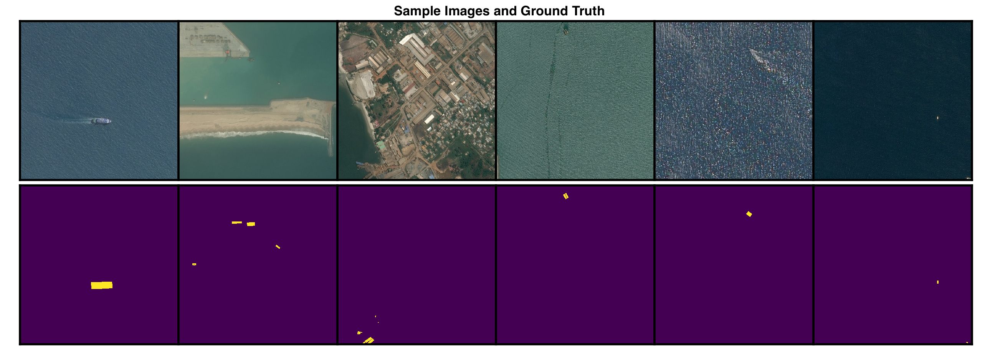

<br />
<h2><center>Kaggle Ship Detection Challenge</center></h2>

The Kaggle Ship Detection Challenge sponsored by Airbus provides a set of satellite images of the ocean with corresponding ground-truth masks identifying the locations of ship in each image.  The objective is to create a model that accurately masks ships in a provided un-labelled test-set.  This is my solution diary.


## Data Exploration
Getting the data:
```bash
$ mkdir Airbus
$ cd Airbus
$ kaggle competitions download -c airbus-ship-detection
$ unzip ./train_v2.zip -d ./data/train_v2/
$ unzip ./test_v2.zip -d ./data/test_v2/
$ unzip ./train_ship_segmentations_v2.csv.zip -d ./data/
```

Check if any images are corrupt:
```bash
$ find ./data/test_v2/ -name "*.jpg" | xargs jpeginfo -c | grep "WARNING"
$ find ./data/train_v2/ -name "*.jpg" | xargs jpeginfo -c | grep "WARNING"
>>> ./data/train_v2/6384c3e78.jpg  768 x 768  24bit JFIF  N   98304  Premature end of JPEG file  [WARNING]
```

One of the images is corrupt, but it's a training image, so we don't need to predict on it, so we can delete it.
```bash
$ rm ./data/train_v2/6384c3e78.jpg
```

How many images are there?
```bash
$ find ./data/train_v2/ -name "*.jpg" | wc -l  # train
>>> 192555
$ find ./data/test_v2/ -name "*.jpg" | wc -l  # test
>>> 15606
```
How many train images have/don't have ships?
```python
import numpy as np
import pandas as pd

# Get images that have ships
df = pd.read_csv('./data/train_ship_segmentations_v2.csv')
has_ship = [isinstance(_, str) for _ in df['EncodedPixels']]  # true if has ship
df_with_ships = df.loc[has_ship]

print('n with ships:', np.sum(has_ship))
print('n without ships:', len(has_ship)-np.sum(has_ship))
```
The result is mostly no ships: 150,000 without and 81,723 with.

What do images with ships look like?
```python
from skimage.io import imread
import utils
import matplotlib.pyplot as plt
plt.switch_backend('agg')

# Get images that have ships
df = pd.read_csv('./data/train_ship_segmentations_v2.csv')
has_ship = [isinstance(_, str) for _ in df['EncodedPixels']]  # true if has ship
df_with_ships = df.loc[has_ship]

# Accumulate rles that belong to the same image
rle_dict = {}
for _, im_id, rle in df_with_ships.itertuples():
    if im_id in rle_dict:
        rle_dict[im_id].append(rle)
    else:
        rle_dict[im_id] = [rle]

# Plot
n_plots = 6
plt_count = 0
for im_id, rles in rle_dict.items():
    plt_count += 1
    plt.subplot(2, n_plots, plt_count)
    plt.imshow(imread('./data/train_v2/' + im_id))
    plt.gca().set_xticks([])
    plt.gca().set_yticks([])
    plt.subplot(2, n_plots, plt_count+n_plots)
    plt.imshow(utils.rles2mask(rles))
    plt.gca().set_xticks([])
    plt.gca().set_yticks([])
    if plt_count == n_plots:
        plt.subplots_adjust(wspace=0, hspace=0)
        plt.savefig('./figures/train_images_masks.png', dpi=500)
        break
```
<br />
<center></center>
<br />

Some ships are large and distinguishable, like the first column, but others are really small and harder to detect, like the last column.  Some ships are _very_ close together, making them hard to distinguish, even when zoomed in:
<br />
<center></center>
<br />

Some images have one ship while others have multiple.  What's the distribution over ships per image (given there are ships)?
```python
ship_counts = [len(item[1]) for item in rle_dict.items()]
max_ships = max(ship_counts)
plt.hist(ship_counts, bins=range(max_ships))
plt.xticks(range(max_ships))
plt.xlim((1,max_ships))
plt.xlabel('Number of Ships')
plt.ylabel('Number of Images')
plt.savefig('./figures/ship_count_distribution.png')
```
<br />
<center></center>
<br />

Most images have only one ship, and nearly all have less than three.

What surface area do ships cover?
```python
areas = []
for im_id, rles in rle_dict.items():
    for rle in rles:
        mask = utils.rle2mask(rle)
        areas.append(np.sum(mask))

min_area = min(areas)
max_area = max(areas)
print(min_area)
print(max_area)
plt.hist(areas, bins=range(min_area,max_area,200))
plt.xticks(range(0,26000,5000))
plt.xlim((min_area,max_area))
plt.xlabel('Ship Area')
plt.ylabel('Count')
plt.savefig('./figures/ship_areas.png')
```
<br />
<center></center>
<br />

The smallest is tiny--2 pixels, the largest is 25,904 pixels (4% of the image), and most are in the hundreds range:
<br />
<center></center>
<br />

## Modeling
First we're going to classify images according to if they have ships or not.  This way the localization model will train on a more relevant dataset and we can quickly generate empty masks for the predicted no-ship images.

Before implementing the binary classifier we're going to cut images into square quarters.  The reason for doing this is because the localization model we'll use after the binary prediction is a Unet, and Unets are best trained on images that have approximately balanced pixel-wise classes per image.  In our case pixels of no-ship significantly out-number pixels of ship.  By cutting images into quarters the out-numbering will be lessened, and, on a practical side, normal batch sizes (16-32 images) will be able to fit into my GPU's memory.

One concern about quartering images, however, is that ships will get split across quarters, leaving behind a sliver that might be hard for Unet to recognize.  Let's see how many ships get cut:

```python
rles = df['EncodedPixels'].tolist()
rles = [_ for _ in rles if isinstance(_,str)]   # remove empty masks

# Convert to mask, check if in multiple sectors
n_crossing = 0
for rle in tqdm(rles):
    mask = utils.rle2mask(rle)
    # Cut into quarters
    sectors = [
        mask[0:384, 0:384],
        mask[0:384, 384:],
        mask[384:, 0:384],
        mask[384:, 384:],
    ]

    in_sector = [np.sum(sector)>0 for sector in sectors]

    if np.sum(in_sector) > 1:
        n_crossing += 1

print(n_crossing)
```

The result is 10,045, so about 12% of ships get cut.  That's more than we'd like, but we'll do the cutting anyways and check later to see if cut-ships are indeed harder to detect.

Quartering images:

```python
# quartify.py
from multiprocessing import Pool
from skimage.io import imread, imsave

imgs_root = sys.argv[0]
out_root = sys.argv[1]
paths = glob(imgs_root+'**/*.jpg', recursive=True)
df = read_csv('./data/train_ship_segmentations_v2.csv')

def make_quarters(path):
    im_id = path.split('/')[-1]
    id_no_jpg = im_id.split('.')[0]
    rles = df.loc[df['ImageId']==im_id, 'EncodedPixels'].tolist()
    # Get mask
    mask = utils.rles2mask(rles)
    # Quarter masks
    mask_quarters = [
        mask[0:384, 0:384],
        mask[0:384, 384:],
        mask[384:, 0:384],
        mask[384:, 384:]
    ]
    # Binary label for each quarter
    mask_labels = [np.sum(_)>0 for _ in mask_quarters]
    mask_labels = [int(_) for _ in mask_labels]
    # Load image
    im = imread(path)
    im_quarters = [
        im[0:384, 0:384, :],
        im[0:384, 384:, :],
        im[384:, 0:384, :],
        im[384:, 384:, :]
    ]
    # Save image in <root>/<class>/<id>/<id>_<quarter>.jpg
    for i, im_quarter in enumerate(im_quarters):
        save_path = '%s%i/%s/%s_%i.jpg' % (out_root, mask_labels[i], id_no_jpg, id_no_jpg, i)
        os.makedirs(os.path.dirname(save_path), exist_ok=True)
        imsave(save_path, im_quarter, plugin='pil', quality=100)

pool = Pool(4)
for _ in tqdm(pool.imap_unordered(make_quarters, paths), total=len(paths)):
    pass
pool.close()
```
```bash
$ python -W ignore quartify.py ./data/train_v2/ ./data/quartered/train_v2/    # suppress annoying skimage warnings
$ python -W ignore quartify.py ./data/test_v2/ ./data/quartered/test_v2/
```

The train set now has 706,997 negative instances and 63,223 positive instances.  We'll balance the set by keeping 63,223 negative instances and ignoring the rest.  The assumption here is that 706,997 negative instances goes beyond the point of diminishing return for sample size, also, having fewer samples to train on will accelerate architecture testing.

### The Binary Model

The set is split 75/25 train/val, and train images are rotated arbitrarily by 0, 90, 180, or 270 degrees on each epoch to introduce rotational invariance into the model.

After playing with several architectures, I found the best to be an Xception model with ImageNet weights, global max-pooling applied to the last convolutional output, and one sigmoid node on the end to represent probability of ship.  The first 50 layers of the network were frozen to minimize training time.

After the third epoch the validation accuracy reaches a maximum of 0.89 and the f-score reaches a maximum of 0.88.  The confusion matrix is

```bash
[[15529   277]
 [ 3177 12629]]
```

where rows are ground-truth and columns are predicted.  We see that there are many more false positives than false negatives.  This is a good thing because the real (testing) data is expected to have many more negative samples than what was used in this validation set, so the testing accuracy should be significantly higher than what's shown here.  In fact, we can approximate that accuracy.  If the testing data has the same bias as the training data (0 = 92%, 1 = 8%), and the tp/tn/fp/fn rates are the same between validation and testing, then the testing accuracy will be about 97%.

Let's look at some validation misclassifications:
<br />
<center></center>
<br />
<br />
<center></center>
<br />

The false negatives mostly occur when ships are split, occluded by clouds, or are really tiny; the false positives mostly occur when there's a rectangular object in the image or there's a _mislabeled_ image.  _Several training images are mislabelled_.  For example, the bottom right image clearly has a ship, but the ground-truth says it's not there.

### Localization Model

The localization model we'll use is a Unet with the same architecture as it was original proposed in [this paper](https://lmb.informatik.uni-freiburg.de/people/ronneber/u-net/).
