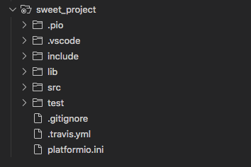

# PlatformIO Notes

<center></center>

PlatformIO is a nice IDE for Arduino that allows you to specify environments and upload sketches via the command line, but more importantly it has code completion and real-time code inspections, which the default Arduino IDE doesn't have -- HOW DOES ANYONE CODE WITHOUT CODE COMPLETION OR INSPECTIONS?!?!?!

Note: PlatformIO is an extension to existing editors, and there are a few different editors it can run on top of.  The recommended editor is VS Code, and that's the one I've found to be the best.

## Directory Structure

When you initialize a new platformio project, you're given a structured set of directories and files that the IDE uses to compile and upload your code properly.  Here's the default structure:

<center></center>

`src/` is where sketches are kept, `lib/` is where libraries are kept, `include/` is where custom headers are kept, and `platform.ini` is where environments are defined.

## Environments

Environments are defined in `platformio.ini`. In it you specify the board to upload to, the libraries to use, the serial port, and other things.  Here's an example:

```ini
[env:receiver]
platform = atmelavr
board = uno
framework = arduino
upload_port = /dev/tty.usbmodem14211
monitor_port = /dev/tty.usbmodem14211
monitor_speed = 115200
lib_deps = 
  SPI
  RF24
targets = upload, monitor
src_filter = +<receiver.cpp>

[env:transmitter]
platform = atmelavr
board = nanoatmega328
framework = arduino
upload_port = /dev/tty.usbserial-12DP0634
monitor_port = /dev/tty.usbserial-12DP0634
monitor_speed = 115200
lib_deps = 
  SD
  SPI
  RF24
targets = upload, monitor
src_filter = +<transmitter.cpp>
```

There are two environments in this example, one for an uno and one for a nano (the project happens to involve a radio transmitter and a radio receiver).  Properties are mostly evident by their names, except maybe `targets` and `source_filter`.  `targets` are the things to do when the environment is run (more on that later), and `source_filter` selects which cpp sketch in `src/` to upload to the board.  Usually you'll just have one sketch called `main.cpp`, in that case `source_filter` isn't necessary, it'll upload `main.cpp` by default, but if you want to give the sketch a different name, or if you have multiple sketches in `src/`, then you need to set `source_filter` so platformio knows which one to upload.  Note the weird syntax.

## Using Libraries

To use a library, download it via platformio's built-in package manager, then put the package name in `lib_deps`, and include the header file in your sketch.  If you want to use a custom library, such as something from github, download it directly into `lib/` and follow the instructions in `lib/README`.

Custom header files can be added inside `include/`.  I've found this useful for defining constants that are shared by multiple sketches.

## Using the CLI

Platformio has a nice CLI for uploading code. I've found these two commands to be the most useful (run from the project folder):

```bash
$ platformio run --environment <environment_name>
$ platformio device monitor --port <port> --baud <baud> 
```

The first command runs the corresponding environment and does whatever's specified by `src_filter` in `platformio.ini`.  In my case, platformio uploads the sketch and then immediately monitors on the port. If `monitor` isn't in `src_filter`, you can still monitor using the second command.

## Troubleshooting

- If platformio isn't able find references to libraries even though they're definitely in the right place, then delete `.vscode/` and restart the editor.




