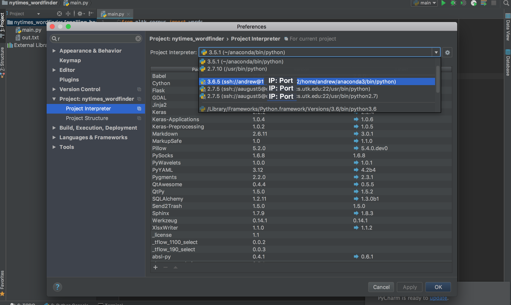
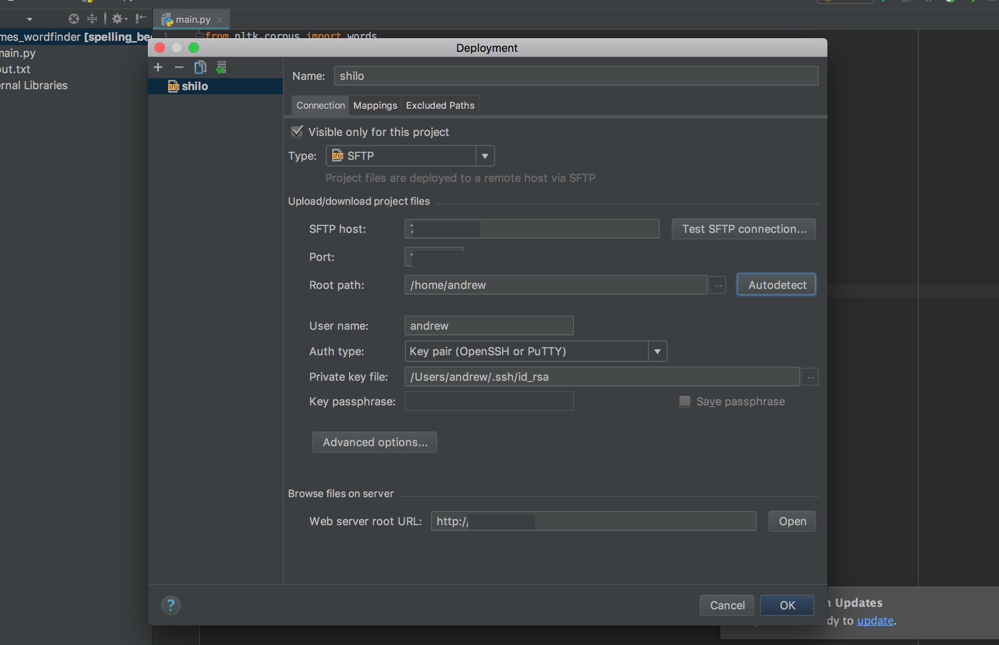
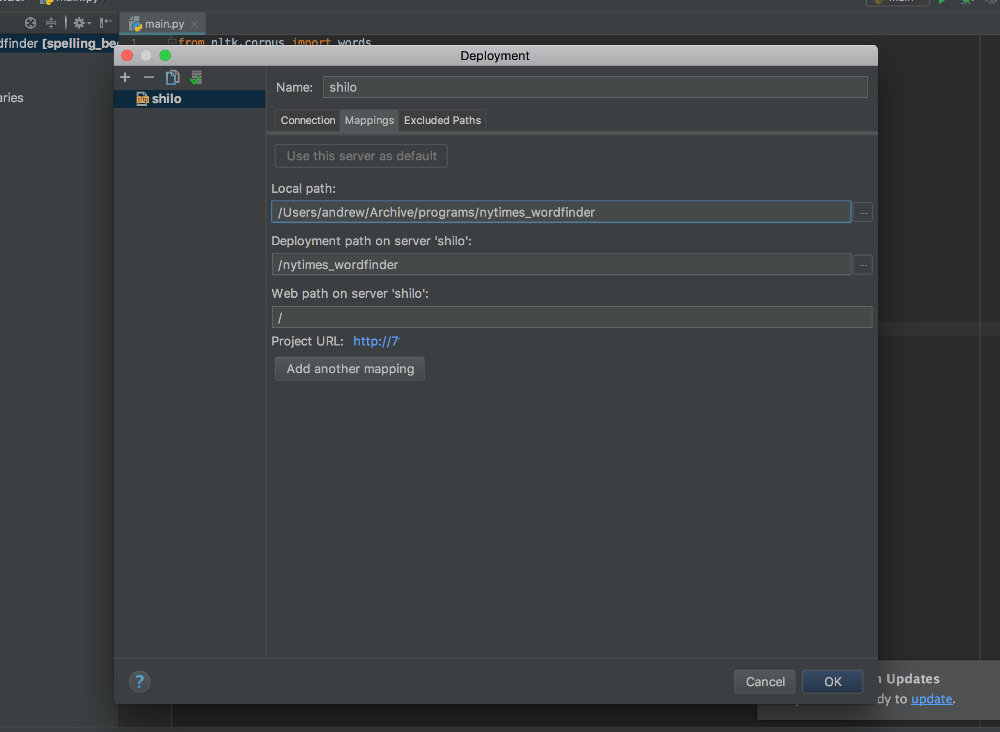

# Connecting PyCharm to a Remote Server

These steps were tested on PyCharm Professional Edition 2017.2.3.

### Configuring the interpreter

PyCharm > Preferences > Project: _project name_ > Project Interpeter > _Select from dropdown or add new_ > Apply > OK

Selecting an existing interpreter:



Adding a new interpreter:


### Configuring the deployment folder (the mapping between local and remote directories)

Tools > Deployment > Configuration > Connection > _Configure connection_ > Mappings > _Configure mappings_ > OK

Configuring the connection:



Configuring the mapping:



### Set auto upload to server when a file change is made

Tools > Deployment > Upload to _server name_

Tools > Deployment > Automatic Upload

### Setting remote environment variables

It has happened to me that an environment variable wasn't found to be defined on the remote system, and using something like ```os.environ['CUDA_VISIBLE_DEVICES']='1'``` in the script I was running didn't work.  The solution is to set the environment variable directly in PyCharm:

Run > Edit Configurations > _set environment variables_ > Apply > OK

But I only recommend doing this _after_ an error related to undefined environment variables appears _and_ no other solution fixes it.
