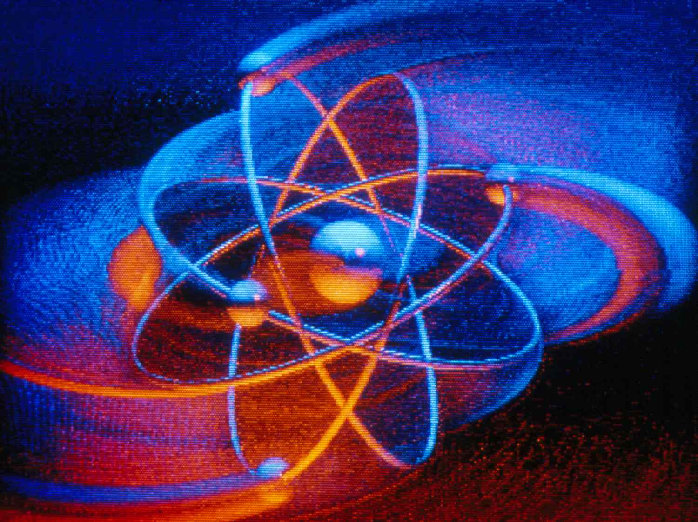
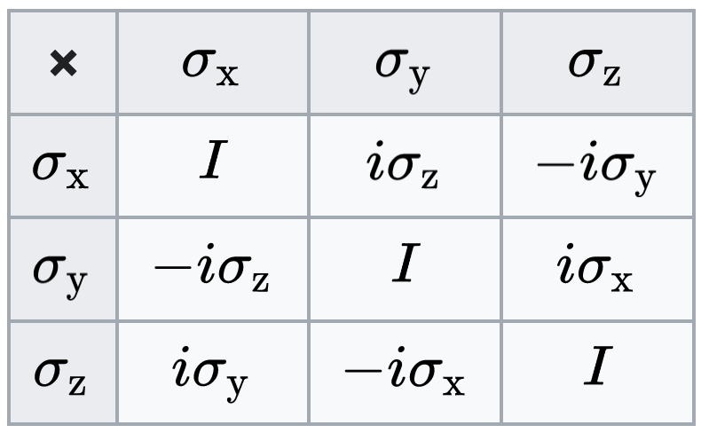

# Quantum Mechanics Part 1: States & Principles

$$\newcommand{\bra}[1]{\left<#1\right|}\newcommand{\ket}[1]{\left|#1\right>}\newcommand{\bk}[2]{\left<#1\middle|#2\right>}\newcommand{\bke}[3]{\left<#1\middle|#2\middle|#3\right>}$$

- [Quantum Mechanics Part 1: States \& Principles](#quantum-mechanics-part-1-states--principles)
	- [Systems and Experiments](#systems-and-experiments)
	- [States](#states)
		- [Spin States](#spin-states)
	- [Principles](#principles)
		- [Spin Operators](#spin-operators)
		- [Sequential Measurement](#sequential-measurement)
	- [Last](#last)

## Systems and Experiments

One way to approach quantum mechanics is by comparing it to classical mechanics though a thought experiment. The experiment involves measure the spin of a particle using an apparatus that can be oriented in an arbitrary direction. The goal is to develop a mathematical model that captures the relationship between the spin of the particle, the orientation of the apparatus and the measurement value. 

For the classical system, suppose we orient the apparatus in the $$+z$$ direction, measure the spin, and find it to be $$+1$$. Next, we orient the apparatus in the $$-z$$ direction, measure the spin, and find it to be $$-1$$. Next, orient in the $$+x$$ direction and measure $$0$$. After more configurations and measurements we find that spin can be modeled as a unit vector $$\hat{\sigma}$$ oriented in 3-space relative to the apparatus direction $$\hat{a}$$, and the measurement we get is $$\hat{a} \cdot \hat{\sigma}$$. Note we've assumed that spin is unaffected by measurements—spin is a physical state existing independent of the apparatus and measurements leave it unchanged. As we'll see this is not necessarily true in QM.

Now let's do the same experiment on quantum spin. Measuring $$\pm z$$ we get the same results, but when we measure $$x$$ we don't get $$0$$ like in the classical experiment, instead we get $$+1$$. Starting the experiment over and taking the same measurements to verify results, we find that $$x$$ has spin $$-1$$. If we restart the experiment several times we get $$+1$$s and $$-1$$s in seemingly random order, with no $$0$$s or any other values. After taking more measurements a pattern emerges: the quantum result is the same as the classical result but only on average. In other words $$\left< \sigma \right> = \hat{a} \cdot \hat{\sigma}$$.

So between CM and QM the notion of determinism changes, as does the notion of measureable states: classical spin is real-valued between $$-1$$ and $$+1$$, but quantum spin is binary. Also, classical states are unchanged by measurements. For example, measuring along $$z$$ and then $$x$$ and then $$z$$ returns the original measurement of $$z$$. In other words measuring $$x$$ doesn't affect the outcome of measuring $$z$$. In quantum mechanics this isn't always true. The intermediate measurement of  $$x$$ changes the system such that re-measuring $$z$$ may not return the original result. To develop intuition for why this is, it's helpful to remember that quantum systems are so small that any measurement energetically strong enough to be useful is necessarily strong enough to change the system in a significant way, whereas classically the energy used to measure a system usually has negligible impact on the system itself.

## States

Quantum states are modeled as vectors in so-called _Hilbert space_. In Hilbert space vectors can be real or complex and have finite or infinite dimension. An example of a finite-dimensional vector is a simple column-vector, and an example of an infinite-dimensional vector is a continuous-valued function (more on those later).

In terms of notation, vectors are drawn as kets $$\ket{\psi}$$ that have complex conjugates called bras, drawn the other way around $$\ket{\psi}^{*} = \bra{\psi}$$. Vectors have inner products $$\bk{\psi}{\phi}^{*} = \bk{\phi}{\psi}$$, orthogonality $$\bk{\psi}{\phi} = 0$$, and unit-normalization $$\bk{\psi}{\psi} = 1$$. The familiar properties of commutativity, associativity, distributivity and closedness are required in order for kets to be considered proper Hilbert vectors. 

A general quantum state can simply be denoted by $$\ket{\psi}$$, but it's often useful to represent it explicitly with components:

$$
\ket{\psi} = \sum_i^N a_i \ket{i}
$$

For now we'll assume $$N \ne \infty$$, meaning this is a finite dimensional vector. The set of $$\ket{i}$$ form an orthonormal basis and the set of $$a_i$$ are complex components. Note that representing $$\ket{\psi}$$ this way implies using a specific basis, and the values of the $$a_i$$ can change from one basis to another.

### Spin States

How is spin represented in this notation? Let $$\ket{+z}$$ and $$\ket{-z}$$ be orthonormal bases for the $$z$$ measurement so that an arbitrary state prior to measurement is written as

$$
\ket{\psi} = a_+ \ket{+z} + a_- \ket{-z}
$$

Defining $$\ket{+z}$$ and $$\ket{-z}$$ as orthonormal is important because it encodes the fact that they are distinct: measuring $$z$$ returns $$\ket{+z}$$ or $$\ket{-z}$$ but never both.

When the values of $$a_+$$ and $$a_-$$ are squared and normalized they represent measurement probabilities. In other words, $$a_+^{*}a_+$$ is the probability of measuring $$\sigma_z = +1$$ and configuring the system into $$\ket{+z}$$, while $$a_-^{*} a_-$$ is the probability of measuring $$\sigma_z = -1$$ and configuring the system into $$\ket{-z}$$. The probabilities normalize:

$$
\sum_i a_i^*a_i = \bk{\psi}{\psi} = 1
$$

The coefficient $$a_i = \bk{i}{\psi}$$, so the probability of preparing $$\ket{i}$$ can be expressed as

$$
p_i = \lvert\bk{i}{\psi}\rvert^2 = \bk{\psi}{i}\bk{i}{\psi}
$$

Effectively $$\ket{\psi}$$ is getting projected onto the basis of interest and then squared. 

So if components are related to measurement probabilities, what are they for $$z+$$ and $$z-$$? Well, it depends on how the system is prepared prior to measurement. If a $$y$$ state is prepared, the components will have certain values, but if a $$x$$ state is prepared they may have different values. 

To actually find these values we have to pick a basis and write components down in terms of them. $$\ket{+z}$$ and $$\ket{-z}$$ are orthogonal, so we'll use them.

Starting with $$\ket{+x}$$, the 50% measurement outcome from the spin experiment is captured by defining

$$
\ket{+x} = \frac{1}{\sqrt{2}} \ket{+z} + \frac{1}{\sqrt{2}} \ket{-z}
$$

Next, for $$\ket{-x}$$, it may seem like the same coefficients will work because they also capture the 50% measurement outcomes, but that would violate the orthogonality constraint $$\bk{+x}{-x} = 0$$. To be orthogonal we use

$$
\ket{-x} = \frac{1}{\sqrt{2}} \ket{+z} - \frac{1}{\sqrt{2}} \ket{-z}
$$

Similar logic applies to the $$y$$ measurement and the states $$\ket{+y}$$ and $$\ket{-y}$$. This time, however, we have to consider the fact that the 50% measurement outcome is true when the system is prepared in a $$z$$ state _or_ an $$x$$ state. The results are

$$
\ket{+y} = \frac{1}{\sqrt{2}} \ket{+z} + \frac{i}{\sqrt{2}} \ket{-z}
$$

$$
\ket{-y} = \frac{1}{\sqrt{2}} \ket{+z} - \frac{i}{\sqrt{2}} \ket{-z}
$$

It's important to point out that states in QM have a very different interpretation compared to states in CM. In CM, states and measurements are the same thing: measuring the state $$(q,p)$$ returns the measurement $$(q,p)$$. In QM measuring the state $$\ket{+z}$$ does not return the measurement $$\ket{+z}$$, instead it returns a number, namely $$+1$$: measured values and states are fundamentally different things in quantum mechanics, while in classical mechanics they are identical.

The table below lists each spin eigenvector represented in the $$z$$-basis, the header row corresponds to the eigenvalue.

|       |                            $$+1$$                            |                            $$-1$$                            |
| :---: | :----------------------------------------------------------: | :----------------------------------------------------------: |
| $$x$$ | $$\frac{1}{\sqrt{2}}\begin{pmatrix} 1 \\ 1  \end{pmatrix}$$  | $$\frac{1}{\sqrt{2}}\begin{pmatrix}  1 \\ -1  \end{pmatrix}$$ |
| $$y$$ | $$\frac{1}{\sqrt{2}} \begin{pmatrix}  1 \\ i  \end{pmatrix}$$ | $$\frac{1}{\sqrt{2}} \begin{pmatrix}1 \\ -i  \end{pmatrix}$$ |
| $$z$$ |           $$\begin{pmatrix}1 \\ 0  \end{pmatrix}$$           |           $$\begin{pmatrix}0 \\ 1  \end{pmatrix}$$           |

As a final comment, multiplying any state by a factor of $$e^{i\theta}$$, where $$\theta$$ is real, does nothing to change measurement probabilities. This comes in handy for simplifying calculations in a lot of situations in QM.

## Principles

The principles of QM are formulated around the idea of measureables, i.e., measurement outcomes. They state that:

* Measureables (such as spin) are represented by Hermitian operators, where a Hermitian operator is an operator with the defining property $$\mathbf{H^\dagger} = \mathbf{H}$$.
* Quantum states (such as $$\ket{+z}$$ and $$\ket{-z}$$) are eigenvectors of their corresponding Hermitian operators.
* Measurement outcomes (such as $$\pm1$$) are eigenvalues of these operators.
* When an eigenvalue is measured the system is said to become _prepared_ in the corresponding eigenstate.
* Distinguishable states are represented by orthogonal vectors.
* If a system is in state $$\ket{\psi}$$ the probability of measuring $$\lambda$$ is $$\lvert\bk{\lambda}{\psi}\rvert^2$$ (states are often labelled by their eigenvalue).

Why Hermitian operators? Hermitian operators have a few desirable mathematical properties:

* They're linear, which is appropriate because states are vectors in a linear vector space. 
* Their eigenvalues are always real, meaning that measurements always return real numbers.
* Unique eigenvalues have orthogonal eigenvectors, which means there's an unambiguously distinct state associated with each unique measurement outcome (for a given operator).
* Their eigenvectors form a complete set, meaning that any vector the operator can generate can be written as a linear combination of its eigenvectors.

Hermitian operators implicitly define eigenvectors and eigenvalues, so they encode the all the information we need to know an observable's state and measureable. The principles, meanwhile, describe the way in which eigenvalues/vectors are used to calculate measurement probabilities.

### Spin Operators

How are spin operators constructed from their eigenvalues and eigenvectors? Through the matrix identity $$\mathbf{X} = \mathbf{P}\mathbf{\Lambda}\mathbf{P}^{-1}$$, where $$\mathbf{P}$$'s columns are the eigenvectors of $$\mathbf{X}$$ and $$\mathbf{\Lambda}$$ is diagonal with eigenvalues of $$\mathbf{X}$$. 

Spin has two eigenvalues, so its operators are $$2\times2$$ matrices called $$\mathbf{\sigma}_x$$, $$\sigma_y$$, and $$\sigma_z$$. For example, $$\sigma_y$$ is

$$
\begin{align*}
\sigma_y &= \frac{1}{2}\begin{pmatrix}
									1 & 1 \\
									i & -i \\
						\end{pmatrix}
						\begin{pmatrix}
									1 & 0 \\
									0 & -1 \\
						\end{pmatrix}
						\begin{pmatrix}
									1 & -i \\
									1 & i \\
						\end{pmatrix} \\
&= \begin{pmatrix}
									0 & -i \\
									i & 0 \\
								\end{pmatrix}
\end{align*}
$$

The rest are the so-called Pauli matrices:

$$
\begin{align*}
		\sigma_x &= \begin{pmatrix}
									0 & 1 \\
									1 & 0 \\
								\end{pmatrix} \\
		\sigma_y &= \begin{pmatrix}
									0 & -i \\
									i & 0 \\
								\end{pmatrix} \\
		\sigma_z &= \begin{pmatrix}
									1 & 0 \\
									0 & -1 \\
								\end{pmatrix} \\
\end{align*}
$$

These matrices are interesting because along with the 2x2 identity matrix they form a basis in which any 2x2 Hermitian matrix can be expressed. In other words if $$\sigma_i$$ denotes a Pauli matrix (including the identity) and $$a_i$$ is a real coefficient, then

$$
\sum_i a_i \sigma_i
$$

is guaranteed to be Hermitian. Note that the $$\sigma_i$$ are not mutually orthogonal in the same sense as mutually orthogonal vectors. Namely,

$$
\sigma_i \sigma_j \neq \delta_{ij}
$$

Instead, their pairwise products are summarized in the following table:

What can we do with these matrices? So far we've measured spin along $$x$$, $$y$$, or $$z$$, but these operators allow us to measure it in any direction. This is done by taking the dot product of the Pauli matrices with the unit vector $$\hat{n}$$ along which the measurement is taken.

For example, if we measure along $$\hat{n}=(1/\sqrt{2},1/\sqrt{2},0)$$, the operator is

$$
\frac{1}{\sqrt{2}} 
\begin{pmatrix}
0 & 1-i \\
1+i & 0 \\
\end{pmatrix}
$$

This operator has eigenvalues  $$\pm 1$$ and eigenvectors

$$
\begin{align*}
	\ket{+n} &= \frac{1}{2}\begin{pmatrix} 1-i \\ \sqrt{2} \end{pmatrix} \\
	\ket{-n} &= \frac{1}{2}\begin{pmatrix} -1+i \\ \sqrt{2} \end{pmatrix} \\
\end{align*}
$$

These eigenvectors can be used to calculate measurement probabilities. For example, if the spin starts in $$\ket{+z}$$, the measurement probabilities are

$$
P(+1) = \lvert \bk{+n}{+z} \rvert^2  = 1/2 \\
P(-1) = \lvert \bk{-n}{+z} \rvert^2  = 1/2
$$

These two probabilities are equal because the measurement happens to be taken at 45 degrees.

### Sequential Measurement

What happens _after_ a measurement? Looking back at the principles, the particle "collapses to" or becomes "prepared in" the eigenstate of the measurement result.

For example, consider a spin particle with initial state (in the $$z$$ basis)

$$
\ket{\psi} = \begin{pmatrix} a \\ b \end{pmatrix}
$$

If $$\sigma_x$$ is measured, the outcome probabilities prior to measurement are

$$
\begin{align*}
P(\sigma_x = +1) &= \lvert\bk{+x}{\psi}\rvert^2  = \frac{1}{2}(1+a^*b+ab^*) \\
P(\sigma_x = -1) &= 1 - P(+1) = \frac{1}{2}(1-a^*b-ab^*)
\end{align*}
$$

After measurement, the state collapses to either $$\ket{+x}$$ or $$\ket{-x}$$. If $$\sigma_x$$ is measured again it's guaranteed to return the same value. On the other hand, if afterward the spin is measured in a different direction, the outcome probabilities are all $$1/2$$, as per the definition of each state. For example, if the first measurement returned $$\sigma_x = +1$$ and we measure $$\sigma_z$$, then the outcome probabilities are

$$
P(\sigma_z = +1) = \lvert\bk{+z}{+x}\rvert^2 = 1/2 \\
P(\sigma_z = -1) = \lvert\bk{-z}{+x}\rvert^2 = 1/2
$$

## Last

States, operators, and principals wrap up the first part of QM. They lay the foundation over which more interesting systems can be modeling, such as particles, forces, dynamics, and entanglement, all of which will be covered in the posts that follow. To be continued…


