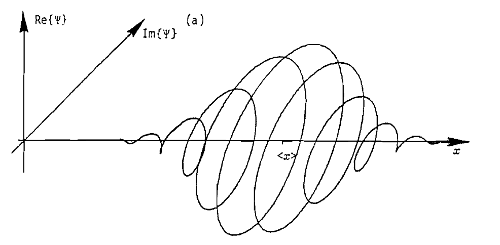

# Quantum Mechanics Part 2: Particles and Dynamics

$$\newcommand{\bra}[1]{\left<#1\right|}\newcommand{\ket}[1]{\left|#1\right>}\newcommand{\bk}[2]{\left<#1\middle|#2\right>}\newcommand{\bke}[3]{\left<#1\middle|#2\middle|#3\right>}$$

## 1. Time and Change

In CM states are real numbers that change under the influence of forces. In QM states are vectors in  Hilbert space—how and what causes them to change?

__Time Evolution Operator.__ To answer this, start by modeling state dynamics generically as

$$
\ket{\Psi(t_2)}=\mathbf{U}(t_2,t_1) \ket{\Psi(t_1)}
$$

where $$\mathbf{U}$$ is the "time evolution operator" that maps states from one point in time to another. In general we'll set $$t_1=0$$ and $$t_2=t$$. One constraint we place on $$\mathbf{U}$$ is conservation of overlap, where overlap is defined as the inner product of two states. In otherwords for arbitrary $$t$$ we want $$\bk{\Psi(t)}{\Phi(t)} = \bk{\Psi(0)}{\Phi(0)}$$ or

$$
\bra{\Psi(0)}\mathbf{U}(t)^{\dagger}\mathbf{U}(t)\ket{\Phi(0)} = \bk{\Psi(0)}{\Phi(0)}
$$

Which implies that $$\mathbf{U}^{\dagger}\mathbf{U} = I$$, a property called unitarity.

Any finite time-evolution can be buit up from the composition of several intermediate evolutions, for example:
$$
\mathbf{U}(t_3,t_0) = \mathbf{U}(t_3,t_2)\mathbf{U}(t_2,t_1)\mathbf{U}(t_1,t_0)
$$
In the limit of infintesimal intermediates we get

$$
\mathbf{U}(\epsilon) = I - \epsilon i \mathbf{H}
$$

Where $$\epsilon$$ is an infinitesimal time interval, $$\mathbf{H}$$ is a constant operator, and $$-i$$ is added to make the results match physical experiments. What does this operator do to $$\ket{\Psi}$$?

$$
\begin{align*}
\ket{\Psi(\epsilon)} &= \mathbf{U}(\epsilon) \ket{\Psi(0)} \\
\ket{\Psi(\epsilon)} &= (I - \epsilon i \mathbf{H}) \ket{\Psi(0)} \\
\frac{\ket{\Psi(\epsilon)} - \ket{\Psi(0)}}{\epsilon} &= -i\mathbf{H} \ket{\Psi(0)} \\
\end{align*}
$$

As $$\epsilon \rightarrow 0$$,

$$
\frac{\partial \ket{\Psi}}{\partial t} = -\frac{i}{\hbar}\mathbf{H}\ket{\Psi}
$$

where $$\hbar$$ is added so the units are correct. It's value is about $$10^{-34} kg \space m^2/s$$. This PDE is called the generalized Schrodinger equation.

Before moving on, we can learn a bit about $$\mathbf{H}$$ by asking what, if anything, the unitary constraint on $$\mathbf{U}$$ implies:

$$
\begin{align*}
\mathbf{U}(\epsilon)^\dagger \mathbf{U}(\epsilon) &= (I - \epsilon i \mathbf{H})^\dagger (I - \epsilon i \mathbf{H}) \\
&= (I + \epsilon i \mathbf{H}^\dagger) (I - \epsilon i \mathbf{H}) \\
&= I - \epsilon i \mathbf{H} + \epsilon i \mathbf{H}^\dagger = I \\
\end{align*}
$$

So $$\mathbf{U}$$ being unitary implies $$\mathbf{H}$$ is Hermitian and therefore can represent an observable, which, as we'll show, is the QM Hamiltonian.

In CM, Hamiltonians represent the total energy of a system and relate to its dynamics through the Poisson bracket:

$$
\dot{L}=\{L,H\}
$$

Where $$L$$ is any quantity defined on phase space $$L(q,p)$$. A similar relation exists in QM, but for expected values:

$$
\frac{d}{dt}\left<\mathbf{L}\right> = -\frac{i}{\hbar}\left<\left[\mathbf{L},\mathbf{H}\right]\right>
$$

$$\left[\mathbf{L},\mathbf{H}\right] = \mathbf{L}\mathbf{H} - \mathbf{H}\mathbf{L}$$ is called the commutator. From it we see that if a quantity commutes with $$\mathbf{H}$$ then it is conserved (in expectation), and more generally any function of a quantity that commutes with $$\mathbf{H}$$ is conserved (in expectation). This is like in CM where if the PB is $$0$$ then $$L$$ is conserved.

Note that in QM expected values don't change due to measurement outcomes changing, those are fixed for a given operator (for example $$\pm 1$$ for spin), instead, expected values change because measurement _probabilities_ change, and to calculate how measurement probabilities change we have to solve the generalized Schrodinger equation.

__Solving the GSE.__ Solving the generalized Schrodinger equation is easiest in the energy basis where $$\mathbf{H}$$ is diagonal and the state vector is

$$
\ket{\Psi(t)} = \sum_i a_i(t) \ket{E_i}
$$

where $$\ket{E_i}$$ is an energy eigenvector satisfying $$\mathbf{H}\ket{E_i} = E_i\ket{E_i}$$. Inserting this into the GSE gives

$$
\begin{align*}
\sum_i \dot{a}_i(t) \ket{E_i} &= -\frac{i}{\hbar} \mathbf{H} \sum_i a_i(t) \ket{E_i} \\
&= -\frac{i}{\hbar} \sum_i E_i a_i(t) \ket{E_i}\\
\end{align*}
$$

Which is a simple first-order ODE for each component. The solution is

$$
a_i(t) = a_i(0) e^{-iE_it/\hbar}
$$

Compared to the general form of an oscillator $$\exp(-i \omega t)$$ we see that $$E/\hbar$$ plays the role of frequency in QM.

This solution assumes we're working in the energy basis. What if we're given a state vector in a different basis and want to compute dynamics? The solution is to do a change of basis. Given a general state vector $$\ket{\Psi}$$ in a non-energy basis (such as the spin basis $$\ket{+z}$$, $$\ket{-z}$$), factor the Hamiltonian according to $$\mathbf{H} = \mathbf{P}\mathbf{\Lambda}\mathbf{P}^{\dagger}$$, then the state in the energy basis is $$\mathbf{P}^{\dagger}\ket{\Psi}$$.  In terms of components $$a_i = \bk{E_i}{\Psi}$$, where $$a_i$$ is the $$i$$th component of $$\ket{\Psi}$$ in the energy basis. This is all summarized by the general solution to the GSE:

$$
\ket{\Psi(t)} = \sum_i \bk{E_i}{\Psi(0)} e^{-iE_it/\hbar} \ket{E_i}
$$

## 2. Particle States

So far the states we've looked at have all been discrete—they're represented by a finite sum over basis vectors. In this section we're going to model particles, which have continuous states for position and momentum. How are continuous states modeled? The answer is in the same way that discrete states are modeled: by using the principles of QM. The trick is to observe that nothing in the principles requires states to be discrete—the principles only define conditions and physical interpretations related to _vectors_, which can be anything, continuous or discrete, as long as they satisfy the mathematical axioms of vectors (they commute, have an inverse, etc). Complex functions, as it turns out, are vectors, and they're what we'll use to model particles.

__Continuous States.__ In terms of notation, a continuous state vector is associated with a _wave function_ $$\psi(x)$$ which takes a complex input and returns a complex output. Wave functions are defined with respect to a particular basis just as discrete vectors are, and their form can change from one basis to the next, just as discrete vectors can. The bra-ket notation is useful for wave-functions like it is for discrete vectors. The discrete representation

$$
\ket{A} = \sum_i a_i \ket{i}
$$

becomes

$$
\ket{\Psi} = \int \psi(x) \ket{x} \,dx
$$

where $$x$$ labels eigenvalues and $$\ket{x}$$ is the associated eigenvector. In this analogy, $$\psi(x)$$ is like a continuous set of coefficients. Another way to think of wave functions is in terms of them being a state vector's projection onto a basis. For example, in the $$x$$ basis the wave function is

$$
\psi(x) = \bk{x}{\Psi}
$$

__Continuous Operators.__ Operators on continuous vectors are similar to operators on discrete vectors: they need to be linear and Hermitian. They're linear when they distribute over the sum of functions with constants factoring out. In other words,

$$
\mathbf{L}(a\psi(x)+b\phi(x)) = a\mathbf{L}\psi(x) + b\mathbf{L}\phi(x)
$$

Examples of linear operators include multiplication by $$x$$ and differentiation by $$d/dx$$.

Hermiticity is a bit trickier. It occurs when

$$
\bke{\psi}{\mathbf{L}}{\phi} = \bke{\phi}{\mathbf{L}}{\psi}^{*}
$$

Where

$$
\bke{\psi}{\mathbf{L}}{\phi} = \int \psi^*(x)\mathbf{L} \phi(x) \,dx
$$

For example, if $$\mathbf{L}=x$$ this is

$$
\begin{align*}
\bke{\psi}{x}{\phi} &= \int \psi^*(x) x \phi(x) \,dx \\
&= \left( \int \psi(x) x \phi^*(x) \,dx \right)^* \\
&= \bke{\phi}{x}{\psi}^*
\end{align*}
$$

Therefore the operator $$x$$ is Hermitian. Note that $$\dagger$$ from discrete operators gets replaced by $$*$$ for functions because there are no transposes for functions. Applying the same test to $$d/dx$$ we find that it's not Hermitian, but if we multiply by $$i$$ it is.

__Eigenfunctions of Position.__ How are eigenvalues and eigenvectors computed for continuous operators? For position the operator is $$x$$ and its eigenvalues are denoted by $$x_0$$. The eigenequation is

$$
x\psi(x) = x_0 \psi(x)
$$

or

$$
(x-x_0)\psi(x) = 0
$$

If $$x \ne x_0$$ then this requires $$\psi(x) = 0$$, and when $$x = x_0$$ then $$\psi(x)$$ can be anything, but because $$\psi$$ is a probability amplitude, it must integrate to $$1$$, so the eigenfunction is

$$
\psi(x) = \delta(x-x_0)
$$

This states the obvious fact that if a particle is measured at $$x_0$$ then it's only at $$x_0$$. It's important to note that $$\delta$$ is not a function, it's a distribution, and as such belongs inside an integral as

$$
\begin{align*}
\ket{\Psi} &= \int \psi(x) \ket{x} \,dx \\
&= \int \delta(x-x_0) \ket{x} dx \\
&= \ket{x_0}
\end{align*}
$$

__Eigenfunctions of Momentum.__ What are the eigenfunctions of momentum? For momentum the set-up and solution are the same, but now $$\bar\psi$$ is used to denote a wave function in momentum space:

$$
p\bar\psi(p) = p_0\bar\psi(p) \\
\rightarrow \bar\psi(p) = \delta(p-p_0)
$$

The $$\delta$$ function solution here and for position are not especially insightful, but when we look at momentum in the $$x$$ basis things are more interesting. In the $$x$$ basis, from experimental insight, the momentum operator changes from $$p$$ to $$-i\hbar \, d/dx$$. The eigenequation is

$$
-i\hbar \frac{d}{dx}\psi(x) = p \psi(x)
$$

The solution is

$$
\psi(x) = Ae^{ipx/\hbar}
$$

Note that because this is a wavefunction in the $$x$$-basis it's considered a function of $$x$$ and not $$p$$. The $$p$$ appears because each value of momentum has a different wavefunction associated with it, so $$p$$ acts more like a parameter or index.

The constant $$A$$ is determined by normalization:

$$
\bk{\psi}{\psi} = \int_{-\infty}^{\infty} \psi(x)^*\psi(x) \,dx = 1
$$

But this gives

$$
|A|^2\int_{-\infty}^{\infty} \,dx = 1
$$

Which is undefined. This reflects the fact that when particles are unconstrained in space the planewave solution $$\exp(ipx/\hbar)$$ is physically unrealistic. In practice, particles are either constrained in space such that the integration limits are finite, or, if they are un-constrained in space, they're acted on by a potential such that they're localized and the integral converges.

__Changing Basis.__ Generally speaking, a state vector $$\ket{\Psi}$$ can be represented in any basis. For example, in the $$x$$ basis $$\psi(x) = \bk{x}{\Psi}$$, in the momentum basis $$\bar\psi(p) = \bk{p}{\Psi}$$, etc. Because these representations ultimately correspond to the same thing, namely $$\ket{\Psi}$$, there must be a way to transform between them. How do we transform between the $$x$$ and $$p$$ basis? The trick is to use the identity operator:

$$
I = \int \ket{x}\bra{x} \cdot \,dx
$$

Where "$$\cdot$$" is a placeholder for the vector which the operator acts on. Inserting this into the momentum-representation gives

$$
\begin{align*}
\bar\psi(p) &= \bk{p}{\Psi} \\
&= \bke{p}{I}{\Psi} \\
&= \int \bk{p}{x}\bk{x}{\Psi}\,dx \\
\end{align*}
$$

But

$$
\begin{align*}
\bk{p}{x} &= \int A e^{-ipx'/\hbar} \delta(x'-x) \,dx' \\
&= Ae^{-ipx/\hbar}
\end{align*}
$$

And $$\bk{x}{\Psi} = \psi(x)$$, so

$$
\bar\psi(p) = A\int e^{-ipx/\hbar} \psi(x) \, dx
$$

Which is the formula for converting a momentum-space wave function into its position-space complement. The derivation of the inverse operation is similar. The result is

$$
\psi(x) = A \int e^{ipx/\hbar} \bar\psi(p) \,dp
$$

So position and momentum space are related by the Fourier. This leads to the interpretation that momentum space is the spatial frequency domain of position space, where spatial frequency is given by $$k=p/\hbar$$.

__Changing Basis: Operators.__ How do operators change basis? In the same way they change basis when they're matrices—using the formula $$\mathbf{L' = \mathbf{U} \mathbf{L} \mathbf{U}^{-1}}$$, where $$\mathbf{L}$$ is the operator of interest, $$\mathbf{L}'$$ is the transformed operator, and $$\mathbf{U}$$ is a unitary change-of-basis operator. Because $$\mathbf{U}$$ is unitary and we're working with continuous operators we can set $$\mathbf{U}^{-1} = \mathbf{U}^*$$.

How does this work out for position and momentum? The relevant change-of-basis transformation is the Fourier transform $$\mathbf{F}$$. Is it unitary? Yes, because $$\mathbf{F}^*\mathbf{F}\psi(x) = \psi(x)$$. Let's use it to derive the position operator in momentum space, call it $$\mathbf{\bar X}$$.

$$
\begin{align*}
\mathbf{\bar X} \bar\psi(p) &= \mathbf{F}\mathbf{X}\mathbf{F}^* \bar \psi(p) \\
&= \mathbf{F} \mathbf{X} \psi(x) \\
&= \mathbf{F} x \psi(x) \\
&= i\hbar \frac{d}{dp} \bar \psi(p)
\end{align*}
$$

Where the last step comes from a Fourier transform identity. So the position operator in momentum-space has the same form as the momentum operator in position space, namely $$i\hbar d/dp$$.

Another way to determine (or at least verify) an operator in a new basis is through the use of commutators. The reason is that commutators are _basis independent_. For example, $$[\mathbf{X}, \mathbf{P}] = [\mathbf{\bar X}, \mathbf{\bar P}] = i\hbar$$.

As a practical note, when working with operators, it's helpful to supply them with a test function to act on, otherwise it isn't necessarily clear how they behave or simplify notationally.

__Position-Momentum Uncertainty.__ Going back to the discussion of commutators, we found that two observables are simultaneously knowable iff their operators commute. Do the operators for $$x$$ and $$p$$ commute? The answer is no. Given $$\mathbf{X}=x$$ and $$\mathbf{P}=-i\hbar d/dx $$ the commutator is

$$
[\mathbf{X}, \mathbf{P}] = i\hbar
$$

Which means that position and momentum aren't simultaneously knowable—measuring one destroys information about the other, and vice versa. How unknowable are they together? Defining unknowability in terms of the standard deviation $$\Delta$$ of an operator we find (from the general uncertainty principle) that

$$
\Delta \mathbf{X} \Delta \mathbf{P} \ge \frac{\hbar}{2}
$$

The lower limit on simultaneous uncertainty is reached when either $$\psi$$ or $$\bar \psi$$ are Gaussian function.

## 3. Particle Dynamics

In the first section we derived the general Schrodinger equation and solved it for the dynamics of discrete-state systems. In the second section we defined wavefunctions and showed how to represent particles in terms of them. The rest of this post combines those two sections to model the dynamics of particles, starting with a free particle, and then moving on to potentials etc.

__Free Particle.__ A free particle is defined as a particle with no forces acting on it. In the 
absence of forces there are no potentials, so the Hamiltonian is

$$
\mathbf{H} = \frac{\mathbf{P}^2}{2m} = -\frac{\hbar^2}{2m}\frac{\partial^2}{\partial x^2}
$$

Plugging this into the GSE gives

$$
\frac{\partial \psi(x,t)}{\partial t} = \frac{i\hbar}{2m} \frac{\partial^2 \psi(x,t)}{\partial x^2}
$$

This is the PDE governing free-particle dynamics. It has the form of a diffusion equation but with a complex diffusion coefficient. To solve it we use the solution derived earlier for discrete state vectors:

$$
\ket{\Psi(t)} = \sum_i \bk{E_i}{\Psi(0)} e^{-iE_it/\hbar} \ket{E_i}
$$

Converting this to continuous space gives

$$
\psi(x,t) = \int \left( \int \psi_E^*(x) \psi(x,0) \,dx \right) e^{-iEt/\hbar} \psi_E(x) \, dE
$$

Where $$\psi_E(x)$$ is an energy eigenfunction in the $$x$$-basis. To find $$\psi_E$$ we solve the eigenvalue equation

$$
\begin{align*}
\mathbf{H}\psi_E(x) &= E\psi_E(x) \\
\rarr -\frac{\hbar^2}{2m} \frac{\partial^2}{\partial x^2} \psi_E(x) &= E \psi_E(x)
\end{align*}
$$

The general solution is

$$
\psi_E(x) = Ae^{ix\sqrt{2mE}/\hbar}
$$

Or, in terms of momentum,

$$
\psi_p(x) = Ae^{ipx/\hbar}
$$

Plugging this into the continuous form of the general solution, and writing everything in terms of $$p$$ instead of $$E$$, gives

$$
\begin{align*}
\psi(x,t) &= \int \left( \mathbf{F}\psi(x,0) \right) \, e^{-iEt/\hbar} \, e^{ipx/\hbar} \, dp \\
&= \int \bar\psi(p,0) \exp(i \left( \frac{p}{\hbar}x-\frac{p^2}{2m\hbar}t \right)) dp
\end{align*}
$$

Which is the general solution of the SE for a free particle. 

At this point it's reasonable to ask why there are any dynamics at all, given the absence of forces.  The reason for dynamics is that the solution can be thought of as a sum of plane waves $$\exp i(kx-\omega t)$$ weighted by the amount of each wave in the initial state $$\bar \psi(p,0)$$. The waves oscillate with wavenumber $$k=p/\hbar$$ and frequency $$\omega=p^2/2m\hbar = \hbar k^2/2m =E/\hbar$$, and have phase velocity $$v = \omega/k = E/p = p/2m =\hbar k/2m$$. Due to the phase velocity dependence on wavelength, each wave composing the initial state moves at a different speed, causing the wavefunction to change over time, in particular it spreads out, as the following example demonstrates.

Note that $$k$$ and $$\omega$$ are not independent quantities, but instead have dispersion relation

$$
\omega (k) = \frac{\hbar k^2}{2m}
$$

__Gaussian Wavepackets.__ A Gaussian wavepacket is a wave function such that $$\psi^*\psi \sim N$$, where $$N$$ is a Gaussian distribution. Distributions like this are interesting because unlike planewaves they're localized in space. Consider the following wavepacket:

$$
\psi(x,0) = \frac{1}{(2\pi)^{1/4}} e^{-x^2/4} e^{ik_0x}
$$

Which is a planewave with Gaussian amplitude. Plugging this into the SE we find that it is __not__ a solution (which shouldn't come as a surprise because we already found that the solution is $$A \exp i(kx-\omega t)$$), and therefore it doesn't describe a single particle. We can, however, _construct_ a Gaussian wavepacket by adding several planewaves—which are solutions of the SE—together such that their superposition is a wavepacket.

Doing so, we find the wavepacket density to be

$$
\lvert \psi(x,t) \rvert^2 \sim \frac{1}{\sqrt{1+4t^2}}\exp(-\frac{2(x-k_0t)^2}{1+4t^2})
$$

Which is a Gaussian function with mean $$x-k_0t$$ standard deviation $$1+4t^2$$. Qualitatively this means that the packet moves to the right with velocity $$k_0$$ 

## WIP


