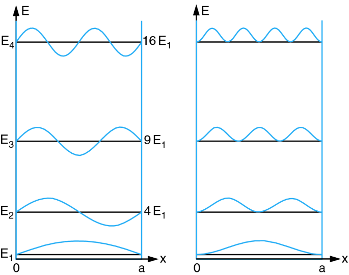

# Quantum Mechanics Part 3: Examples

$$\newcommand{\bra}[1]{\left<#1\right|}\newcommand{\ket}[1]{\left|#1\right>}\newcommand{\bk}[2]{\left<#1\middle|#2\right>}\newcommand{\bke}[3]{\left<#1\middle|#2\middle|#3\right>}$$

## 1. The Free Particle

Conceivably the simples particle to model is one with no forces acting on it. This is the so-called _free particle_. Without forces the Hamiltonian is

$$
\mathbf{H} = \frac{\mathbf{P}^2}{2m} = -\frac{\hbar^2}{2m}\frac{\partial^2}{\partial x^2}
$$

Note that mass is treated as a fixed parameter, instead of as an operator like position or momentum. The reason is that mass, as far as has been experimentally shown, doesn't have measureable uncertainty associated with it, instead, it behaves like charge in the sense that it's an intrinsic propert of the particle, independent of measurement.

Plugging $$\mathbf{H}$$ into the GSE yields the free particle PDE

$$
i\hbar\frac{\partial \psi(x,t)}{\partial t} = -\frac{\hbar^2}{2m} \frac{\partial^2 \psi(x,t)}{\partial x^2}
$$

This has the form of a diffusion equation but with a complex coefficient, which we'll show gives rise to wave-like solutions that spread out over time.

Separation of variables is used to solve the PDE. The result can be written several ways:

$$
\begin{align*}
\psi(x,t) &= \left(Ae^{ix\sqrt{2mE}/\hbar} + Be^{-ix\sqrt{2mE}/\hbar}\right) e^{-iEt/\hbar} \\
&= Ae^{i\left(k x - \omega t\right)} + Be^{-i\left(k x + \omega t\right)} \\
&= \left(A\cos\left(kx\right) + B\sin\left(kx\right)\right) e^{-i\omega t}
\end{align*}
$$

where $$A$$ and $$B$$ are constants chosen to fit the initial and/or boundary conditions of a particular configuration, and $$k = p/\hbar = \sqrt{2mE}/\hbar$$ and $$\omega = E/\hbar$$. 

By inspection, the solution contains two planewaves moving in opposite directions and oscillating together at frequency $$\omega$$. The waves' phase velocity is

$$
v = \omega/k = E/p = p/2m =\hbar k/2m
$$

Their dispersion relation is

$$
\omega (k) = \frac{\hbar k^2}{2m}
$$

In terms of normalization, this wavefunction only normalizes when the particle is _bound_ by a potential. For example, if a particle is _un_-bound such that it can exist freely in $$(-\infty,\infty)$$, then there's no way to set $$A$$ and $$B$$ such that $$\int\psi^*\psi = 1$$. Thus, to be physically meaningful free particles must be bound.

__Particle in a box.__ An example of a bound free particle is the so-called particle in a box. Consider the potential

$$
V(0\le x \le L) = 0 \\
V(x < 0) = V(x>L) = \infty
$$

This is a so-called potential well which bounds the particle between $$0$$ and $$L$$. The boundary conditions imply $$\psi(0)=\psi(L)=0$$. This and normalization yields the solution

$$
\begin{align*}
\psi_n(x,t) &= \sqrt{\frac{2}{L}}\sin\left(\frac{n\pi x}{L}\right) e^{-iE_nt/\hbar} \\
E_n &= \frac{\hbar^2 \pi^2}{2mL^2}n^2
\end{align*}
$$

where $$n\in \{1,2,...\}$$. 

The first few wavefunctions at $$t=0$$ are shown below on the left with their probability densities on the right. Interestingly, the boundary conditions force solutions to be countable and have discrete energy levels.

Because the Schrodinger equation is linear, any linear combination of the $$\psi_n$$ is a solution, so the general solution is

$$
\sum_n a_n (0) \psi_n
$$

where $$a_n(0)$$ captures the "amount" of $$\psi_n$$ in the initial condition, subject to the constraint

$$
\sum_n a_n^*(0)a_n(0) = 1
$$

Because the $$\psi_n$$ are an orthogonal set of functions, they can be summed to create an arbitrary wavefunction (up to the boundary conditions) shape within the well. 

__Stationary states.__ Eigenfunctions of the Schrodinger equation are sometimes called _stationary states_. "Stationary" because their PDFs are time-independent. For example, if $$\psi_E(x)$$ is an eigenfunction of $$\mathbf{H}$$, then the wavefunction at time $$t$$ is

$$
\psi_E(x)e^{-iEt/\hbar}
$$

which depends on time, but the PDF doesn't. Note however that the _sum_ of stationary states _isn't_ stationary. For example, if $$\psi_1$$ and $$\psi_2$$ are stationary and normalized individually, then the sum

$$
a\psi_1(x) e^{i\omega_1t} + b\psi_2(x) e^{i\omega_2t}
$$

has PDF

$$
\left| a\psi_1 \right|^2 + \left| b\psi_2 \right|^2 + a^*b\psi_1^*\psi_2\cos((\omega_1-\omega_2)t) + ab^*\psi_1\psi_2^*\sin((\omega_1-\omega_2)t)
$$

which depends on time. But keep in mind that if the energy of this system is measured it will return just one of the energy eigenvalues $$E_1$$ or $$E_2$$ (corresponding to $$\omega_1$$ and $$\omega_2$$) and the wavefunction will collapse to the corresponding stationary state.

__Mutual Information.__ Looking at the PDFs for the particle in a box, it's evident that some position measurements provide more information about the system's energy than others. For example, if position is measured to be near $$L/2$$, then energy is unlikely to be an even level. The reason is that $$\psi_n^*\psi_n(L/2) \approx 0$$ when $$n$$ is even.

The reduction in uncertainty (or equivalently the gain in information) when energy or position is measured can be defined in terms of mutual information. Mutual information is
$$
\begin{align*}
I(X;E) &= H(X) + H(E) - H(X,E) \\
&= \sum_n \int_x P(x, E_n)\log\left( \frac{P(x,E_n)}{P(x)P(E_n)} \right)
\end{align*}
$$
Where $$X$$ and $$E$$ represent random variables for position and energy, and $$H$$ is entropy. This is the reduction in uncertainty averaged over all $$x$$, but as a function of $$x$$ it's simply
$$
\begin{align*}
I(X=x; E) &= \sum_n P(x,E_n)\log\left( \frac{P(x,E_n)}{P(x)P(E_n)} \right) \\
&= \sum_n P(x,E_n)\log\left( \frac{P(x|E_n)}{P(x)} \right)
\end{align*}
$$
The probability densities are as follows: the Boltzmann distribution can be used to model $$P(E=E_n)$$:
$$
\begin{align*}
P(E_n) &\sim e^{-n^2} \\
P(x|E_n) &\sim \sin^2(n\pi x/L) \\
P(x,E_n) &= P(x|E_n)P(E_n) \\
P(x) &= \sum_n P(x, E_n) \\
\end{align*}
$$
Where the Boltzmann distribution is used to model $$P(E=E_n)$$.

__The Gaussian Wavepacket.__  The _Gaussian wavepacket_ is a common wavefunction used to model unbound free particles. The wavefunction has Gaussian shape so its density is Normal $$\psi^*\psi \sim N$$. This makes it ideal for modeling localized particles.

It may seem that Gaussian wavepackets aren't physical because unbound wavefunctions don't normalize, and that's true—if an unbound free particle has a single definite energy then the wavefunction doesn't normalize. However, linear combinations of wavefunctions weighted properly over many different energies _can_ normalize, and this is the way unbound free particles are constructed mathematically.

How does this work? Consider the general solution of the SE derived earlier for discrete vectors:
$$
\ket{\Psi(t)} = \sum_i \bk{E_i}{\Psi(0)} \ket{E_i} e^{-i E_i t/\hbar}
$$
The continuous version is
$$
\psi(x,t) = \int \left( \int \psi_E^*(x) \psi(x,0) \,dx \right) \psi_E(x) e^{-iEt/\hbar} \, dp
$$
Where $$\psi(x,0)$$ is an intial condition and the integrals run from $$-\infty$$ to $$+\infty$$. Normally,
$$
\psi_E(x) = Ae^{ik x } + Be^{-ik x}
$$
but because the integral covers negative and positive values of $$x$$ we can just focus on one of the terms without loss of generality. We'll focus on the first term. The result is
$$
\begin{align*}
\psi(x,t) &= \int \left( \int e^{-ipx/\hbar} \psi(x,0) \,dx \right) e^{-iEt/\hbar} e^{ipx/\hbar} \, dp \\
&= \int \left(\mathbf{F}\psi(x,0)\right) e^{i(kx-\omega t)} dk \\
&=\int \bar\psi(k,0)e^{i(kx-\omega t)}dk
\end{align*}
$$
So the general solution is a sum of planewaves weighted by the "amount" of each wave present in the initial condition. Because each planewave moves at a different speed—its _phase speed_—the initial waveform spreads out over time.

To make a Gaussian wavepacket, consider the following initial condition in momentum-space:

$$
\bar\psi(p,0) = \frac{1}{(2\pi \sigma_p^2)^{1/4}} \exp (-\frac{(p-p_0)^2}{4\sigma_p^2})
$$

When squared this wavepacket is Gaussian centered at $$p_0$$ with spread $$\sigma_p$$. In position space this wavefunction is

$$
\psi(x,0) = \left( \frac{4 \sigma_p^2 \hbar^2}{2\pi} \right)^{1/4} \exp(-\sigma_p^2 x^2 /\hbar^2) \exp(ip_0x/\hbar)
$$

Which is a Gaussian multiplied by a wave factor. By inspection, the position space uncertainty is related to the momentum space uncertainty by $$\sigma_x \sigma_p = \hbar/2$$, which is exactly the lower limit of the Heisenberg uncertainty relation. 

Note that plugging $$\psi(x,0)$$ into the SE we find that it's _not_ a solution.

Plugging $$\bar \psi(p,0)$$ into the GSE solution and taking the integral gives

$$
\psi(x,t) = \frac{(2\pi\sigma_x^2)^{-1/4}}{\left(1+i\frac{\hbar}{2m\sigma_x^2}\right)^{1/2}}\exp \frac{-x^2+\frac{i}{\hbar}(4\sigma_x p_0 x + 2\sigma_x^2p_0^2t)}{4\sigma_x^2(1+i\frac{\hbar}{2m\sigma_x^2}t)}
$$

This is a complicated looking wavefunction, but its density is a Gaussian:

$$
\lvert \psi(x,t) \rvert^2 = \frac{1}{\sqrt{2\pi\sigma_x^2(t)}} \exp -\frac{\left( x-\mu(t) \right)^2}{2\sigma^2_x(t)}
$$

Where

$$
\begin{align*}
\mu(t) &= \frac{p_0}{m}t \\
\sigma_x(t) &= \sigma_x \sqrt{1+\left(\frac{\hbar}{2m\sigma_x^2}t\right)^2}
\end{align*}
$$

So the center of the wavepacket moves with group velocity $$p_0/m$$ just like a classical particle, and the phase waves disperse causing the packet to spread over time. The spread increases like $$\sqrt{1+t^2}$$, so the particle becomes less localized and the product $$\sigma_x\sigma_p$$ rises above the Heisenberg lower limit.

What happens when a Gaussian wavepacket is measured? If its energy is measured to be, say, $$E_0$$ then the wavefunction collapses to the eigenfunction corresponding to that energy, namely $$\exp(ix\sqrt{2mE_0}/\hbar)$$.

## 2. Harmonic Oscillator

The quantum harmonic oscillator is modeled with a quadratic potential energy function, just as the classical harmonic oscillator is. The Hamiltonian is

$$
\mathbf{H} = \frac{\mathbf{P}^2}{2m} + \frac{1}{2}m\omega^2\mathbf{X}^2 = -\frac{\hbar^2}{2m}\frac{\partial^2}{\partial x^2} + \frac{1}{2}m\omega^2x^2
$$

where $$\omega$$ is the oscillator's frequency parameter (not to be confused with a phase wave frequency). Plugging this into the GSE gives

$$
i\frac{\partial \psi}{\partial t} = -\frac{\hbar}{2m} \frac{\partial^2 \psi}{\partial x^2} + \frac{m \omega^2}{2\hbar}x^2\psi
$$

As usual the solution approach is to find the energy eigenfunctions and multiply them by the time-dependency factor $$\exp(-iE_it/\hbar)$$, then sum them to make a general solution. 

The energy eigen-equation is

$$
-\frac{\hbar^2}{2m}\frac{d^2 \psi_E}{d x^2} + \frac{1}{2} m \omega^2 x^2 \psi_E = E\psi_E
$$

It turns out that this equation has solutions for every value of $$E$$ (including complex $$E$$) but only a few solutions normalize as they need to in order for the wavfunction to represent physically meaningful states.

Deriving the normalizable solutions requires a bit of math that isn't necessarily relevant to the physics, so I'll just present the result. The result is that for each $$0 \le n$$ the $$n$$th normalizable energy is

$$
E_n = \left( n + \frac{1}{2} \right)\hbar\omega
$$

and the corresponding wavefunction is

$$
\psi_n(x) = \sqrt{\frac{a}{2^n n! \sqrt{\pi}}} H_n(ax) e^{-a^2x^2/2}
$$

where $$a = \sqrt{\omega m / \hbar}$$ and $$H_n$$ are _Hermite polynomials_. The probability densities of the first few energies are shown below along with the quadratic oscillator potential. 

There are a few interesting things to notice…

* The minimum energy is not zero—it's $$\hbar \omega /2$$. So for an oscillator to exist at all some energy is required. This can be understood in terms of the uncertainty principle: suppose we try to make the total energy zero by closely localizing the particle to $$x=0$$. In this case the potential energy will be approximately zero, but the momentum will be very spread out, and momentum has energy associated with it. On the other hand if we try to set the particle at rest so it has no momentum then the position will be spread out, in particular it will be spread out away from $$x=0$$ and therefore have potential energy. So either way the oscillator has _some_ energy.
* Energy levels don't depend on mass (in constrast to particle in a box). 
* Hermite polynomials are orthogonal (they better be—they're eigenvectors!).
* Probability densities are non-zero outside the potential energy curve, so the particle can be found _beyond_ the classically allowed region.
* Inside the classically allowed region there are points where the density is zero, so the particle will _never_ be measured there even though it can be classically.
* In the limit of large $$n$$ the quantum density approaches the classical density.

## 4. Tunnelling

## 5. Hydrogen atom

## References

* Gaussian wavepacket integrals: [1](https://ocw.mit.edu/courses/6-974-fundamentals-of-photonics-quantum-electronics-spring-2006/235adf962a3ef4772b2f494261e00d4b_chapter4.pdf), [2](https://here.isnew.info/inverse-fourier-transform-of-the-gaussian-function.html)


