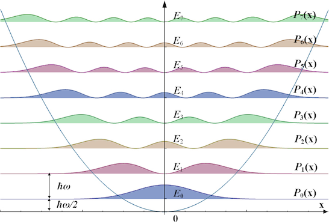

# Quantum Mechanics Part 3: Examples

$$\newcommand{\bra}[1]{\left<#1\right|}\newcommand{\ket}[1]{\left|#1\right>}\newcommand{\bk}[2]{\left<#1\middle|#2\right>}\newcommand{\bke}[3]{\left<#1\middle|#2\middle|#3\right>}$$

## 1. Free Particle

A particle is said to be "free" when no forces act on it. In the absence of forces there are no potentials so the Hamiltonian is

$$
\mathbf{H} = \frac{\mathbf{P}^2}{2m} = -\frac{\hbar^2}{2m}\frac{\partial^2}{\partial x^2}
$$

Plugging this into the GSE gives the PDE:

$$
\frac{\partial \psi(x,t)}{\partial t} = \frac{i\hbar}{2m} \frac{\partial^2 \psi(x,t)}{\partial x^2}
$$

This has the form of a diffusion equation but with a complex coefficient. We'll see that the complex coefficient gives rise to wave-like solutions. 

To solve the PDE we use the solution derived earlier for discrete vectors:

$$
\ket{\Psi(t)} = \sum_i \bk{E_i}{\Psi(0)} e^{-iE_it/\hbar} \ket{E_i}
$$

Converting this to continuous space gives

$$
\psi(x,t) = \int \left( \int \psi_E^*(x) \psi(x,0) \,dx \right) e^{-iEt/\hbar} \psi_E(x) \, dE
$$

Where $$\psi_E(x)$$ is an energy eigenfunction in the $$x$$-basis. To find $$\psi_E$$ we solve the eigenvalue equation

$$
\begin{align*}
\mathbf{H}\psi_E(x) &= E\psi_E(x) \\
\rightarrow -\frac{\hbar^2}{2m} \frac{\partial^2}{\partial x^2} \psi_E(x) &= E \psi_E(x)
\end{align*}
$$

The general solution is

$$
\psi_E(x) = Ae^{ix\sqrt{2mE}/\hbar}
$$

Or in terms of momentum

$$
\psi_p(x) = Ae^{ipx/\hbar}
$$

Plugging this into the general solution and writing everything in terms of $$p$$ instead of $$E$$ gives

$$
\begin{align*}
\psi(x,t) &= \int \left( \mathbf{F}\psi(x,0) \right) \, e^{-iEt/\hbar} \, e^{ipx/\hbar} \, dp \\
&= \int \bar\psi(p,0) \exp(i \left( \frac{p}{\hbar}x-\frac{p^2}{2m\hbar}t \right)) dp
\end{align*}
$$

This is the general solution to the SE for a free particle. 

At this point it's reasonable to ask why there would be any dynamics at all, given the absence of forces. The reason is that the wavefunction is a sum of plane waves $$\exp i(kx-\omega t)$$ weighted by the amount of each such wave in the initial condition $$\bar \psi(p,0)$$. Each wave moves at a different speed, called its _phase velocity_, and this causes the shape of the overall wavefunction to change over time. If instead the phase waves all moved at the same speed then the initial wavefunction shape would be preserved and there wouldn't be any dynamics (besides motion at constant velocity).

The speed of each phase wave is

$$
v(k) = \omega/k = E/p = p/2m =\hbar k/2m
$$

Where $$k=p/\hbar$$ and $$\omega=p^2/2m\hbar = \hbar k^2/2m =E/\hbar$$. So waves with smaller wavelength move faster—they have more energy.

Note that $$k$$ and $$\omega$$ are not independent quantities—they have a dispersion relation

$$
\omega (k) = \frac{\hbar k^2}{2m}
$$

__The Gaussian Wavepacket.__  The _Gaussian wavepacket_ is a common wavefunction used to model free particles. It's a wavefunction having Gaussian, or Normal, density $$\psi^*\psi \sim N$$, which makes for an interesting initial condition because in contrast to planewaves it's localized in space. 

Consider the following initial wavepacket in momentum-space:

$$
\bar\psi(p,0) = \frac{1}{(2\pi \sigma_p^2)^{1/4}} \exp (-\frac{(p-p_0)^2}{4\sigma_p^2})
$$

When squared, this wavepacket is a Gaussian centered around $$p_0$$ with spread $$\sigma_p$$. In position space the corresponding wavefunction is

$$
\psi(x,0) = \left( \frac{4 \sigma_p^2 \hbar^2}{2\pi} \right)^{1/4} \exp(-\sigma_p^2 x^2 /\hbar^2) \exp(ip_0x/\hbar)
$$

Which is a Gaussian multiplied by a wave factor. By inspection, position space uncertainty is related to momentum space uncertainty by $$\sigma_x \sigma_p = \hbar/2$$, which is exactly the lower limit of the Heisenberg uncertainty relation.

Plugging $$\psi(x,0)$$ into the SE we find that it's actually _not_ a solution, which shouldn't come as a surprise—we already showed that solutions are planewaves of the form $$A \exp i(kx-\omega t)$$. So technically wavepackets don't describe single particles, _but_ we can add several planewaves together such that their superposition _approximates_ a wavepacket, and the sum of planewaves _is_ a solution to the SE, so in this sense wavepackets are realistic.

Plugging $$\bar \psi(p,0)$$ into the GSE solution and taking the integral gives

$$
\psi(x,t) = \frac{(2\pi\sigma_x^2)^{-1/4}}{\left(1+i\frac{\hbar}{2m\sigma_x^2}\right)^{1/2}}\exp \frac{-x^2+\frac{i}{\hbar}(4\sigma_x p_0 x + 2\sigma_x^2p_0^2t)}{4\sigma_x^2(1+i\frac{\hbar}{2m\sigma_x^2}t)}
$$

This is a complicated looking wavefunction, but its density is a simple Gaussian:

$$
\lvert \psi(x,t) \rvert^2 = \frac{1}{\sqrt{2\pi\sigma_x^2(t)}} \exp -\frac{\left( x-\mu(t) \right)^2}{2\sigma^2_x(t)}
$$

Where

$$
\begin{align*}
\mu(t) &= \frac{p_0}{m}t \\
\sigma_x(t) &= \sigma_x \sqrt{1+\left(\frac{\hbar}{2m\sigma_x^2}t\right)^2}
\end{align*}
$$

So the center of the wavepacket moves with "group velocity" $$p_0/m$$ just like a classical particle, and the dispersion of the phase waves causes the packet to spread over time. The spread increases like $$\sqrt{1+t^2}$$, so the particle becomes less localized and the product $$\sigma_x\sigma_p$$ rises above the Heisenberg lower limit.

## 2. Harmonic Oscillator

The quantum harmonic oscillator is modeled like the classical harmonic oscillator—with a quadratic potential. The Hamiltonian is

$$
\mathbf{H} = \frac{\mathbf{P}^2}{2m} + \frac{1}{2}m\omega^2\mathbf{X}^2 = -\frac{\hbar^2}{2m}\frac{\partial^2}{\partial x^2} + \frac{1}{2}m\omega^2x^2
$$

where $$\omega$$ is the oscillator's frequency parameter. Plugging this into the GSE gives

$$
i\frac{\partial \psi}{\partial t} = -\frac{\hbar}{2m} \frac{\partial^2 \psi}{\partial x^2} + \frac{m \omega^2}{2\hbar}x^2\psi
$$

This PDE can be simplified by recalling that the solution is the sum of energy eigenvectors multiplied by the time-dependant factor $$\exp(-iE_it/\hbar)$$. So the first step is to find the eigenvectors and eigenvalues of 

$$
\mathbf{H}\psi_E = E\psi_E
$$

where $$\psi_E$$ is an energy eigenvector corresponding to the energy eigenvalue $$E$$. The ODE this produces is

$$
-\frac{\hbar^2}{2m}\frac{d^2 \psi_E}{d x^2} + \frac{1}{2} m \omega^2 x^2 \psi_E = E\psi_E
$$

As it turns out this equation has solutions for every value of $$E$$, including complex $$E$$, but interestingly only a small few of those are normalizable, the rest diverge and therefore don't represent physically realistic states. 

I won't derive the solution to this ODE for the normalizable states, but the result is that for each $$n \ge 0$$ the $$n$$th energy eigenvalue is

$$
E_n = \left( n + \frac{1}{2} \right)\hbar\omega
$$

and the corresponding wavefunction is

$$
\psi_n(x) = \sqrt{\frac{a}{2^n n! \sqrt{\pi}}} H_n(ax) e^{-a^2x^2/2}
$$

where

$$
a = \sqrt{\omega m / \hbar}
$$

and $$H_n$$ are called _Hermite polynomials_. The probability densities of the first few energy levels are shown below along with the potential energy function.

There are a few interesting things to notice…

* The minimum energy is not zero—it's $$\hbar \omega /2$$. So for an oscillator to even exist in the first place some energy is involved. This can be understood in terms of the uncertainty principle: suppose we try to make the energy zero by closely localizing the particle to $$x=0$$ where the potential energy is zero. In this case the momentum will be very spread out, and momentum has energy associated with it. On the other hand if we try to set the particle at rest so it has no momentum then the position will be spread out, in particular it will be spread out away from $$x=0$$ and therefore have potential energy. So either way the oscillator has _some_ energy.
* Hermite polynomials are orthogonal. They better be—they're eigenvectors!
* The probability density is non-zero outside the potential energy curve, so the particle can be found _beyond_ the classical region.
* There are points in the classical region where the density is zero, so the particle will _never_ be measured there even though classically it can be.
* In the limit of large $$n$$ the quantum density approaches the classical density.

## 3. Particle in a Box

## 4. Tunnelling

## References

* Gaussian wavepacket integrals: [1](https://ocw.mit.edu/courses/6-974-fundamentals-of-photonics-quantum-electronics-spring-2006/235adf962a3ef4772b2f494261e00d4b_chapter4.pdf), [2](https://here.isnew.info/inverse-fourier-transform-of-the-gaussian-function.html)


