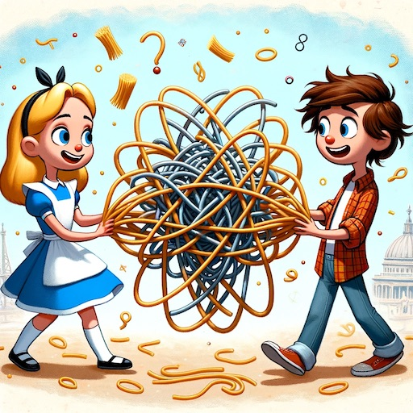

$$\newcommand{\bra}[1]{\left<#1\right|}\newcommand{\ket}[1]{\left|#1\right>}\newcommand{\bk}[2]{\left<#1\middle|#2\right>}\newcommand{\bke}[3]{\left<#1\middle|#2\middle|#3\right>}$$

# Quantum Mechanics Part 3: Joint Systems & Entanglement

Alice and Bob—two quantum systems all tangled up.

&nbsp;

- [Quantum Mechanics Part 3: Joint Systems \& Entanglement](#quantum-mechanics-part-3-joint-systems--entanglement)
    - [Joint Systems](#joint-systems)
    - [Observables](#observables)
    - [Entanglement](#entanglement)
    - [Tensor Products](#tensor-products)
    - [Composite Observables](#composite-observables)
    - [Product States](#product-states)
    - [Mixed States](#mixed-states)
    - [Footnotes](#footnotes)

### Joint Systems

To describe a quantum system composed of several subsystems, we use basis vectors that are multiply-indexed. For example, if a joint system consists of two objects, one having 3 possible measurement outcomes and another having 2, the joint system is defined by six bases: $$\ket{00}$$, $$\ket{01}$$, $$\ket{02}$$, $$\ket{10}$$, $$\ket{11}$$, $$\ket{12}$$. The first symbol denotes the first object's contribution to the overall state and the second symbol denotes the second object's contribution. Together they describe a _single_ measurement possibility of the joint system.

As with isolated systems, joint systems are represented by linear combinations of independent basis vectors. For example, if a joint system has two subsystems (which is the number of subsystems I'll look at in this post, for simplicity), the most general state is given by

$$
\ket{\psi}=\sum_{ij}a_{ij}\ket{ij}
$$

States are subject to the normalization constraint

$$
\sum_{ij} \lvert a_{ij} \rvert^2 = 1
$$

and coefficients have the usual probabilistic interpretation where $$\lvert a_{ij} \rvert^2$$ is the probability that a measurement of the first system returns state $$i$$ and a measurement the second system returns state $$j$$.

In terms of naming conventions, it's standard to call the first subsystem Alice and the second subsystem Bob, and if there's a third it's called Charlie, and so on down the alphabet.

### Observables

How are observables represented for joint systems? In the same way as for isolated systems—with operators, but now each subsystem has its own set of operators that act independently on the corresponding part of the system.

For example, consider two spins. The most general state is

$$
a\ket{00} + b\ket{01} + c\ket{10} + d\ket{11}
$$

In terms of notation I'm using $$0$$ to represent spin-down and $$1$$ to represent spin-up. Also, I'm working in the $$z$$-basis, so what I called $$\ket{+z}$$ in the first set of notes I'm now calling $$\ket{1}$$. The reason for this change is that it's much easier to write $$\ket{11}$$ instead of $$\ket{+z+z}$$, etc.

Alice and Bob have their own separate operators, corresponding to their observables. In particular, Alice has $$\sigma_x^A$$, $$\sigma_y^A$$, $$\sigma_z^A$$, and Bob has $$\sigma_x^B$$, $$\sigma_y^B$$, $$\sigma_z^B$$. So what do these operators do to states? Here are a few examples:

$$
\begin{align*}
\sigma_z^A \ket{\psi} &= -a\ket{00} - b\ket{01} + c\ket{10} + d\ket{11} \\
\sigma_x^A \ket{\psi} &= a\ket{10} + b\ket{11} + c\ket{00} + d\ket{01} \\
\sigma_z^B \ket{\psi} &= -a\ket{00} + b\ket{01} - c\ket{10} + d\ket{11} \\
\end{align*}
$$

The pattern is that $$\sigma^A$$ acts only on Alice's part of each basis vector and $$\sigma^B$$ acts only on Bob's part. The table below summarizes the action of each operator on each basis. 

|              |  $$\ket{0}$$  | $$\ket{1}$$  |
| :----------: | :-----------: | :----------: |
| $$\sigma_x$$ |  $$\ket{1}$$  | $$\ket{0}$$  |
| $$\sigma_y$$ | $$-i\ket{1}$$ | $$i\ket{0}$$ |
| $$\sigma_z$$ | $$-\ket{0}$$  | $$\ket{1}$$  |

To calculate the probability that Alice or Bob measure a certain outcome, we sum the probabilities over all the ways the outcome can be measured. For example, for Alice

$$
\begin{align*}
P_z(-1) &= \sum_j \lvert \bk{0j}{\psi} \rvert^2 \\
&= \lvert \bk{00}{\psi} \rvert^2 + \lvert \bk{01}{\psi} \rvert^2 \\
&= \lvert a \rvert^2 + \lvert b \rvert^2 \\
P_z(+1) &= \sum_j \lvert \bk{1j}{\psi} \rvert^2 \\
&= \lvert \bk{10}{\psi} \rvert^2 + \lvert \bk{11}{\psi} \rvert^2 \\
&= \lvert c \rvert^2 + \lvert d \rvert^2
\end{align*}
$$

For Bob

$$
\begin{align*}
P_z(-1) &= \sum_j \lvert \bk{j0}{\psi} \rvert^2 \\
&= \lvert \bk{00}{\psi} \rvert^2 + \lvert \bk{10}{\psi} \rvert^2 \\
&= \lvert a \rvert^2 + \lvert c \rvert^2 \\
P_z(+1) &= \sum_j \lvert \bk{j1}{\psi} \rvert^2 \\
&= \lvert \bk{01}{\psi} \rvert^2 + \lvert \bk{11}{\psi} \rvert^2 \\
&= \lvert b \rvert^2 + \lvert d \rvert^2
\end{align*}
$$

For example, if Alice measures her spin to be $$-1$$ then the overall state collapses to

$$
\ket{\psi'} = \frac{a\ket{00} + b\ket{01}}{\sqrt{\lvert a \rvert^2 + \lvert b \rvert^2}}
$$

where the denominator is a new normalization factor. At this point, unless Alice tells Bob about her measurement outcome, this new state _belongs only to Alice_[^1]. Bob's model of the system is still the original vector

$$
a\ket{00} + b\ket{01}+c\ket{10}+d\ket{11}
$$

and Bob's probability calculations are based on _this_ vector, while Alice's are based on $$\ket{\psi'}$$. Note that this difference in knowledge between Alice and Bob is not due to Alice's measurement changing Bob's spin in any way, it's simply a matter of Alice knowing which of Bob's outcomes are still feasible given her knowledge of her system—information that Bob doesn't have access to at this point.

When Bob measures his half of the system, and Alice and Bob exchange measurement results, the state collapses to the corresponding basis vector and the measurement of the joint system is complete.

### Entanglement

Do Alice and Bob always have to exchange measurement outcomes to know the complete state? Sometimes the answer is no. For example, consider the so-called _singlet state_

$$
\frac{1}{\sqrt{2}} \left( \ket{10}-\ket{01} \right)
$$

In this state if Alice measures $$1$$ she immediately knows Bob's state is $$0$$, and vice-versa. This is called _entanglement_, and because the spins are entangled Alice's measurement effectively _determines_ Bob's, just as if Bob had measured his himself, so in some sense Alice gets two bits for the price of one.

This may sound like the "classical entanglement" scenario that goes as follows: Charlie has two cards, one marked $$0$$ and the other marked $$1$$. He shuffles the cards, gives one to Alice and the other to Bob. When Alice or Bob look at their card they immediately know which card the other has. This is distinctly different from quantum entanglement. The reason is that quantum measurements influence states, while classical measurements don't. If Charlie measures the entangled quantum system before giving it to Alice and Bob, he inherently changes the outcome by collapsing the state, which doesn't happen classicaly.

Here are the other possible entangled states for a two-spin system, they're called _triplet states_

$$
\frac{1}{\sqrt{2}} \left( \ket{01}+\ket{10} \right) \\
\frac{1}{\sqrt{2}} \left( \ket{00}+\ket{11} \right) \\
\frac{1}{\sqrt{2}} \left( \ket{11}-\ket{00} \right)
$$

### Tensor Products

Going back to probability calculations, suppose we want to know $$P_y(+1)$$. If the system is isolated then we know how to calculate this, it's just

$$
\lvert \bk{+y}{\psi} \rvert^2
$$

where

$$
\ket{\psi} = a\ket{0} + b\ket{1} = \begin{pmatrix}  b \\ a  \end{pmatrix}
$$

and

$$
\ket{+y} = \frac{1}{\sqrt{2}}\left( i\ket{0} + \ket{1} \right) = \frac{1}{\sqrt{2}} \begin{pmatrix}  1 \\ i  \end{pmatrix}
$$

Taking the inner product is straightforward, but how do we do it when $$\ket{\psi}$$ is joint? When $$\ket{\psi}$$ is joint we would have to compute terms like $$\bk{+y}{01}$$ and $$\bk{+y}{11}$$, etc, but this doesn't work because $$\ket{+y}$$ and, say, $$\ket{11}$$ live in two different vector spaces, $$\ket{11}$$ is in the joint space while $$\ket{+y}$$ is in the isolated space. We need to represent $$\ket{+y}$$ in the joint space to take the inner product, and to do that we need a mathematical thing called _tensor products_.

Tensor products, specifically the type called Kronecker products, are a form of matrix multiplication. For two $$2\times2$$ matrices the tensor product is defined as

$$
\mathbf{A} \otimes \mathbf{B} = \begin{pmatrix}
a_{11}\mathbf{B} & a_{12}\mathbf{B} \\ 
a_{21}\mathbf{B} & a_{22}\mathbf{B} 
\end{pmatrix}
$$

which is a $$4\times4$$ matrix. For two $$2\times1$$ vectors the tensor product is

$$
\ket{\psi} \otimes \ket{\phi} = \begin{pmatrix}  \psi_1 \\ \psi_2  \end{pmatrix} \otimes \begin{pmatrix}  \phi_1 \\ \phi_2  \end{pmatrix} = \begin{pmatrix}  \psi_1\phi_1 \\ \psi_1\phi_2 \\ \psi_2\phi_1 \\ \psi_2\phi_2 \end{pmatrix}
$$

Here's a short-list of tensor product properties:

* The Kronecker product is a _type_ of tensor product. Tensor products are more general, but for the purpose of this discussion the Kronecker product does everything we need, so we simply refer to it as if it were _the_ tensor product.
* If the first matrix is $$m\times n$$ and the second is $$p\times q$$, the tensor product is $$mp \times nq$$.
* They don't commute in general.
* They're associative.
* They're distributive.
* Transpose and conjugate transpose distribute: $$(\mathbf{A} \otimes \mathbf{B})^\dagger = \mathbf{A}^\dagger \otimes \mathbf{B}^\dagger$$
* They have a so-called mixed product where $$(\mathbf{A} \otimes \mathbf{B})(\mathbf{C} \otimes \mathbf{D}) = (\mathbf{A}\mathbf{C}) \otimes (\mathbf{B}\mathbf{D})$$ 

So what does this have to do with quantum mechanics? The answer is that it's very useful to represent joint quantum states and operators as tensor products. For example, what I've called $$\ket{01}$$ can be written as $$\ket{0} \otimes \ket{1}$$, what we've called $$\sigma^A$$ can be written $$\sigma \otimes I$$, and $$\sigma^B$$ can be written $$I \otimes \sigma$$. 

Looked at in terms of tensor products, Alice's operator indeed acts only on her part of the system. For example,

$$
\begin{align*}
\sigma^A\ket{ab} &\rightarrow (\sigma \otimes I)(\ket{a} \otimes \ket{b}) \\
&= (\sigma \ket{a}) \otimes (I \ket{b}) \\
&= (\sigma \ket{a}) \otimes \ket{b}
\end{align*}
$$

Tensor products capture the experimental observation that Alice and Bob's measurements _are_ compatible. Without tensor products, Alice and Bob's operators don't commute—they're both spin operators, and spin operators don't commute:

$$
[\sigma_i,\sigma_j] = 2i\epsilon_{ijk}\sigma_k
$$

So it seems that Alice and Bob's measurements _aren't_ compatible, but the tensor versions _do_ commute:

$$
\begin{align*}
[\sigma^A,\sigma^B] &\rightarrow (\sigma \otimes I)(I\otimes \sigma)-(I\otimes \sigma)(\sigma\otimes I) \\
&= \sigma I \otimes I\sigma - I\sigma \otimes \sigma I \\
&= \sigma \otimes\sigma - \sigma\otimes \sigma \\
&= 0
\end{align*}
$$

Therefore Alice and Bob do in-fact make independent measurements.

Going back to the probability calculation, now with tensor products, we can write

$$
P_y(+1) = \lvert (\bra{+y} \otimes \bra{0}) \ket{\psi} \rvert^2 + \lvert (\bra{+y} \otimes \bra{1}) \ket{\psi} \rvert^2
$$

where

$$
\ket{+y} \otimes \ket{0} = \frac{1}{\sqrt{2}} \begin{pmatrix}  1 \\ i  \end{pmatrix} \otimes \begin{pmatrix} 0 \\ 1  \end{pmatrix} = \frac{1}{\sqrt{2}} \begin{pmatrix}  0 \\ 1 \\ 0 \\ i  \end{pmatrix}
$$

and

$$
\ket{+y} \otimes \ket{1} = \frac{1}{\sqrt{2}} \begin{pmatrix}  1 \\ i  \end{pmatrix} \otimes \begin{pmatrix} 1 \\ 0  \end{pmatrix} = \frac{1}{\sqrt{2}} \begin{pmatrix}  1 \\ 0 \\ i \\ 0  \end{pmatrix}
$$

Using $$\ket{\psi} = \begin{pmatrix} d & c & b & a \end{pmatrix}^T$$ we get

$$
P_y(+1) = \frac{1}{2}\lvert c-ia \rvert^2 + \frac{1}{2}\lvert d-ib \rvert^2
$$

As a sanity check, we can compute $$P_y(-1)$$ by this same method and find that $$P_y(+1) + P_y(-1) =1$$, as expected.

In terms of tensor-product vectors the entangled states are

$$
\ket{S} = \frac{1}{\sqrt{2}} \begin{pmatrix} 0 \\ 1 \\ -1 \\0 \end{pmatrix} \\\ket{T_1}=\frac{1}{\sqrt{2}} \begin{pmatrix} 0 \\ 1 \\ 1 \\0 \end{pmatrix},\ \ket{T_2}=\frac{1}{\sqrt{2}} \begin{pmatrix} 1 \\ 0 \\ 0 \\1 \end{pmatrix},\ \ket{T_3}=\frac{1}{\sqrt{2}} \begin{pmatrix} 1 \\ 0 \\ 0 \\-1 \end{pmatrix}
$$

### Composite Observables

Composite observables are observables that depend on the outcome of both Alice's and Bob's measurements. Here are a few examples:

* The total $$i$$th component of spin: $$\sigma_i^A + \sigma_i^B = \sigma_i \otimes I + I \otimes \sigma_i$$
* The product of a pair of spins: $$\sigma_i^A\sigma_j^B = \sigma_i \otimes \sigma_j$$

Composite observables, like isolated observables, are represented by operators and have eigenvalues and eigenvectors associated with them. These eigenquantities define their measurable outcomes and the corresponding states to which a state-vector will collapse when an outcome is measured.

### Product States

In terms of correlatedness, the opposite of an entangled state is a _product state_. A product states is what you get when a joint state factors into the tensor product of states that are individually normalized. In a product state we can think of the sub-systems as having been separately prepared, and measurements on one part of the system leave the other part unchanged. For example, consider the binary sub-systems $$\ket{A}$$ and $$\ket{B}$$

$$
\begin{align*}
\ket{A} &= a_0\ket{0} + a_1\ket{1} \\
\ket{B} &= b_0\ket{0} + b_1\ket{1}
\end{align*}
$$

where $$\bk{A}{A}=1$$ and $$\bk{B}{B}=1$$. The product state state is

$$
\ket{A} \otimes \ket{B} = a_0b_0\ket{00} + a_0b_1\ket{01} + a_1b_0\ket{10} + a_1b_1\ket{11}
$$

A few properties of products states are listed below.

* Normalization of the parts implies normalization of the whole:

$$
(\bra{A} \otimes \bra{B})(\ket{A} \otimes \ket{B}) = \bk{A}{A} \otimes \bk{B}{B} =1
$$

* The action of spin operators preserves product-ness. For example, for Alice:

$$
(\sigma \ket{A})^\dagger \sigma \ket{A} = \bra{A} \sigma^\dagger \sigma \ket{A} = \bk{A}{A} = 1
$$

* The expected value of any spin measurement is the same as if the composite system were an individual spin. For example, for Alice:

$$
\left< \sigma^A \right> = (\bra{A} \otimes \bra{B}) \sigma^A (\ket{A} \otimes \ket{B}) = \bke{A}{\sigma}{A} \otimes \bk{B}{B} = \left< \sigma \right>
$$

These properties imply that any prediction about one half of the system gives the same result as if the other half wasn't there, in contrast to entanglement.

### Mixed States

In practice we may not know exactly which state a system is in. By this I don't just mean that we don't know if it's in $$\ket{0}$$ or $$\ket{1}$$, but more generally we may not know if it's in, say,

$$
\ket{\psi_1} = a\ket{0} + b\ket{1}
$$

or, say,

$$
\ket{\psi_2} = c\ket{0} + d\ket{1}
$$

But if we know the system is in one of these states we can assign statistical probabilities, or likelihoods, to each and make calculations from there. For example, to calculate the probability of measuring $$\lambda$$, we use

$$
P(\lambda) = \sum_i p_i \left| \bk{\lambda}{\psi_i} \right|^2
$$

To calculate the expected value of an observable in a mixed state, we can use the following trick: Suppose the system is in a pure state, say, $$\ket{\psi}$$. It turns out that the expected value of an observable can be written as

$$
\left< \mathbf{L} \right> = \text{Tr} (\ket{\psi}\bra{\psi}\mathbf{L})
$$

If the state is mixed,

$$
\begin{align*}
\left< \mathbf{L} \right> &= \sum_i p_i \text{Tr} (\ket{\psi_i}\bra{\psi_i}\mathbf{L}) \\
&= \sum_i \text{Tr} (p_i\ket{\psi_i}\bra{\psi_i}\mathbf{L}) \\
&= \text{Tr} \left( \sum_i p_i\ket{\psi_i}\bra{\psi_i}\mathbf{L} \right) \\
&= \text{Tr} (\boldsymbol{\rho}\mathbf{L})
\end{align*}
$$

Where the _density matrix_ is defined as

$$
\boldsymbol{\rho} = \sum_ip_i\ket{\psi_i}\bra{\psi_i}
$$

As a concrete example of what a density matrix can look like, consider two pure states

$$
(\ket{0} + \ket{1})/\sqrt{2} \\
(\ket{1} - \ket{0})/\sqrt{2}
$$

If they're mixed with proportions $$p$$ and $$1-p$$, their density matrix turns out to be

$$
\begin{pmatrix}
1/2 & p-1/2 \\
p-1/2 & 1/2
\end{pmatrix}
$$

Some general properties of density matrices include:

* Unit trace: $$\text{Tr}(\boldsymbol{\rho})=1$$
* Hermiticity: $$\boldsymbol{\rho}^\dagger = \boldsymbol{\rho}$$
* Eigenvalues are all between $$0$$ and $$1$$.
* Eigenvalues sum to $$1$$.
* For pure states $$\boldsymbol{\rho}^2 = \boldsymbol{\rho}$$ and $$\text{Tr}(\boldsymbol{\rho^2}) = 1$$
* For mixed or entangled states $$\boldsymbol{\rho}^2 \neq \boldsymbol{\rho}$$ and $$\text{Tr}(\boldsymbol{\rho^2}) < 1$$

More to add later!

### Footnotes

[^1]: Alice "telling" Bob her measurement outcome physically amounts to Bob measuring a property of Alice that has stored her measurement outcome. In otherwords, Alice acts like a detector whose state equals her measurement result, and Bob measures that result. 
