# Soundcatcher

<center></center>
Soundcatcher consists of two devices: one that's deployed to an acoustic environment and one that sits attached to a base-computer.  The deployed device records sounds using a small microphone and then transmits the sound via a radio transceiver to a second device attached to a computer.  That device writes the recieved data to playable wav file on the computer and a machine learning algorithm decides which wav files contain bird sounds and which don't.  Lets look at how the devices are made.

## Components

Here's the component list:

|              Item              | Quantity |                             Link                             |                        Image                         | Total Price |
| :----------------------------: | :------: | :----------------------------------------------------------: | :--------------------------------------------------: | :---------: |
|          Arduino Uno           |    1     | [Arduino Store](https://store.arduino.cc/usa/arduino-uno-rev3) |        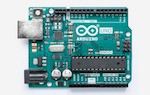        |    23.00    |
|         ATMega328 Chip         |    1     |     [Sparkfun](https://www.sparkfun.com/products/10524)      |  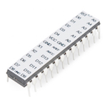  |    5.50     |
| NRF24L01+PA+LNA RF Transceiver |    2     | [Amazon](https://www.amazon.com/WayinTop-NRF24L01-Transceiver-Wireless-Regulator/dp/B07PBBC4H9/ref=cm_cr_arp_d_product_sims?ie=UTF8) |        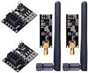        |    11.99    |
|         MicroSD Module         |    1     |       [Adafruit](https://www.adafruit.com/product/254)       |     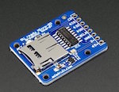      |    7.50     |
|          MicroSD Card          |    1     | [Amazon](https://www.amazon.com/Sandisk-Ultra-Micro-UHS-I-Adapter/dp/B073K14CVB/ref=sxin_2_ac_d_pm?ac_md=1-0-VW5kZXIgJDg%3D-ac_d_pm&cv_ct_cx=16gb+micro+sd+card&dchild=1&keywords=16gb+micro+sd+card&pd_rd_i=B073K14CVB&pd_rd_r=d1995db6-767f-426b-9e24-f141fb565686&pd_rd_w=ktMre&pd_rd_wg=0eDGa&pf_rd_p=0e223c60-bcf8-4663-98f3-da892fbd4372&pf_rd_r=0E6KJKY1BB8H0BDX6ERF&psc=1&qid=1585247378&s=electronics) |    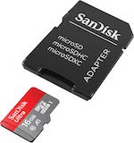    |    5.79     |
|          Battery Pack          |    1     |      [Voltaic Systems](https://voltaicsystems.com/v50/)      |    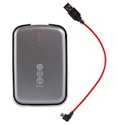    |    69.00    |
|           Microphone           |    1     |      [Adafruit](https://www.adafruit.com/product/1713)       |        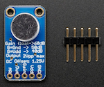        |    7.95     |
|        16MHz Oscillator        |    1     |      [Sparkfun](https://www.sparkfun.com/products/536)       | 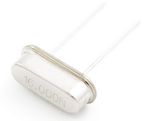 |    0.95     |
|        22pf Ceramic Cap        |    2     |      [Sparkfun](https://www.sparkfun.com/products/8571)      |       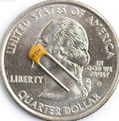       |    0.50     |
|          10k Resistor          |    1     |     [Sparkfun](https://www.sparkfun.com/products/10969)      |    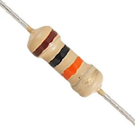    |    0.01     |
|       Micro USB Breakout       |    1     |     [Sparkfun](https://www.sparkfun.com/products/12035)      |      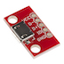      |    2.50     |

The total cost should be between 130-170USD, depending on shipping, taxes, etc.

Here's more info about each component:

- **Uno**: This functions as the reciever and stays connected to the base-computer.  It isn't strictly necessary to use an Uno, for example a Nano should work just as well.. I used an Uno because I had an extra one lying around.
- **ATMega328**: This is the brain of the transmitter.  It functions like an full-blown Uno board but consumes less energy and space, which is ideal for remote devices that are connected to a finite battery and which may need to fit in small spaces.
- **NRF24L01**: This sends and receives audio data.  These ones have a larger antenna than some others on the market and are rated at 1000m line-of-sight communication.  I'm also using a voltage regulator module (shown in the image), which takes a 5V power supply and converts it to a voltage which makes the NRF happy.
- **SD Module**:  Be sure to order this from Adafruit.  Originally I bought SD Modules from a company on Amazon, but they were useless because they didn't allow for multiple inputs on the SPI line.  In otherwords, they don't let you de-select them when you want another device (e.g., the transmitter) to send SPI signals.  The Adafruit modules _do_ support multi-module SPI however, so go with them.
- **Micro SD card**: It doesn't need to be big; 16GB is fine.  Each recording over-writes the previous one, and a 3 second recording is only about 96kB.
- **Battery Pack**: This one comes from a company called Voltaics Systems.  They sell batteries and solar panels marketed toward mostly IoT and outdoorsing. Their batteries are special because they have an "always on" mode, which means they don't turn off automatically when current draw goes below a threshold, as some other batteries do.  The model I suggest is the V50, which has 12,800mAh rating.  There's another, cheaper option for 29.00$, but it only has 4,000mAh, so you would probably want a solar panel to go with it.
- **Mic**: This is an electret mic with automatic gain control.  I haven't experimented too much with the auto gain control, but according to Adafruit, "The AGC in the amplifier means that nearby 'loud' sounds will be quieted so they don't overwhelm & 'clip' the amplifier, and even quiet,  far-away sounds will be amplified. This amplifier is great for when you  want to record or detect audio in a setting where levels change and you don't want to have to tweak the amplifier gain all the time."  which is perfect for a mic that lives outside.
- The rest of the components are basic circuit elements used to run the 'naked' ATMega chip. 

## The Circuit

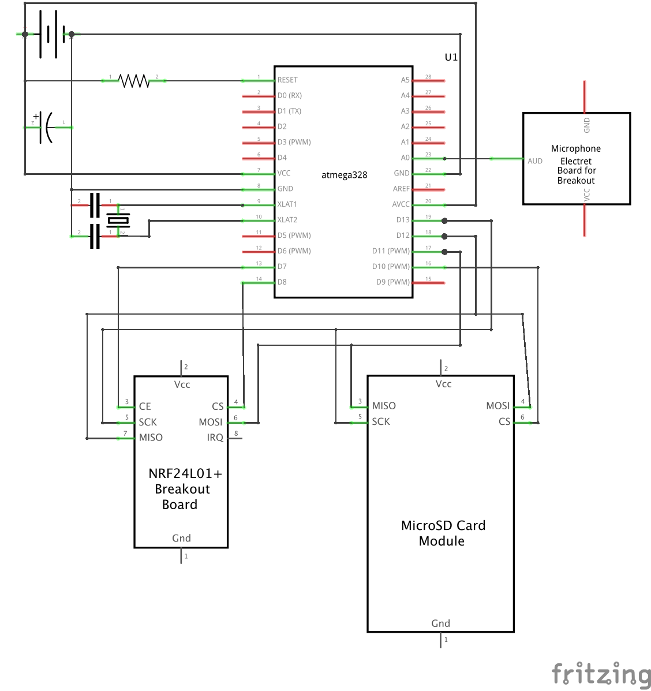

The circuit might look complicated, but once it's on a breadboard it's straightforward.  Note that the power supply is 5V, and although the wires aren't shown for Vcc and GND on the devices, they're connected to 5V as well.

To upload a sketch to the atmega chip I did the following:

1. Pull the atmega chip out of an uno board
2. Wire the uno board to the soundcatcher atmega like what's shown in Method 2 of [this link](https://dronebotworkshop.com/arduino-uno-atmega328/)
3. Connect the uno board to the computer and upload the sketch like normal

There are a couple other ways to upload to the chip, but I found this one to be the most convenient.

## Recording

To record audio I used the [TMRpcm library](https://github.com/TMRh20/TMRpcm).  It has convenient functions for writing audio data to the SD card.  For example:

```c++
#include <TMRpcm.h>

TMRpcm audio;
audio.startRecording("sound.wav", SAMPLERATE, AUDIO_PIN);
delay(recording_length);
audio.stopRecording("sound.wav");
```

Where `AUDIO_PIN` is the analog pin connected to the mic and `SAMPLERATE` is typically set somewhere between `8000` and `16000` Hz.

To decide _when_ to record, I have the microcontroller check if a sufficiently loud noise is detected:

```c++
void loop() {
    delay(200);
    amplitude = analogRead(AUDIO_PIN);
    if (abs(amplitude-baseline_amplitude) > trigger_delta) {
      // record
      // transmit
    }
}
```

Where `baseline_amplitude` is the output value of the mic in quiet conditions (I use `250`), and `trigger_delta` is the amplitude deviation that triggers a recording (I use `80`).

## Transmitting

Transmitting is done with the [RF24 library](https://github.com/nRF24/RF24).  The idea is to open the file you want to transmit, load its bytes into a packet and send the packet.  For example:

```c++
byte data[PAYLOAD_SZ];
f = SD.open(filename);
while (f.available()) {
  f.read(&data, PAYLOAD_SZ);        // Fill up a packet
  radio.write(&data, PAYLOAD_SZ);   // Send
}
```

The maximum payload size is 32 bytes, so the file has to be read and sent in a loop.  [This website](https://lastminuteengineers.com/nrf24l01-arduino-wireless-communication/) has a ton of great information about the nRF24L01 packet protocol and all the module configurations that are available.

## Receiving

Finally... getting data on the base computer.  This is done by running a simple sketch on the receiving module. The main loop looks like:

```c++
byte data[PAYLOAD_SZ];
void loop() {
    if (radio.available()) {
        radio.read(&data, PAYLOAD_SZ);
        Serial.write(data, PAYLOAD_SZ);
    }
}
```

The `Serial.write` sends the payload bytes through the serial port and onto the computer where they're read by a python script that's listening for data.  The python script assembles the bytes and writes them to a wav file.  The python script is a bit more involved, so I won't go into the weeds describing it, but you can look at it here (link).




