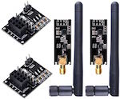
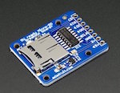
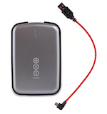
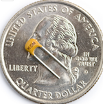
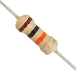

# Soundcatcher: A Device for Remote Acoustic Monitoring

IoT is all the rage, and so are acoustics (right?).  So here I show how to make an IoT-style device for remote monitoring of acoustic signals, specifically, bird chirps.

Soundcatcher consists of two devices: one that's deployed to an acoustic environment of interest and one that sits attached to a base-computer.  The one that's deployed records sounds via a small microphone and transmits recordings via a radio transmitter to the device at the computer, which writes the recording to a playable sound file.

Sound files stack up on the base-computer where a classifier analyses them to separate bird chirps from, say, someone mowing their lawn, but more about that later.  For now let's look at how to make a Soundcatcher.

## Components

Here's the component list:

| Item                                                         | Quantity | Link                                                         | Image                                               | Total Price |
| ------------------------------------------------------------ | -------- | ------------------------------------------------------------ | --------------------------------------------------- | ----------- |
| Arduino Uno                                                  | 1        | [Arduino Store](https://store.arduino.cc/usa/arduino-uno-rev3) |                | 23.00       |
| ATMega328 Chip                                               | 1        | [Sparkfun](https://www.sparkfun.com/products/10524)          |    | 5.50        |
| NRF24L01+PA+LNA RF Transceiver with SMA Antenna and Voltage Regulator Module | 2        | [Amazon](https://www.amazon.com/WayinTop-NRF24L01-Transceiver-Wireless-Regulator/dp/B07PBBC4H9/ref=cm_cr_arp_d_product_sims?ie=UTF8) |                | 11.99       |
| MicroSD Module                                               | 1        | [Adafruit](https://www.adafruit.com/product/254)             |           | 7.50        |
| MicroSD Card                                                 | 1        | [Amazon](https://www.amazon.com/Sandisk-Ultra-Micro-UHS-I-Adapter/dp/B073K14CVB/ref=sxin_2_ac_d_pm?ac_md=1-0-VW5kZXIgJDg%3D-ac_d_pm&cv_ct_cx=16gb+micro+sd+card&dchild=1&keywords=16gb+micro+sd+card&pd_rd_i=B073K14CVB&pd_rd_r=d1995db6-767f-426b-9e24-f141fb565686&pd_rd_w=ktMre&pd_rd_wg=0eDGa&pf_rd_p=0e223c60-bcf8-4663-98f3-da892fbd4372&pf_rd_r=0E6KJKY1BB8H0BDX6ERF&psc=1&qid=1585247378&s=electronics) |        | 5.79        |
| Battery Pack                                                 | 1        | [Voltaic Systems](https://voltaicsystems.com/v50/)           |        | 69.00       |
| Microphone                                                   | 1        | [Adafruit](https://www.adafruit.com/product/1713)            |                | 7.95        |
| 16MHz Oscillator                                             | 1        | [Sparkfun](https://www.sparkfun.com/products/536)            |  | 0.95        |
| 22pf Ceramic Cap                                             | 2        | [Sparkfun](https://www.sparkfun.com/products/8571)           |              | 0.50        |
| 10k Resistor                                                 | 1        | [Sparkfun](https://www.sparkfun.com/products/10969)          |        | 0.01        |

Here's more info about each component:

- The Uno functions as the reciever node and will stay connected to the base-computer.  It isn't strictly necessary to use an Uno here, for example a Nano would work just as well, I used an Uno because I had an extra one lying around.
- The ATMega328 chip will be the brains of the transmitter node.  It functions like an full-blown Uno board but consumes less energy and space, which is ideal for remote devices that are only connected to battery and which may need to fit in small spaces.
- The NRF24L01 sends and receives audio data.  These ones have a larger antenna than some others on the market and are rated at 1000m line-of-sight communication.  I'm also using a voltage regulator module (shown in the image), which takes a 5V power supply and converts it to a voltage which makes the NRF happy.
- Be sure to order the SD Module from Adafruit.  Originally I bought SD Modules from a company on Amazon, but they were useless because they didn't allow for multiple inputs on the SPI line.  In otherwords, they don't let you de-select them when you want another device (e.g., the transmitter) to send SPI signals.  The Adafruit modules _do_ support multi-module SPI however, so go with them.
- The micro SD card doesn't need to be big; 16GB is fine.  Each recording over-writes the previous one, and a 3 second recording is only about 96kB.
- The battery pack comes from a company called Voltaics Systems that sells batteries and solar panels marketed toward IoT and outdoorsing. Their batteries are special because they have "always on" mode, which means they don't turn off automatically when current draw goes below a threshold, as some other batteries do.  The model I suggest is the V50, which has 12,800mAh rating.  There's another, cheaper option for 29.00$, but it only has 4,000mAh, so you would probably want a solar panel with it.
- The mic is electret with automatic gain control.  I haven't experimented too much with the auto gain control, but according to Adafruit, "The AGC in the amplifier means that nearby 'loud' sounds will be quieted so they don't overwhelm & 'clip' the amplifier, and even quiet,  far-away sounds will be amplified. This amplifier is great for when you  want to record or detect audio in a setting where levels change and you don't want to have to tweak the amplifier gain all the time."  which is perfect for a mic that lives outside.
- The rest of the components are basic circuit elements used to run the 'naked' ATMega chip.  Later I'll show how those are used in the circuit diagram.



