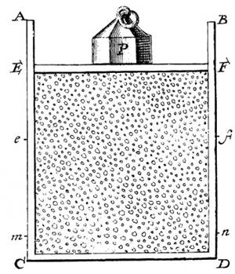

# Statistical Thermodynamics 1: Micro to Macro

statistical thermodynamics connects the thermal properties of objects to the motion of elementary objects like atoms. Thermal properties like hot and cold are relatively intuitive, but that they should occur due to the motion of atoms is far from obvious, and if we tried to predict any of them directly using classical or quantum mechanics we wouldn't get very far—there are just too many objects to keep track of.

How many objects? A mole is the typical scale used to measure the number of objects in thermal systems, it's about $$10^{23}$$. To get a feel for this number, a mole of gas fills about $$22$$ liters at standard temperature and pressure. To classically represent a mole of gas we would have to list each atom's position and momentum—about $$10^{23}$$ numbers in total. This is an absurdly large number of numbers. It would take about $$10^9$$ supercomputers-worth of storage space to represent them all. Imagine the computational energy required to propagate the state one step forward in time, let alone accurately capture all relevant interactions—it's not happening.

Instead of tracking every object, it's much more practical to compute a small number of functions of state to get macroscopic properties such as temperature, pressure and energy. But this raises a question: if we're calculating functions of state, don't we need to know the state? The answer is technically yes, but practically no. Practically no because, as we'll see, when thermal systems come to equilibrium, quantities such as pressure, temperature and energy are effectively constant even though the underlying states that define them are continuously changing.

Before going further, I'll mention that the word _state_ can be ambiguous in thermodynamics. It could refer to the state of macroscopic variables, like temperature and pressure, or it could refer to the configuration of the system, like the position and momentum of atoms (which is what I've been calling state so far). To disambiguate, configurations are called _microstates_ (even though they may be bigger or smaller than a micron) and macroscopic states are called _macrostates_. If I don't include the prefix it should be clear from context what I mean.

Also, the word _thermodynamics_ should be defined. Thermodynamics is about thermal things changing, like when energy is absorbed, or pressure increases, etc. But changes are assumed to happen in a special way. They happen such that the system can be _treated_ like it's in equilibrium at all times, even though it really is changing. The way to accomplish this is through so-called "quasi-static" change, where the system is evolved so slowly that after every infinitesimal change the system has enough time to settle to equilibrium before further changes are applied.

The reason for making changes quasi-statically is because we want to treat thermal properties as uniform and stationary throughout the system. For example, if a volume of gas decreases, initially the gas's pressure will be higher near its container's surface, so pressure becomes a function of position. Thermodynamics, however, associate one pressure, volume, etc., with the system, so we let the new pressure spread uniformly throughout the gas, dissipating transients, before doing any kind of thermal analysis on it. There's a branch of physics dedicated to non-quasistatic change called non-equilibrium thermodynamics, but I'll save its discussion for another post. (Footnote—I was tempted to synonymize  "quasi-static" with "dynamic equilibrium" due to the system being in equilibrium throughout its dynamics, but this is wrong, dynamic equilibrium means something different.)

Now, to start deriving macroscopic thermal properties from microscopic physics, we need the fundamental postulate of thermodynamics called the _ergodic hypothesis_: 

> For a many-particle system in thermal equilibrium, each accessible microstate is equally likely to be observed at all times.

From a classical mechanics perspective this sounds weird. In CM, microstates follow a single deterministic trajectory through state space, so the microstate we expect to observe seems like it should be uniquely determined, not random...but that's only if we know the system's initial conditions with infinite precision, which is absolutely impossible for $$O(10^{23})$$ particles (see: chaos theory). For so many particles, over long time scales, it makes more sense to talk about the probability that a system occupies a volume of state space, and, without any priors, the postulate says we should assign a probability that's proportional to the volume of that region, which seems reasonable.

Another way to break the postulate down is to simply not—it's a postulate, it can say whatever it wants…just as long as it predicts experimental measurements, which, as I'll show throughout this post, for large systems like those in thermodynamics, it does.

### Isolated Systems

Isolated systems are a simple starting point. What can we say about them? We can say they have a number of particles $$N$$, a total energy $$U$$, and perhaps there are some constraints, like that the system is inside a volume $$V$$. Given these things we can try to figure out the number of ways that $$U$$ can be split amongst the particles while satisfying the constraints. This number, called the system's multiplicity $$\Omega$$, is the number of microstates available to the system, it plays an important role in determining which macrostate a system equilibrates to when it interacts with another system.

To get a feel for $$\Omega$$ I'll calculate it for three example systems, then in the next section I'll show how it determines equilibrium.

__The Paramagnet.__ A simple model of a paramagnet is the ideal two-state paramagnet. Its "particles" are dipole moments that align either with or against an external magnetic field. If we use energy units of $$\mu B$$, where $$\mu$$ is each dipole's moment (the same for all dipoles) and $$B$$ is the external field, then the energy of an aligned dipole is $$-1$$ and the energy of an anti-aligned dipole is $$+1$$ (so dipoles want to align with the field).

The total energy is

$$
U = N_+-N_- = N-2N_-
$$

where $$N_-$$ and $$N_+$$ are the number of aligned and anti-aligned dipoles, and $$N=N_++N_-$$ is the total number of dipoles. Note that $$N_{-} \le U \le N_+$$ and $$N_{-} \le U \le N-N_{-}$$.

A microstate for this system is a binary list of each dipole's alignment, for example $$(+,-,...,+)$$. Macrostates are aggregate functions of microstate, such as $$U$$, $$N_+$$, and the total magnetization $$M$$.

The multiplicity is

$$
\Omega(N_-) = \begin{pmatrix} N \\ N_- \end{pmatrix}
$$

or in terms of energy and the total number of particles,

$$
\Omega(U,N) = \frac{N!}{\frac{N-U}{2}!\frac{N+U}{2}!}
$$

Note that the fractions in the denominator actually work out to be integers because adding or subtracting a particle always changes the energy by one unit.

For large $$N$$ and $$N \gg N_-$$ (the high energy limit) this simplifies to

$$
\left( \frac{Ne}{N_-} \right)^{N_-} = \left( \frac{2Ne}{N-U}\right)^{(N-U)/2}
$$

__The Solid.__ A simple model of a solid is the Einstein solid. Its "particles" are spring-like oscillators that connect atoms into a cubic lattice. Oscillators are defined as identical, so they have the same frequency parameter $$\omega$$, and they're treated quantum mechanically so their energy is in units of $$\hbar \omega$$.

The total energy of the oscillators (relative to the ground state) is just the total number of energy units in the system: $$U$$. Note that unlike the paramagnet, the solid's $$U$$ and $$N$$ are independent—a particle can be added without necessarily changing the system's energy (relative to the ground state).

A microstate is specified by listing each oscillator's energy. For example, if there are 5 energy units and 3 oscillators, possible microstates are $$(2,0,3)$$ or $$(1,1,3)$$, etc. 

The multiplicity is

$$
\Omega(U,N) = \begin{pmatrix} U+N-1 \\ U \end{pmatrix}
$$

For large $$N$$ and $$U$$ this is approximately

$$
\frac{(U+N)^{U+N}}{U^U N^N}
$$

In the high-energy limit where $$U \gg N$$ this further approximates to

$$
\left( \frac{Ue}{N} \right)^N
$$

__The Gas.__ A simple model of a gas is the ideal gas. It's a gas at low density and high energy such that its atoms scatter elastically off each other and off the walls of the container they're in. As it turns out, many gases fall within this regime, so it's a really useful model.

To derive the multiplicity of an ideal gas containing $$N$$ atoms, it's easiest to start by thinking about what happens when $$N=1$$. With one atom the microstate is given by that atom's position and momentum 3-vectors $$(\mathbf{x},\mathbf{p})$$, where $$\mathbf{x}$$ is bound within a volume $$V$$, and $$\mathbf{p}$$ is related to energy by

$$
U = \frac{1}{2m}\lvert \mathbf{p} \rvert ^2
$$

We're going to assume for now that the atoms have no internal energy-bearing degrees of freedom, such as rotations or vibrations—this is a reasonable assumption when the atoms are, well, atoms and not molecules.

Classically a single particle can occupy a continuously infinite number of positions and momenta while satisfying the energy and volume constraints, so it seems like the multiplicity should likewise be continuously infinite. Quantumly, however, there's a limit to the simultaneous "resolution" of $$\mathbf{x}$$ and $$\mathbf{p}$$. In particular, they can only be known together up to the Heisenberg limit $$\Delta x_i \Delta p_i = \hbar/2$$, where $$i$$ indexes the three spatial dimensions. So if we imagine phase space as being chopped up into a grid of $$\Delta x$$s and $$\Delta p$$s that are at this limit, then we can count the number of microstates in a finite, discrete way. Let's see what happens.

The number of position states is

$$
\Omega_x = \frac{V}{\Delta x_1 \Delta x_2 \Delta x_3}
$$

The number of momentum states is

$$
\Omega_p = \frac{S_d(r)}{\Delta p_1 \Delta p_2 \Delta p_3}
$$

Here, $$S_d(r)$$ is the surface area of a sphere of radius $$r$$ and dimension $$d$$. Why the surface area of a sphere? Because the energy-momentum relation is the equation of a sphere, and the momenta satisfying the energy constraint lie on its surface. For one particle, $$d = 3$$ and $$r = \sqrt{2mU}$$. The total multiplicity is

$$
\Omega = \Omega_x \Omega_p
$$

For $$N$$ particles we use the same approach, but now the position-space volume is $$V^N$$ and the momentum-space dimensionality is $$d=3N$$. Also, we have to account for the fact that the atoms are indistinguishable. To see why, consider a _distinguishable_ three-atom gas. One of its microstate is

$$
((\mathbf{x}_1,\mathbf{p}_1),(\mathbf{x}_2,\mathbf{p}_2),(\mathbf{x}_3,\mathbf{p}_3))
$$

If the atoms switch places they'll have another, distinct, microstate such as

$$
((\mathbf{x}_3,\mathbf{p}_3),(\mathbf{x}_1,\mathbf{p}_1),(\mathbf{x}_2,\mathbf{p}_2))
$$

In this case there are two states to count, but if the particles are indistinguishable then there are no subscripts on the individual states and the first overall state is the same as the second. The way we're calculating $$\Omega$$, however, doesn't account for such _permutation redundancy_, that is unless $$\Omega$$ is divided by $$N!$$ to "un-count" the redundant states. So really the multiplicity is $$\Omega_x \Omega_p/N!$$.

The final result after dividing by $$N!$$ and approximating for large $$N$$ is

$$
\Omega(U,V,N) = f(N) V^N U^{3N/2}
$$

where 

$$
f(N) = \frac{(2\pi m)^{3N/2}}{h^{3N}N!(3N/2)!}
$$

As a last comment about these three models I'll highlight the fact that none of them capture any inter-particle interactions. For example, the paramagnet treats each dipole as independent, even though really each one exerts a small magnetic field on each other one. Similarly, the solid treats oscillators as independent, and the gas treats atoms as independent. These are "ideal" approximations that make for instructive toy models, but they actually do manage to match experimental measurements over a wide range of parameters, so we go ahead and use them.

### Interacting Systems

Suppose that two thermodynamic systems interact by exchanging something with each other. "Something" could be energy, particles, volume, or any other macroscopic quantity that's exchangeable. The question of this section is: after the systems interact for a while, what macrostate do we expect to observe for each of them?

__Energy Exchange.__ To start, consider two systems that exchange energy. Energy could be exchanged in any number of ways at the microscopic level, but for the purposes of this analysis all we care about is that

* Energy is the only thing exchanged (particles and volume, for example, stay constant). 
* Total energy is conserved.
* The microstate associated with each energy macrostate is uniformly random in the sense of the ergodic hypothesis.

After the systems interact in this way for a while, what are their energies? According to the ergodic hypothesis the probability of observing $$U_1$$ and $$U_2$$ is

$$
p(U_1,U_2) \propto \Omega(U_1, U_2) = \Omega_1(U_1) \Omega_2(U_2)
$$

So the more microstates associated with a macrostate, the more likely that macrostate is to be observed. Let's see how this works out for two Einstein solids.

The multiplicity of two Einstein solids is

$$
\Omega(U_1, U_2) = \left( \frac{U_1e}{N_1} \right)^{N_1} \left( \frac{U_2e}{N_2} \right)^{N_2}
$$

This function turns out to be shaped like a Gaussian. By taking the total derivative of $$\Omega$$ and setting it equal to zero, we find that it peaks when 

$$
\frac{N_1}{N_2} = \frac{U_1}{U_2}
$$

So the most likely macrostate has the energies split in the same proportion as the number of particles.

How sharp is the multiplicity's peak? Fitting a Gaussian to $$\Omega$$, we find that its width parameter is $$\sigma=U/2\sqrt{N}$$, where $$N$$ is the total number of particles and $$U$$ is the total energy. This is the number of macrostates the joint system most likely occupies as the two sub-systems exchange energy. Relative to the entire energy scale it's $$1/2\sqrt{N}$$, so for a mole of particles only about $$10^{-9}$$ percent of macrostates have a reasonable chance of occupation, making the peak effectively the _only_ macrostate we expect to observe, therefore we call it the _equilibrium_ state.

Applying the same analysis to the ideal gas, we get the same result. This is because the gas's multiplicity function depends on energy in the same way, namely $$\Omega \sim U^{aN}$$, where $$a > 0$$ is a constant that doesn't qualitatively change the shape of $$\Omega$$.

Applying the same analysis to the paramagnet gives a slightly different result. The magnet's multiplicity maximizes when

$$
\frac{N_1}{N_2} = \frac{N_1-U_1}{N_2-U_2}=\frac{N_{1-}}{N_{2-}}
$$

In the high-energy-per-particle limit this result is qualitatively the same: multiplicity has one _very_ sharp peak for large systems (at high enough energy). In fact, the same is true when other quantities like volume or number of particles are exchanged. This observation prompts us to look for a general relationship between $$\Omega$$ and the equilibrium state of _all_ macroscopic variables it depends on.

__General Equilibrium.__ Going back to energy exchange, we know that thermal equilibrium happens when

$$
d\Omega=\frac{\partial\Omega}{\partial U_1}dU_1 + \frac{\partial\Omega}{\partial U_2}dU_2=0
$$

Using $$dU_1 = -dU_2$$, this simplifies to

$$
\frac{\partial \ln\Omega_1}{\partial U_1} = \frac{\partial \ln\Omega_2}{\partial U_2}
$$

If we define _entropy_ as $$S = k \ln \Omega$$ where $$k \approx 10^{-23} \text{J/K}$$ is the Boltzmann constant, and define temperature as 

$$
\frac{1}{T} = \frac{\partial S}{\partial U}
$$

then we get a relationship between temperature and multiplicity that's consistent with the thermodynamic definition of entropy (more on that in the next post). This equation is therefore the statistical definition of temperature.

Entropy increases monotonically with multiplicity, therefore higher entropy states are more likely to be occupied, and two systems initially out of thermal equilibrium with each other will eventually equilibrate to the highest entropy macrostate. This gives rise to the second law of thermodynamics: _entropy tends to increase_. Note that entropy is a logarithm, therefore the total entropy of two systems is the sum of their individual entropies.

When energy equilibrates the system is said to have _thermalized_, and the type of energy associated with thermalization is called _heat_. Note that the word "heat" here means something different from what it means when we casually say something like "the oven is hot". "The oven is hot" suggests that a system _contains_ heat, whereas in thermal physics heat is defined as energy _in transit_. It's not a property of a system. So technically we should say "the oven _transfers_ heat to my body, and subsequently my body doesn't "have" that heat, it just has more $$U$$.)".

We can apply a similar analysis to volume exchange. For volume exchange the equilibrating quantity is pressure, and the type of equilibrium that's reached is called _mechanical_ equilibrium. Starting with

$$
d\Omega = \frac{\partial\Omega}{\partial V_1}dV_1 + \frac{\partial\Omega}{\partial V_2}dV_2 = 0
$$

we get

$$
P = T \frac{\partial S}{\partial V}
$$

where the factor of $$T$$ is included to make units work out properly and to ensure that the relationship between pressure, temperature and multiplicity is experimentally consistent.

Finally, there's particle exchange. When particles are exchanged between systems they eventually reach _diffusive_ equilibrium. The associated thermal variable is called chemical potential $$\mu$$ and it's defined as

$$
\mu = -T \frac{\partial S}{\partial N}
$$

Chemical potential has units of energy, it measures how willing a system is to give or gain a particle. The minus sign captures the fact that systems at higher $$\mu$$ tend to give particles to systems at lower $$\mu$$. 

From these equations it's clear that in the context of thermodynamics $$S$$ is a more natural quantity to work with than $$\Omega$$, which isn't a surprise given that historically $$S$$ was defined thermodynamically and only later connected to $$\Omega$$, so it makes sense to start using $$S$$ at this point. And what's really useful is to now define thermal quantities _together_ in terms of it. We can do this easily by taking the total derivative of $$S$$ and insert the three partial derivatives above. Rearranging for $$U$$ gives

$$
dU = T\,dS - P\,dV + \mu\,dN
$$

This equation is called the _thermodynamic identity_, and it's useful for understanding the interconnectedness of the various thermodynamic variables. Each of its terms has units of energy. The first is heat, the second mechanical work, and the third chemical work. 

### Last

The thermodynamic identity is firmly in the territory of thermodynamics and over the horizon from the statistical models that led to its derivation. The next natural topic from here seems to be thermodynamics proper, so I'll discuss that in the next post where I'll go over things like engines, free energy, and the thermodynamic definition of entropy. Don't touch that dial…



